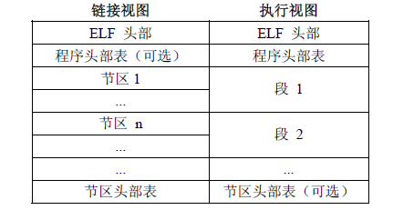

# Linux C & Gcc

### 0 缩略语

1. ELF: Executable and Linkable Format 可执行可链接格式
2. ABI: Application Binary Interface 应用程序二进制接口


### 1 基础知识储备

#### 1.1 Linux进程的五个段

1. BSS段：（BSS segment）通常是指用来存放程序中未初始化的全局变量的一块内存区域。是Block Started by Symbol的简称，属于静态内存分配。
2. 数据段：（data segment）通常是指用来存放程序中已初始化的全局变量的一块内存区域。属于静态内存分配。
3. 代码段：（code segment/text segment）通常是指用来存放程序执行代码的一块内存区域。这部分区域的大小在程序运行前就已经确定，并且内存区域通常属于只读，某些架构也允许代码段为可写，即允许修改程序。在代码段中，也有可能包含一些制度的常数变量，例如字符串常量等。
4. 堆（heap）：堆是用来存放进程运行中被动态分配的内存段，它的大小并不固定，可动态扩张或缩减。当进程调用malloc等函数分配内存时，新分配的内存就被动态添加到堆上（堆被扩张）；当利用free等函数释放内存时，被释放的内存从堆中被剔除（堆被缩减）
5. 栈（stack）：栈又称堆栈，是用户存放程序临时创建的局部变量，也就是说我们函数括弧“{}”中定义的变量（但不包括static声明的变量，static意味着在数据段中存放变量）。除此之外，在函数被调用时，其参数也会被压入发起调用的进程栈中，并且待到调用结束后，函数的返回值也会被存放回栈中。由于栈的先进后出特点，所以栈特别方便用来保存/恢复调用现场。从这个意义上讲，我们可以把”（堆）栈“看成一个寄存、交换临时数据的内存段。它是由操作系统分配的，内存的申请与回收都由OS管理。

全局的未初始化变量存在于.bss段中，具体体现为一个占位符；全局的已初始化变量存在于.data段中；而函数内的自动变量都在栈上分配空间。.bss是不占用.exe文件空间的，其内容由操作系统初始化（清零）；而.data却需要占用，其内容由程序初始化。

（已手动初始化的数据）段则为数据分配空间，数据保存在目标文件中。数据段包含经过初始化的全局变量以及它们的值。BSS段的大小从可执行文件中得到，然后链接器得到这个大小的内存块，紧跟在数据段后面。当这个内存区进入程序的地址空间后全部清零。包含数据段和BSS段的整个区段此时通常称为数据区。

```c
#include <stdio.h>
#include <stdlib.h>

int BSS;					//位于BSS段，存放在程序组未初始化的内存区域
int data = 100;				//位于数据段；存放在程序中已经初始化的内存区域
static int y;				//静态区

int stack(void);

int main(void)
{
    static int k;			//静态区
    int i, j;				//栈区，内存自动申请自动释放
    int *p = NULL;
    p = malloc(1024);		//堆区，内存手动申请手动释放
    free(p);
    
    return 0;
}

int static(void)
{
    int i;					//栈区
    
    return 0;
}
```

#### 1.2 进程（process）和线程（thread）

额。。。。。。


### 2 Gcc使用手册

GCC（GNU C Compiler）是编译工具，将C/C++等语言编写的程序转换成处理器能够执行的二进制代码的过程就是由编译器完成。

**GCC包含一组二进制程序处理工具**：

|   工具    | 作用                                                         |
| :-------: | :----------------------------------------------------------- |
| addr2line | 用来将程序地址转换成其所对应的程序源文件及对应的代码行，也可以得到所对应的函数。该工具将帮助调试器在调试的过程中定位对应的源代码位置 |
|    as     | 主要用于汇编                                                 |
|    ld     | 主要用于链接                                                 |
|    ar     | 主要用于创建静态库                                           |
|    ldd    | 可以用于查看一个可执行程序依赖的共享库                       |
|  objcopy  | 将一种对象文件翻译成另一种格式，譬如将.bin转换成.elf、或将.elf转换成.bin |
|  objdump  | 主要的作用是反汇编                                           |
|  readelf  | 显示有关ELF文件的信息                                        |
|   size    | 列出可执行文件每个部分的尺寸和总尺寸，代码段、数据段、总大小等 |

**还包含C运行库**：

C语言标准主要由两部分组成：一部分描述C的语法，另一部分描述C标准库。C标准库定义了一组标准头文件，每个头文件中包含一些相关的函数、变量、类型声明和宏定义，譬如常见的printf函数便是一个C标准库函数，其原型定义在stdio.h头文件中。

C语言标准仅仅定义了C标准库函数的函数原型，并没有提供实现。因此，C语言编译器通常需要一个C运行时库（C Run Time Library, CRT）的支持。C运行时库又常简称为C运行库。与C语言类似，C++也定义了自己的标准，同时提供了相关支持库，成为C++运行时库。

#### 2.1 Gcc入门

先用常用的文本编辑器编辑一个简单的hello.c文件

```c
#include <stdio.h>

int main(void)
{
    printf("Hello World!\n");
    
    return 0;
}
```

实质上，GCC编译过程是分为四个阶段进行的，即**预处理**（也称预编译，Preprocessing）、**编译**（Compilation）、**汇编**（Assembly）和链接（Linking）。以hello.c文件为例，各个阶段的编译命令如下表所示。

| 编译阶段 |         编译命令          | 作用                                 |
| :------: | :-----------------------: | ------------------------------------ |
|  预处理  | gcc -E hello.c -o hello.i | 编译器将源代码中包含的头文件编译进来 |
|   编译   | gcc -S hello.i -o hello.s | 检查代码规范性并翻译成汇编语言       |
|   汇编   | gcc -c hello.s -o hello.o | 将.s文件转换为目标文件               |
|   链接   |   gcc hello.o -o hello    | 将目标文件转换为可执行文件           |


### 3 ELF文件格式

ELF为Executable and Linkable Format的简写。


###### ELF文件可以分为四个部分：

1. ELF Header：描述整个文件的组织。
2. Program Header Table：描述文件中的各种segments，用来告诉系统如何创建进程映像。
3. sections/segments：segments是从运行的角度来描述elf文件，sections是从链接的角度来描述elf文件。也就是说，在链接阶段，我们可以忽略program header table来处理此文件，在运行阶段可以忽略section header table来处理此程序。从上图中也可以看出，segments与sections是包含关系，一个segments可以包含若干sections。
4. Sections Header Table：包含了文件各个sections的属性信息。



链接视图是以节（section）为单位，执行视图是以（segment）为单位。


###### 3.1 进程映像


