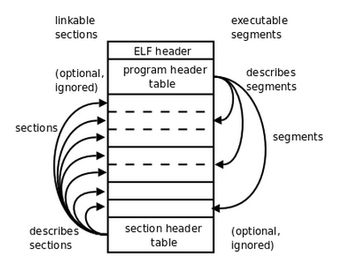

# Linux C & Gcc

### 0 缩略语

1. ELF: Executable and Linkable Format 可执行可链接格式
2. ABI: Application Binary Interface 应用程序二进制接口


### 1 基础知识储备

#### 1.1 Linux进程的五个段

1. BSS段：（BSS segment）通常是指用来存放程序中未初始化的全局变量的一块内存区域。是Block Started by Symbol的简称，属于静态内存分配。
2. 数据段：（data segment）通常是指用来存放程序中已初始化的全局变量的一块内存区域。属于静态内存分配。
3. 代码段：（code segment/text segment）通常是指用来存放程序执行代码的一块内存区域。这部分区域的大小在程序运行前就已经确定，并且内存区域通常属于只读，某些架构也允许代码段为可写，即允许修改程序。在代码段中，也有可能包含一些制度的常数变量，例如字符串常量等。
4. 堆（heap）：堆是用来存放进程运行中被动态分配的内存段，它的大小并不固定，可动态扩张或缩减。当进程调用malloc等函数分配内存时，新分配的内存就被动态添加到堆上（堆被扩张）；当利用free等函数释放内存时，被释放的内存从堆中被剔除（堆被缩减）
5. 栈（stack）：栈又称堆栈，是用户存放程序临时创建的局部变量，也就是说我们函数括弧“{}”中定义的变量（但不包括static声明的变量，static意味着在数据段中存放变量）。除此之外，在函数被调用时，其参数也会被压入发起调用的进程栈中，并且待到调用结束后，函数的返回值也会被存放回栈中。由于栈的先进后出特点，所以栈特别方便用来保存/恢复调用现场。从这个意义上讲，我们可以把”（堆）栈“看成一个寄存、交换临时数据的内存段。它是由操作系统分配的，内存的申请与回收都由OS管理。

全局的未初始化变量存在于.bss段中，具体体现为一个占位符；全局的已初始化变量存在于.data段中；而函数内的自动变量都在栈上分配空间。.bss是不占用.exe文件空间的，其内容由操作系统初始化（清零）；而.data却需要占用，其内容由程序初始化。

（已手动初始化的数据）段则为数据分配空间，数据保存在目标文件中。数据段包含经过初始化的全局变量以及它们的值。BSS段的大小从可执行文件中得到，然后链接器得到这个大小的内存块，紧跟在数据段后面。当这个内存区进入程序的地址空间后全部清零。包含数据段和BSS段的整个区段此时通常称为数据区。

```c
#include <stdio.h>
#include <stdlib.h>

int BSS;					//位于BSS段，存放在程序组未初始化的内存区域
int data = 100;				//位于数据段；存放在程序中已经初始化的内存区域
static int y;				//静态区

int stack(void);

int main(void)
{
    static int k;			//静态区
    int i, j;				//栈区，内存自动申请自动释放
    int *p = NULL;
    p = malloc(1024);		//堆区，内存手动申请手动释放
    free(p);
    
    return 0;
}

int static(void)
{
    int i;					//栈区
    
    return 0;
}
```

#### 1.2 进程（process）和线程（thread）

额。。。。。。

### 2 ELF文件格式

ELF为Executable and Linkable Format的简写，即可执行可链接文件格式。目前常见的Linux、Android可执行文件、共享库（.so）、目标文件（.o）以及Core文件均为此格式。




###### ELF文件可以分为四个部分：

1. ELF Header：描述整个文件的组织。
2. Program Header Table：描述文件中的各种segments，用来告诉系统如何创建**进程映像**。
3. sections/segments：segments是从运行的角度来描述elf文件，sections是从链接的角度来描述elf文件。也就是说，在链接阶段，我们可以忽略program header table来处理此文件，在运行阶段可以忽略section header table来处理此程序。从上图中也可以看出，segments与sections是包含关系，一个segments可以包含若干sections。
4. Sections Header Table：包含了文件各个sections的属性信息。


链接视图是以节（section）为单位，执行视图是以（segment）为单位。


###### 2.1 进程映像


### 3 Gcc使用手册

GCC（GNU C Compiler）是编译工具，将C/C++等语言编写的程序转换成处理器能够执行的二进制代码的过程就是由编译器完成。如今的GCC是一个包含众多语言的编译器，其中包括C、C++、Ada、Object C和Java等。所以，GCC也有原来的GNU C Compiler变为GNU Compiler Collection，GNU编译器家族的意思。

**GCC包含一组二进制程序处理工具**：

|    工具     | 作用                                       |
| :-------: | :--------------------------------------- |
| addr2line | 用来将程序地址转换成其所对应的程序源文件及对应的代码行，也可以得到所对应的函数。该工具将帮助调试器在调试的过程中定位对应的源代码位置 |
|    as     | 主要用于汇编                                   |
|    ld     | 主要用于链接                                   |
|    ar     | 主要用于创建静态库                                |
|    ldd    | 可以用于查看一个可执行程序依赖的共享库                      |
|  objcopy  | 将一种对象文件翻译成另一种格式，譬如将.bin转换成.elf、或将.elf转换成.bin |
|  objdump  | 主要的作用是反汇编                                |
|  readelf  | 显示有关ELF文件的信息                             |
|   size    | 列出可执行文件每个部分的尺寸和总尺寸，代码段、数据段、总大小等          |

**还包含C运行库**：

C语言标准主要由两部分组成：一部分描述C的语法，另一部分描述C标准库。C标准库定义了一组标准头文件，每个头文件中包含一些相关的函数、变量、类型声明和宏定义，譬如常见的printf函数便是一个C标准库函数，其原型定义在stdio.h头文件中。

C语言标准仅仅定义了C标准库函数的函数原型，并没有提供实现。因此，C语言编译器通常需要一个C运行时库（C Run Time Library, CRT）的支持。C运行时库又常简称为C运行库。与C语言类似，C++也定义了自己的标准，同时提供了相关支持库，成为C++运行时库。

#### 3.1 Gcc入门

先用常用的文本编辑器编辑一个简单的hello.c文件

```c
#include <stdio.h>

int main(void)
{
    printf("Hello World!\n");
    
    return 0;
}
```

实质上，GCC编译过程是分为四个阶段进行的，即**预处理**（也称预编译，Preprocessing）、**编译**（Compilation）、**汇编**（Assembly）和链接（Linking）。以hello.c文件为例，各个阶段的编译命令如下表所示。

| 编译阶段 |           编译命令            | 作用                 |
| :--: | :-----------------------: | ------------------ |
| 预处理  | gcc -E hello.c -o hello.i | 编译器将源代码中包含的头文件编译进来 |
|  编译  | gcc -S hello.i -o hello.s | 检查代码规范性并翻译成汇编语言    |
|  汇编  | gcc -c hello.s -o hello.o | 将.s文件转换为目标文件       |
|  链接  |   gcc hello.o -o hello    | 将目标文件转换为可执行文件      |

##### 3.1.1 Gcc最基本的用法

```shell
gcc [options] [filenames]
```

其中options就是编译器所需要的参数，filenames给出相关的文件名称。

- -c，只编译，不链接成可执行文件，编译器只是由输入的.c等源代码文件生成以.o为后缀的目标文件，通常用于编译不包含主程序的子程序文件。
- -o output_filename，指定输出文件的名称为output_filename，这个名称不能和源文件同名。如果不给出这个选项，GCC就给出预设的可执行文件a.out。
- -g，产生符号调试工具（GNU的GDB）所必需的符号资讯，要想对源代码进行调试，就必须加入该选项。
- -O，对程序进行优化编译、链接，采用这个选项，整个源代码会在编译、链接过程中进行优化处理，这样产生的可执行文件的执行效率可以提高，但是编译、链接的速度就相应地要慢一些。
- -O2，比-O更好的优化编译、链接，但是整个编译、链接过程会更慢。

##### 3.1.2 GCC警告

GCC包含完整的**出错检查**和**警告提示**功能

- -pedantic，加上该选项，那么在编译时使用了扩展语法的地方将产生相应的警告信息。-pedantic编译选项并不能保证被编译程序与ANSI/ISO C语言标准的完全兼容，它仅用来帮助Linux程序员离这个目标越来越近。即该选项能够帮助程序员发现一些不符合ANSI/ISO C标准的代码，但不是全部。事实上只有ANSI/ISO C语言标准中要求进行编译器诊断的那些情况，才有可能被GCC发现并提出警告。

  ```shell
  gcc -pedantic illcode.c -o illcode
  ```

- -Wall，除了-pedantic之外，GCC还有一些其它编译选项也能够产生有用的警告信息。这些选项大多以**-W**开头，其中做有价值的当属**-Wall**，使用它能够使GCC产生尽可能多的警告信息。

  ```shell
  gcc -Wall illcode.c -o illcode
  ```

- **-Werror**，该选项要求GCC**将所有的警告当成错误进行处理**，这在使用自动编译工具（如nake等）时非常有用。如果编译时带上-Werror选项，那么GCC会在所有产生警告的地方停止编译，迫使程序员对自己的代码进行修改。只有当相应的警告信息消除时，才可能将编译过程继续朝前推进。

  ```shell
  # -Werror选项必须配合-Wall选项一块使用，单独使用无效。
  gcc -Wall -Werror illcode.c -o illcode
  ```

  **注意：-Werror选项必须配合-Wall选项一块使用，单独使用-Werror选项没有作用**

##### 3.1.3 GCC调试

GDB（GNU Debugger）通过与GCC的配合使用，为基于Linux的软件开发提供了一个完善的调试环境。

默认情况下，GCC在编译时不会将调试符号插入到生成的二进制代码中，因为这样会增加可执行文件的大小。如果需要在编译时生成调试符号信息，可以使用GCC的-g或-ggdb选项。GCC在产生调试符号时，同样采用了分级的思路，开发人员可以通过在-g选项后附加数字1、2或3来指定在代码中加入调试信息的多少。默认的级别是2（-g2），此时产生的调试信息包括扩展的符号表、行号、局部或外部变量信息。级别3（-g3）包含级别2中的所有调试信息，以及源代码中定义的宏。级别1（-g1）不包含局部变量和与行号有关的调试信息，因此只能够用于**回溯追踪**和**堆栈转储**。

**回溯跟踪**指的是监视程序在运行过程中的函数调用历史，**堆栈转储**则是一种原始的十六进制格式保存程序执行环境的方法，两者都是京城用到的调试手段。

GCC产生的调试符号具有普遍的适应性，可以被许多调试器加以利用，但如果使用的是GDB，那么还可以通过-ggdb选项在生成的二进制代码中包含GDB专用的调试信息。这种做法的优点是可以方便GDB的调试工作，但缺点是可能导致其他调试器（如DBX）无法进行正常的调试。选项-ggdb能够接受的调试级别和-g是完全一样的，它们对输出的调试符号有着相同的影响。

```shell
gcc -g crash.c -o crash  # 编译程序，-g添加调试信息
gdb crash  # 进入gdb调试
run   # 运行可执行文件
backtrace  # 回溯追踪
frame n  # 查看详细的某一条回溯，n是运行backtrace命令后的某一条结果序号
quit  # 退出gdb调试器
```

GDB的功能远远不止这些，它还可以**单步跟踪程序**、**检查内存变量**和**设置断点**等。

调试时可能会需要用到编译器产生的中间结果，这时可以使用-save-temps选项。

- **-save-temps**，让GCC将预

- 处理代码、汇编代码和目标代码都作为文件保存起来。如果像检查生成的代码是否能够通过手工调整的办法来提高执行性能，在编译过程中生成的中间文件将会很有帮助。

  ```shell
  gcc -save-temps foo.c -o foo
  ```

- -p/-pg，GCC支持的其他调试选项还包括-p和-pg，他们会将剖析（Profiling）信息加入到最终生成的二进制代码中。剖析信息对于找出程序的性能瓶颈很有帮助，是协助Linux程序员开发出高性能程序的有力工具。在编译时加入-p选项，会在生成的代码中加入通用剖析工具（Prof）能够识别的统计信息，而-pg选项则生成只有GNU剖析工具（Gprof）才能识别的统计信息。

**提醒一点**，虽然GCC允许在优化的同时加入调试符号信息，但优化后的代码对于调试本身而言将是一个很大的挑战。代码在经过优化之后，在源程序中声明和使用的变量很可能不在使用，控制流也可能会突然跳转到意外的地方，循环语句有可能因为循环展开而变得到处都有，所以这些对于调试来讲都将是一场噩梦。**建议在调试时最好不使用任何优化选项，只有当程序在最终发行时才考虑对其进行优化。**

##### 3.1.4 代码优化

GCC提供的代码优化功能非常强大，它通过编译选项-On来控制优化代码的生成，其中n是一个代表优化级别的整数。对于不同版本的GCC来讲，n的取值范围及其对应的优化效果可能并不完全相同，比较典型的范围是从0变化到2或3。

编译时使用选项-O可以告诉GCC同时减小代码的长度和执行时间，其效果等价于-O1.在这一级别上能够进行的优化类型虽然**取决于目标处理器**，但一般都会包括**线程跳转**（Thread Jump）和**延迟退栈**（Deferred Stack Pops）两种优化。选项-O2告诉GCC除了完成所有-O1级别的优化之外，同时还要进行一些额外的调整工作，如处理器指令调度等。选项-O3则除了完成所有-O2级别的优化之外，还包括循环展开和其他一些预处理器特性相关的工作。通常来说，数字越大优化的等级越高，同时也就意味着程序的运行速度越快。许多Linux程序员都喜欢使用-O2选项，因为他在优化长度、编译时间和代码大小之间，取得了一个比较理想的平衡点。

优化虽然能够给程序带来更好的执行性能，但在如下一些场合中应该避免优化代码：

- 程序开发时：优化等级越高，消耗在编译上的时间就越长，因此在开发时最好不要使用优化选项，只有到软件发行或开发结束时，才考虑对最终生成的代码进行优化。
- 资源受限时：一些优化选项会增加可执行代码的体积，如果程序在运行时能够申请到的内存资源非常紧张（如一些实时嵌入式设备），那就不要对代码进行优化，因为由此带来的负面影响可能会产生非常严重的后果。
- 跟踪调试时：在对代码进行优化时，某些代码可能会被删除或改写，或者为了却更佳的性能而进行重组，从而使跟踪和调试变得异常困难。

#### 3.2 GCC编译流程

GCC编译程序时，编译过程可以细分为4个阶段：

- 预处理（Pre-Processing)
- 编译（Compiling）
- 汇编（Assembling）
- 链接（Linking）


##### 3.2.1 预处理（Pre-Precessing）

**C预处理器CPP**是用来完成对于程序中的宏定义等相关内容进行先期的处理。一般是指那些前面含有#号的语句，这些语句一般会在CPP中处理，例如：

```c
#define MR (25 * 4)
printf("%d", MR * 5);
```

经过CPP的处理后，就会变成如下格式传递到代码中：

```c
printf("%d", (25 * 4) * 5);
```

CPP的作用就是解释宏定义和处理包含文件。在GCC中使用时，GCC会自动调用CPP预处理器，生成以**.i格式**的文件。

##### 3.2.2 编译

编译的过程就是将输入的源代码和预处理相关文件编译为**.s格式**的目标文件。汇编语言文件。

##### 3.2.3 汇编

在使用GCC编译程序时，会产生一些汇编代码，而处理这些汇编代码就需要使用**汇编器as**。as可以处理这些汇编代码，从未使其成为目标文件，最终目标文件转换成**.o文件**或其他可执行文件，而且as汇编器和CPP一样，可以被GCC自动调用。

##### 3.2.4 链接

在处理一个较大的C语言项目时，通常会将程序分割成很多模块，那么这事就需要使用链接器将这些模块组合起来，并结合相应的C语言函数库和初始代码，产生最后的可执行文件。链接器一般用在一些大的程序和项目中，对最后生成可执行文件起着重要的作用。

#### 3.3 其他编译工具简介

##### 3.3.1 C++编译器G++

GCC编译器虽然可以对C++的源代码进行编译，但是需要手动设置一些选项，在使用时很不方便，而且容易产生一些错误。

而G++编译器使用的选项和GCC一样，但是在使用扩展名时一般使用.cxx，这样就可以很好地与C代码进行区别。G++命令格式如下：

```shell
g++ [-options] [filename]
```

##### 3.3.2 EGCS

EGCS可以说是GCC的未来摸样，它集成了Fortran等编译器，不仅如此，它还继承了对GCC的各种改进和优化。

##### 3.3.3 F2C和P2C

其实F2C和P2C这两种编译器可以说成是代码转化器，F2C将Fortran代码转换成C代码，而P2C将Pascal代码转换成C代码，尤其是对于一些小的代码程序，可以直接转换而不需要使用命令行选项。

### 4 GDB调试工具

在Linux平台下，GNU发布了一款功能强大的调试工具，称为GDB（GNU Debugger），该软件最早是由Richard Stallman编写的。GDB是专门用来调试C和C++程序的。通过此调试工具可以在程序运行时观察程序的内部结构和内存的使用情况。

GDB调试其实在终端通过输入命令进入调试界面的。在调试的过程中，也是通过命令来进行调试的。在终端输入“gdb”命令，就可以进入GDB调试界面。

GDB调试器主要实现3方面的功能，分别如下：

1. 启动被调试的程序。
2. 使被调试的程序在指定位置停住。
3. 当程序被停住时，可以检查程序此时的状态，如变量的值等。

为了使调试器实现上述3方面的功能，可以使用如下5条命令进行操作：

1. 启动程序。启动程序时，可以设置程序的运行环境，使程序运行在GDB调试环境下。
2. 设置断点。在运行程序时，程序会在断点处停住，方便用户查看程序此时的运行情况。断点可以是函数，也可以是函数名称或者条件表达式。
3. 查看信息。可以查看与可执行程序相关的各种信息。
4. 分布运行。可以使代码一句一句地执行，方便及时查看程序的信息。
5. 改变环境。可以在程序运行时改变程序的运行环境和程序变量。

#### 4.1 用GDB调试简单程序

使用GDB调试程序时必须要让GDB可以获得程序的信息，因此需要在编译程序时加入参数-g，生成一个带有调试信息的可执行文件。

##### 4.1.0  生成带有调试信息的可执行文件

```shell
gcc -g file_name.c -o file_name
```

##### 4.1.1 启动GDB并载入可执行文件

使用下面的命令，直接加载可执行文件程序进入GDB调试工具

```shell
gdb 可执行文件
```

或者使用下面两条命令，先启动gdb，再加载可执行文件

```
gdb
file 可执行文件 或者 exec-file 可执行文件
```

##### 4.1.2 运行程序

使用GDB命令run运行程序

```shell
run
```

##### 4.1.3 退出GDB调试工具

当调试结束后，输入命令quit，回车退出GDB调试工具，也可以按Ctrl+D快捷键退出GDB调试工具。

```shell
quit
```

#### 4.2 断点功能

在GDB调试工具中使用break命令可以设置断点。设置断点是为了在该点处中断程序的运行，方便观察程序状态，并且可以单步跟踪后续代码。

##### 4.2.1 设置断点

``` shell
break 行号		 	 		 # 运行到某行停止运行，可以使用b代替break
break 函数名					# 程序进入指定功能函数时停止运行
break 行号/函数名称 if 条件 	  # 符合if语句条件时，运行到指定位置停止运行
```

运行停止到断点处，可以对接下来的代码进行单步追踪或者查看此时的变量值。完成需要的调试后，可以使用continue命令继续执行程序，不必一条一条地执行下去。

```shell
step 或 s 		# 单步运行，使用step进入子函数。step命令可以使用快捷键s代替
next			# 单步执行程序语句，next命令可以使用快捷键n代替
continue		# 继续向下运行
```

在使用断点时，enable命令可以恢复暂时不起作用的断点，例如，程序已经运行完了第二个断点，反过来还想运行第一个断点处，此时可以使用enable命令。

```shell
enable 断点号			# 恢复断点号的断点，如果要恢复多个失效的断电，断点号用空格隔开
enable 断点号1 断点号2 ......		# 恢复多个失效断点
```

与恢复失效的断点命令相对应的有设置断点失效的命令，disable命令，使用此命令设置断点失效后，可以使程序继续执行，不在此段点处停住。

```shell
disable 断点号			# 使对应断点号的断点失效
disable 断点号1 断点号2 ......		# 使多个断点失效
```

当在程序设置的断点处不再需要暂停运行时，可以使用delete命令和clear命令清除断点，这两个命令的功能都是清除断点，区别在于清除断点的命令书写方法不同，clear清除断点需要标明断点所在的行号，而delete命令则需要标明断点的编号。

```shell
clear 断点所在行号		  # 清除断点
delete 断点号				# 清除断点
```

##### 4.2.2 查看断点

使用下面的命令可以查看设置的断点信息：

```shell
info break [list...]
info breakpoints [list...]
```

#### 4.3 检查数据功能

常见的显示变量或表达式的值的命令有print和display。print命令用于打印变量或表达式的值。

##### 4.3.1 print命令

```shell
print 变量名/表达式		# 查看变量名/表达式的值
```

执行完此命令，会通过"$"显示出这是在调试过程中第几次使用print命令，也就是显示当前的序列号。"$"作为print命令的参数，表示给定序号的前一个序号，"$$"表示给定序号的向前第二个序号。表达式如下：

```shell
print $			# 表示给定序号的前一个序号
print $$ 		# 表示给定序号的向前第二个序号
```

例如，当前给定序号是9，那么print $表示序号为8时显示的数据，print $$表示 序号为7时显示的数据。

print命令还可以用于对变量赋值，并且还可以打印内存中从某一部分开始的一块连续空间的内容，表达形式如下：

```shell
print vari = 7			# 对变量赋值
print 开始表达式@要打印的连续空间大小		# 打印连续空间数据
```

##### 4.3.2 display命令

display命令用于显示表达式的值。与print命令不同的是，使用了该命令后，每当程序运行到断点处，都会显示表达式的值。

```shell
display 表达式				# 显示表达式的值
disable display 序号		 # 设置要显示的表达式暂时无效，即不显示
enable display 序号		 # 恢复显示
```

当不再需要显示变量或表达式的值时，可以使用delete或者undisplay命令结束某个变量或表达式的显示。

```shell
delete display 序号		# 不再显示指定序号的变量或表达式的值
undisplay 序号			# 不再显示指定序号的变量或表达式的值
```

##### 4.3.3 whatis命令 & ptype命令

检查表达式的信息，包括表达式的值和表达式的数据类型，可以使用whatis命令和ptype命令实现。whatis命令只可以显示数据类型，而ptype命令可以给出类型的定义（如类和结构体变量）。

```shell
whatis 变量或函数		# 显示变量的数据类型或函数原型
ptype 变量或函数			# 显示变量或函数的类型以及定义
```

##### 4.3.4 set命令

修改变量的值使用set命令

```shell
set variable 变量=值		# 设置变量的值
```

##### 4.3.5 x命令

在GDB中提供了查看内存的命令x，可以查看此内存地址中的值。命令x的使用形式如下：

```shell
x/<n/f/u> <addr>			# 以格式f，从addr位置显示数量n个u字节数据
```

n、f和u为查看内存命令的可选参数，addr为起始地址。

**n**代表一个正整数，表示显示内容的个数，也就是说从当前地址向后显示几个地址的内容。

**f**代表输出的格式，在默认情况下，输出格式依赖于它的数据类型，但是可以依据情况改变输出格式。f表示的输出格式有如下几种：

- x：十六进制整数格式
- d：有符号十进制整数格式
- u：无符号十进制整数格式
- o：八进制整数格式
- t：二进制整数格式
- c：字符格式
- f：浮点数格式

**u**代表从当前地址开始向后请求的字节数。通常GDB会默认为4个字节。当指定了字节长度后，GDB会从指定内存地址开始读写指定字节，并把它当作一个值取出来。u表示的字节有以下几种形式：

- b：字节（byte）
- h：双字节数值
- w：四字节数值
- g：八字节数值

#### 4.4 观察窗口功能及其命令

在使用观察窗口时，需要设置监视点，用于监视某个表达式或变量，当表达式或变量的值被读或被写时让程序停住。在GDB调试工具中，关于设置监视点有如下集中命令：

1. watch命令：为表达式（或变量）设置一个监视点，用于监视被写的内容，一旦表达式值（或变量值）有变化，就立即停住程序。
2. rwatch命令：用于监视某个表达式（或变量）被读，当表达式值（或变量值）被读取时，就停住程序。
3. awatch命令：用于当表达式（或变量）的值被读或被写时，停住程序。
4. info watchpoints命令：用于列出当前所设置的所有监视点的相关信息。


### 附录1 Gcc命令、选项


### 附录2 GDB命令、选项


