# FreeRTOS Study Log

### 0 简介

**在FreeRTOS中，每一个执行的线程被叫做任务**

**内核对象包括任务、队列、信号量、事件组**

##### 0.1 一些术语的中英对照

|      English      |     中文     |
| :---------------: | :----------: |
|  portable layer   |   可移植层   |
| abstraction layer |    抽象层    |
|    Deamon Task    | 守护进程任务 |
|                   |              |
|                   |              |
|                   |              |
|                   |              |
|                   |              |
|                   |              |


### 1 数据类型 & 编码风格

**Tab键=4个空格。**

**对于源代码中过多类型转换的说明**

FreeRTOS源代码可以用许多不同的编译器进行编译，所有这些编译器在生成警告的方式和时间上都是不同的。特别是，不同的编译器希望以不同的方式使用类型转换。因此，FreeRTOS源代码中包含的类型转换比通常需要的要多。

#### 1.1 TickType_t & BaseType_t

FreeRTOS配置一个周期性的中断，称为tick interrupt。从FreeRTOS应用启动开始tick interrupt发生的次数称为tick count。tick count被用来度量时间。两个tick interrupt之间的用时称为tick period。TickType_t是用来保存tick count值的数据类型，即指定时间。TickType_t可以是uint16或者uint32，这取决于FreeRTOSConfig.h中变量configUSE_16_BIT_TICKS的值，设置为1则使用uint16，0为uint32，在32位处理器上没有理由使用uint16。

**BaseType_t**通常用作函数返回值的类型，一般是很有限的值，常用于pdTRUE/pdFALSE的布尔运算。BaseType_t的类型一般取决于处理器的位数，8-bit、16-bit、32-bit。

#### 1.2 变量命名规则

FreeRTOS中使用前缀（prefix）告诉你该变量的数据类型。具体如下表所示。

| 前缀（prefix） |    数据类型    | 示例 |
| :------------: | :------------: | :--: |
|      "c"       |      char      |      |
|      "s"       | int16_t(short) |      |
|      "l"       | int32_t(long)  |      |
|      "x"       |   BaseType_t   |      |

**"x"前缀也加在非标准的数据类型前面，例如structures、task handles、queue handles等。**

另外，**如果变量是unsigned也会加前缀"u"，如果变量是指针类型会加"p"**。例如，一个uint8_t类型的变量会加前缀"uc"，指向字符类型的指针会加前缀"pc"。

#### 1.3 函数命名规则

函数的前缀中有该函数返回值的类型和定义该函数的文件。如下表：

|         函数名          | 含义                                                |
| :---------------------: | :-------------------------------------------------- |
|    **x**QueueReceive    | 返回值类型为**BaseType_t**，在**queue.c**中定义     |
| **v**TaskPrioritySet()  | 返回值类型为**void**，在**task.c**中定义            |
| **pv**TimerGetTimerID() | 返回值类型为**指向void的指针**，在**timer.c**中定义 |

另外，**前缀"prv"表示该函数为定义该函数的文件私有的（private），即函数的作用域为该文件内。**

#### 1.4 宏命名规则

大部分的宏都用大写字母，并且加上小写字母前缀表明定义该宏的位置，如下表所示。

| 前缀                               |     定义该宏的位置      |
| :--------------------------------- | :---------------------: |
| port(例如，portMAX_DELAY)          | portable.h或portmacro.h |
| task(例如，taskENTER_CRITICAL())   |         task.h          |
| pd(例如，pdTRUE)                   |       projdefs.h        |
| config(例如，configUSE_PREEMPTION) |    FreeRTOSConfig.h     |
| err(例如，errQUEUE_FULL)           |       projdefs.h        |

**注意**：虽然信号量应用程序接口（semaphore API）几乎全部使用宏来编写，但其命名按照函数的命名规则，而不是宏的命名规则。

下表中的宏在整个FreeRTOS源代码中都可以使用。

|   宏    |  值  |
| :-----: | :--: |
| pdTRUE  |  1   |
| pdFALSE |  0   |
| pdPASS  |  1   |
| pdFAIL  |  0   |

### 2 堆内存管理

FreeRTOS中使用pvPortMalloc()和pvPortFree()代替C标准库中的malloc()和free()函数，它们的函数原型（prototype）是一样的。FreeRTOS提供了五种pvPortMalloc()函数和pvPortFree()函数的实现，用户编写的FreeRTOS应用可以使用其中的一种，或者使用自己提供的。

Heap_1.c中只实现了一个非常基础的pvPortMalloc()版本，没有实现pvPortFree()。因此适用于从不删除任务或者内核对象的应用。

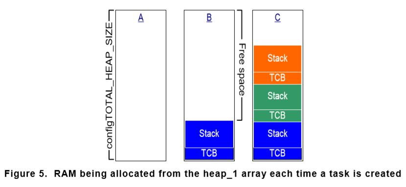

Heap_4.c相当于Heap_2.c的增强版，在设计中推荐使用前者，保留后者是为了向下兼容。相比于Heap_1.c，Heap_2.c中允许释放内存。Heap_2.c不能像Heap_4.c可以把相邻的小内存块合并成大内存块，因此会产生内存碎片，不过它适用于重复创建删除占用相同内存大小任务的应用中。

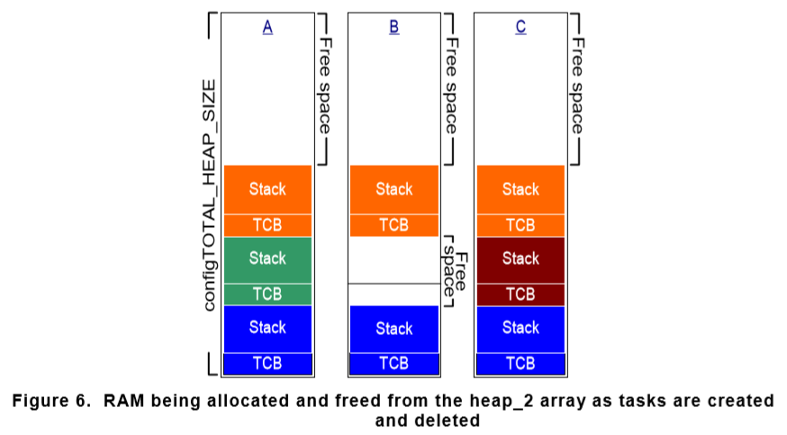

Heap_3.c使用标准库中的malloc() & free()函数，因此堆内存的大小由连接器配置决定，不受configTOTAL_HEAP_SIZE设置的影响。Heap_3.c通过暂时挂起FreeRTOS调度器保证malloc() & free()函数thread-safe。

Heap_4.c同Heap_1.c和Heap_2.c一样将内存分为小块，且被静态分配。如前所述，Heap_4.c可以将临近的内存合并到一起，因此它适用于任务被重复创建和删除的应用，任务所占内存大小可不相同。

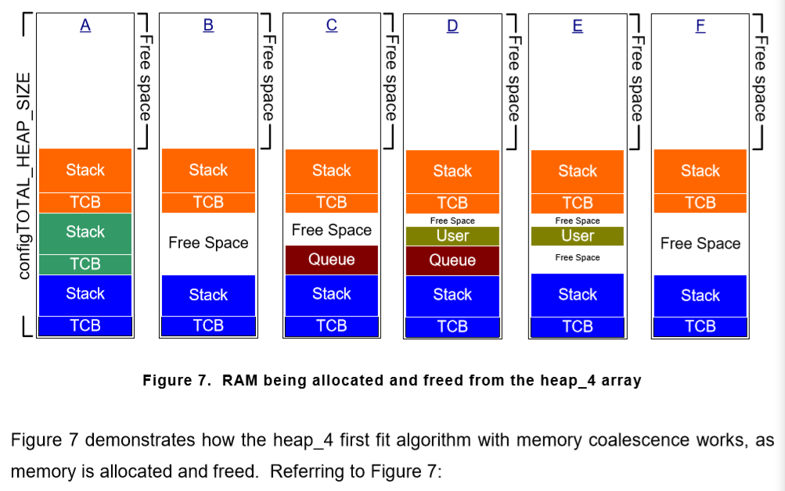

Heap_5.c中使用的内存分配与释放算法与Heap_4.c相同，但它不局限于分配单个静态声明的内存区域，它可以从多块分离的内存空间中分配内存。当FreeRTOS运行在系统内存映射不是一个连续的内存块是，它是相当有用的。

（只有）在使用Heap_5.c内提供的pvPortMalloc()函数时，必须提前明确地使用vPortDefineHeapRegions()函数初始化所使用的内存分配方案。在创建任何的内核对象（任务，队列，信号量等）之前必须先调用vPortDefineRegions()，该函数用来指定每一个内存块的开始地址和其大小，所有的内存块供Heap_5.c使用。（更详尽的说明尽在内核手册）

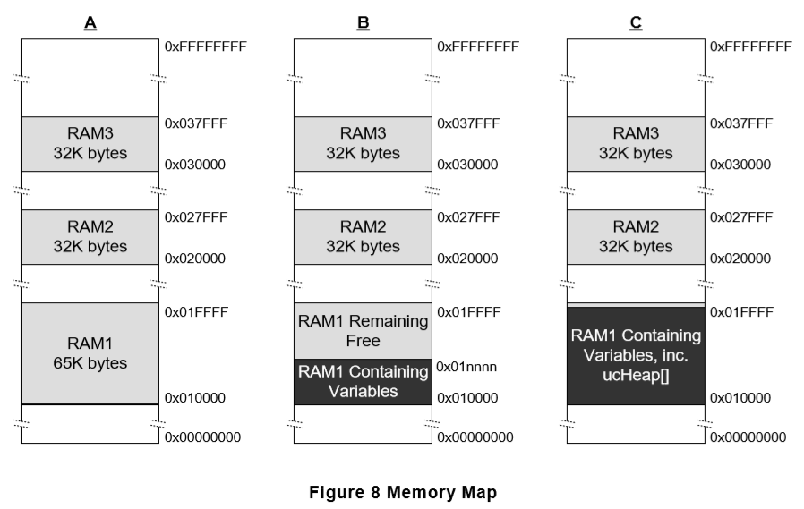

### 3 任务管理

**任务**用普通的C函数实现，唯一特殊的是他们的函数原型，必须返回void，必须给分空指针void *。例如下面：

```
void ATaskFunction(void *pvParameters);
```

**每个任务本身都是一个小程序，它有一个入口点，通常会一直运行在死循环中，并永远不会退出。**FreeRTOS任务绝不允许从它的实现函数中以任何方式退出，不能包含return语句，不允许在函数结束时运行。如果任务不再需要了，可以删除它。下图为创建任务的例子。

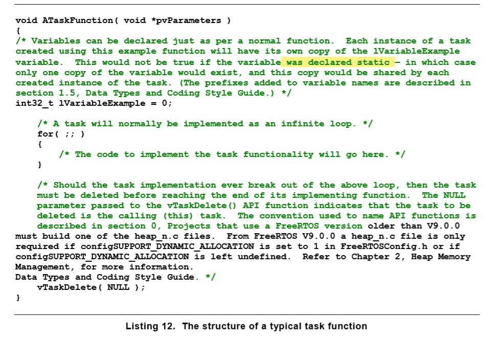

#### 3.1 任务状态（Task States）

一个应用程序可以由许多任务组成。单核处理器运行应用程序时在任一时刻只有一个任务可以执行。这意味着任务可以有运行（Running）和非运行（Not Running）两个状态。

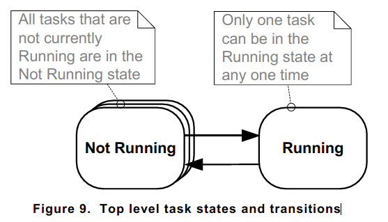

任务从非运行态转化到运行态时称为"switched in"或者"swapped in"。相反的，任务宠运行态转化到非运行态称为"switched out"或"swapped out"。**FreeRTOS scheduler（调度器）是唯一可以转换任务状态的实体**。

#### 3.2 创建任务

**xTaskCreate()函数**

xTaskCreate()函数用于创建任务（此函数可能是最复杂的API Functions），在FreeRTOS V9.0.0中还包含xTaskCreateStatic()函数，该函数在编译时为任务的创建静态分配内存。xTaskCreate()函数原型如下图所示：

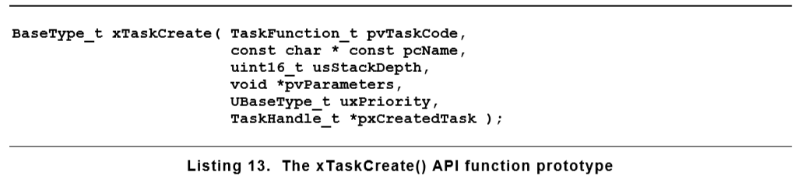

**参数**

**pvTaskCode**：任务是简单的C函数，通常实现为一个死循环。pvTaskCode参数为指向该任务的指针（实际上，就是任务的函数名）。

**pcName**：任务的一个描述。在FreeRTOS中不会用到它，他的存在纯粹是为了debugging目的。通过一个可读的名字识别任务相对于通过任务句柄识别的有点是显而易见的。configMAX_TASK_NAME_LEN定义了该名字可以占用的最大长度（包含结束符），如果超过最大值，会被切掉。

**usStackDepth**：任务创建时，内核会为每一个任务都分配一个属于该任务唯一的栈，usStackDepth参数告诉内核该任务需要的栈大小，单位是字words。常量configMINIMAL_STACK_SIZE规定了空闲任务使用的栈大小，该常量也是所有任务栈大小的最小值。

**pvParameters**：任务接受一个指向void的指针。pvParameters的值就是传入任务的值。

**uxPriority**：任务执行的优先级，优先级可以设置为最低的0到最高优先级（configMAX_PRIORITIES - 1），常量configMAX_PRIORITIES由用户定义。如果给定的优先级数值大于（configMAX_PRIORITIES - 1），则会将其优先级设置为最大优先级。

**pxCreatedTask**：pxCreatedTask参数用作当前创建任务的句柄。该句柄可以用来改变该任务的优先级，或删除该任务。如果你的应用程序中用不上该句柄，可将其设置为NULL。

**返回值**

返回值可能是**pdPASS**，表示任务创建成功，也可能是**pdFAIL**，表示任务创建失败，原因是内存不足。

#### 3.3 任务优先级 Task Priorities（重点）

在调度器启动之后，可以通过vTaskPrioritySet()函数改变创建任务时给定的初始任务优先级。任务优先级的最大值configMAX_PRIORITIES在FreeRTOSConfig.h文件中定义，编译时配置为常量。数字越小优先级越低，0代表最低优先级。多个任务可以有相同的优先级，确保设计的灵活性最大。

**FreeRTOS调度器可以使用以下两种方法中的一种来决定哪一个任务处于运行态。configMAX_PRIORITIES的取值由使用的决策方法决定。（可以理解为切换任务的代码？）**

**通用方法**

通用方法用C代码实现，可以被FreeRTOS的所有架构端口使用。通用方法对configMAX_PRIORITIES的最大取值没有限制，但强烈推荐其取值够用就好，过大的优先级会浪费RAM，最坏情况下的执行时间也会加长。

当FreeRTOSConfig.h文件中configUSE_PORT_OPTIMISED_TASK_SELECTION被设置为0或未定义（undefined）时，使用通用方法。另外如果FreeRTOS port只提供该方法，则只能用它。

**结构优化方法**

结构优化方法使用一小段汇编语言，比通用方法更快。configMAX_PRIORITIES的设置不影响最坏情况下的执行时间。但使用结构优化方法时，改值的大小不能超过32。同样也强烈建议够用就好，过大，依然或浪费RAM。

当FreeRTOSConfig.h文件中configUSE_PORT_OPTIMISED_TASK_SELECTION设置为1时，将会使用该方法，不是所有的FreeRTOS ports都提供一个结构优化方法。

FreeRTOS调度器会确保当前可运行的任务中任务优先级最高的进入运行状态，如果由多个任务处于最高优先级，则调度器将轮流运行它们。

#### 3.4 时间度量 & Tick中断（重点，调度器什么时候调度）

在后面的调度算法章节中将会讲述被称为时间片的可选特征。到目前位置，前面的例子（在书中，我没摘抄下来）中都使用的时时间片，从他们的输出中可以观察到时间片的使用。在例子中，两个任务创建时拥有相同的优先级，都可以运行。因此，每个任务运行一个时间片的时间，在时间片开始时进入运行态，在时间片结束时退出运行态。在下图中，t1到t2之间的时间长度为一个时间片。

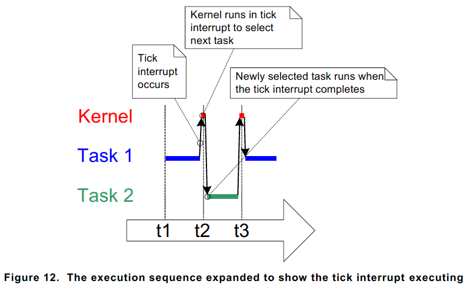

**为了能够选择下一个要执行的任务，调度器本身必须在每个时间片结束时运行。被称为tick interrupt的周期中断，就是为了此目的。**时间片的长度由tick终端频率决定，该常量configTICK_RATE_HZ的值在FreeRTOSConfig.h文件中定义，编译时配置完成。举个栗子，如果**configTICK_RATE_HZ**设置为100，则时间片的长度为10毫秒。两次tick中断之间的长度称为tick周期，其就等于一个时间片的长度。

**注意**：**调度器选择新任务的执行，不只是在时间片结束时，在当前任务处于阻塞状态或者当发生中断并移动一个更高优先级的任务进入就绪态时，调度器会立即选择一个新的任务去执行。**

configTICK_RATE_HZ的值取决于你设计的应用程序，一般取值为100。

调用FreeRTOS应用程序接口时指定的时间总是滴答周期的倍数，该时间经常被叫做“ticks”。pdMS_TO_TICKS()宏可以将以毫秒为单位的时间转换为ticks周期数。转换的精度取决于定义的滴答频率configTICK_RATE_HZ，当滴答频率大于1000时该宏不能被使用。使用该宏指定时间的优点是，当tick频率改变时指定的时间仍然是xx毫秒。

#### 3.5 详述S非运行状态

之前例子（在手册中，未摘抄）中，任务不需要等待什么东西，因此它将经常可以进如运行态，但实际上这种连续性任务是没多大用处的，这种任务的运行会阻碍比它优先级低的任务进入运行态。

为了使任务发挥更大的用处，必须重新编写它们使之成为事件驱动（event-driven）。事件驱动任务只有在触发该任务的事件发生时才会被执行，在其他情况下不会进入运行态。调度器经常选择能够被执行的任务中优先级最高的那个任务。

##### 3.5.1 阻塞状态（Blocked StateS）

任务在等待事件发生被称作阻塞态。任务进入阻塞态可能是等待以下两个事件的发生。

1. 时间（相关）事件--事件可能是延时到期或者到了一个绝对时间。例如，任务可能因为等待10ms延时到期而进入阻塞状态。
2. 同步事件--事件由其他任务或中断引起。例如，任务可能因到等待到达某个队列的数据而进入阻塞状态。

FreeRTOS queue, binary semaphores, counting semaphores, mutexes, recurisive mutexes（递归互斥量）, event group and **direct to task notifications**都可以被用来创建同步事件。

任务也有可能被一个带有延时到期的同步事件阻塞，即同时被两种类型的事件阻塞。例如，任务可能选择等待数据到达一个队列的最大时间为10ms。如果数据在10ms内到达或者超过10ms后没有到达，任务都将离开阻塞状态。

##### 3.5.2 挂起状态（Suspended State）

处于挂起状态的任务将不能被调度器调度。进入挂起状态的唯一方法就是通过调用vTaskSuspend()应用函数，退出挂起状态的唯一方法就是通过调用vTaskResume() 或vTaskResumeFromISR()应用函数。大部分的应用不使用挂起状态。

##### 3.5.3 就绪状态（Ready State）

不在运行态且不在阻塞态且不在挂起态，那就是在就绪态。它们具备了被执行（运行）的能力，时刻准备着去运行。

##### 3.5.4 完整的状态转换图示


更优秀的例子在内核使用手册中。

**vTaskDelay()函数**

在之前的例子中使用的延时手段会占用处理器的运行时间，在延时这段时间内其实任务没有需要做的工作，这浪会费资源，因此使用**vTaskDelay()**函数来进行延时，并使得调用延时的任务进入阻塞状态，把处理器暂时让出来供其他任务使用。在FreeRTOSConfig.h文件中设置**INCLUDE_vTaskDelay**设置为1时，vTaskDelay()函数才能够被调用。其函数原型如下图所示：


**参数**

xTicksToDelay：调用该延时函数的任务从阻塞态转换为就绪态所持续的滴答中断的数量。例如，一个任务调用函数vTaskDelay( 100 )时滴答计数的值为10000，此时该任务立即进入阻塞态，一直持续到滴答计数增长到10100时。宏pdMS_TO_TICKS()可以用来将以毫秒为单位的时间值转换为相应的滴答中断（周期）数。下图为一个任务函数：

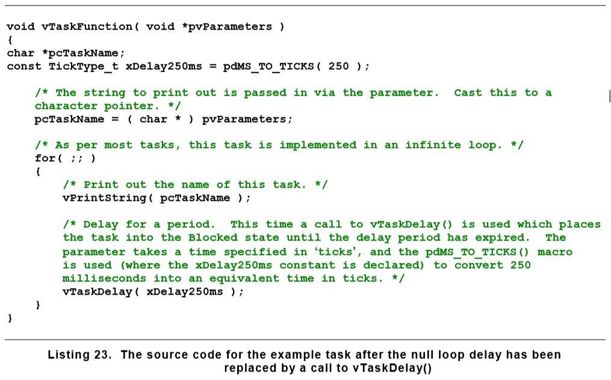

当调度器被调用时，为了保证在任一时刻至少有一个任务可以运行（或者说在就绪状态），空闲任务（idle task）自动被创建。

**vTaskDelayUntil()函数**

vTaskDelayUnitl()的参数指定了精确的滴答计数值，在达到该计数值时，调用vTaskDelayUntil()函数的任务应从阻塞态转为就绪态。vTaskDelayUntil()函数用于有固定执行周期的需求任务（当你想要你的任务以一个固定的频率，周期性的执行），因为调用任务被解除阻塞的时间是绝对的，而不是相对于函数被调用的时间。其函数原型如下图所示：

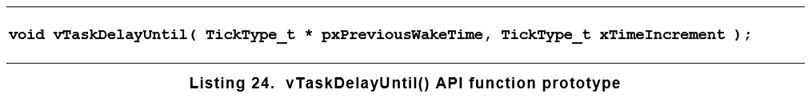

**参数**

pxPreviousWakeTime：该参数的命名建立在vTaskDelayUntil()函数被用于一个以固定频率，周期性地执行任务的假设上。在该假设下，pxPreviousWakeTime参数值为该任务上一次退出阻塞状态（被唤醒）的时刻，该值用作计算下一次该任务退出阻塞状态时刻的参考点。pxPreviousWakeTime参数的值在vTaskDelayUntil()函数中自动更新，该参数的值在首次使用该参数时用当前的滴答计数值初始化后，一般不会被应用代码修改。

xTimeIncrement：该名字的又来同上假设，任务的固定频率由该参数的值所设置。单位为ticks，同样宏pdMS_TO_TICKS()可以将以毫秒为单位的时间转换为tick数量。

***********************************************************************************************************************************************************************************************

下图为结合了周期性任务和连续性任务的示例执行时序图，下图中的例子在手册中。

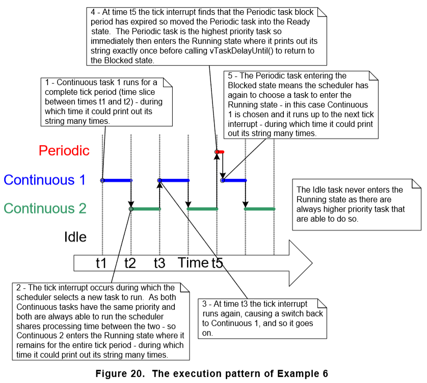

#### 3.6 空闲任务 & 空闲任务钩子（The Idle Task & the Idle Task Hook）

##### 3.6.1 空闲任务

空闲任务的优先级应尽可能低（0优先级），保证不能影响其他高优先级任务进入运行态。如果你非要创建一个任务优先级域空闲任务相同的应用任务，则FreeRTOSconfig.h文件中定义的静态常量（compile time configuration constant）configIDLE_SHOULD_YIELD可以用于防止空闲任务消耗处理器时间，保证分配CPU给应用任务。

以最低优先级运行可以确保当高优先级任务进入就绪态时，空闲任务就会从运行状态转移出去。当高优先级的任务退出阻塞状态时，空闲任务立即退出运行以保证高优先级的任务被执行。这被称作**高优先级抢占了空闲任务**。**抢占自动发生，并且它不知道抢占了谁**。

注意：如果在程序中使用了vTaskDelete()函数，那么必须确保空闲任务可以进入运行态。这是因为空闲任务要在任务被删除之后清理内核资源。

##### 3.6.2 空闲任务钩子函数

可以通过使用空闲钩子（或空闲回调）函数将特定于应用程序的功能直接添加到空闲任务中，空闲钩子函数会在空闲任务的每一个循环自动调用一次。（将功能添加到空闲钩子函数中，空闲钩子函数会在空闲任务的每一循环自动调用一次）

**空闲任务钩子的常见用途包括：**

- 执行低优先级、后台或连续处理功能。

- 度量空闲处理能力数量。

- 使处理器进入低功耗模式，每当应用不需要工作的时候，提供一个简单的自动节能方法，尽管该方法的效果远低于使用tick-less空闲模式的节能效果。

**使用空闲任务钩子函数的条件：**

空闲任务钩子函数必须遵从以下规则

- 空闲任务钩子函数绝不能试图阻塞或者挂起。阻塞空闲任务可能会造成没有能够进入运行态的任务。
- 如果应用程序使用了vTaskDelete()函数，那么空闲任务钩子必须在一个合理的时间内返回到它的调用者（空闲函数吗）。如果空闲任务永久的在钩子函数里，当有任务被删除时，那它就不能清理内核资源了。

下图为空闲钩子函数的一个实例：

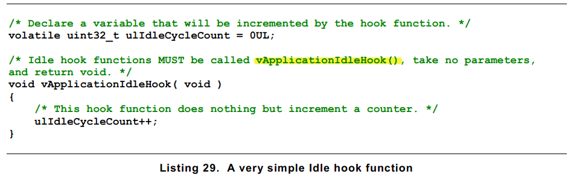

空闲钩子函数必须以vApplicationIdleHook()命名，且没有参数，也返回空void。**自动被调用。**

必须将FreeRTOSconfig,h头文件中的configUSE_IDLE_HOOK设置为1才能调用空闲钩子函数。

#### 3.7 修改任务优先级

在调度器开始调度之后，vTaskPrioritySet()函数可以修改任意任务的优先级。不过要使用vTaskPrioritySet()函数必须在FreeRTOSconfig.h头文件中将INCLUDE_vTaskPrioritySet设置为1。其函数原型如下图所示：

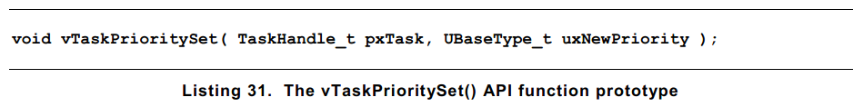

**参数**

pxTask：将要被修改优先级的任务句柄。任务可以通过想改参数传递NULL来修改自己的优先级。

uxNewPriority：任务的新优先级。

uxTaskPriorityGet()函数可以用来询问任务的优先级。要使用该函数，需在FreeRTOSconfig.h头文件中将INCLUDE_uxTaskPriorityGet设置为1。其函数原型如下图所示：

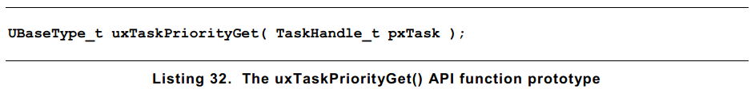

**参数**

pxTask：被询问优先级的任务句柄。任务可以通过NULL作为该参数值询问自己的优先级。

**返回值**

询问时该任务的优先级。

#### 3.8 删除任务

任务可以使用vTaskDelete()函数删除自己，也可以被其他函数删除。只有在FreeRTOSconfig.h头文件中将INCLUDE_vTaskDelete设置为1时，该函数才能被调用。

删除不再存在及不能再进入运行态的任务。当任务被删除之后，释放分配给该任务的内存是idle task的工作。因此，应用程序在任何情况下使用vTaskDelete()函数删除任务时，不能完全starve空闲任务是非常重要的。

**注意：****当任务被删除时，只有内核自己分配给任务的内存会被自动释放。任务自己申请的任何内存或资源需被显式的释放。**就是你在程序中自己申请的变量，需要自己显式地释放。

vTaskDelete()函数的原型如下图所示：

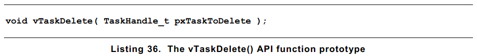

**参数**

pxTaskToDelete：要被删除的函数句柄。任务可以通过输入NULL作为该参数值删除自己。

例子在手册中，下图是例子的执行时序图。

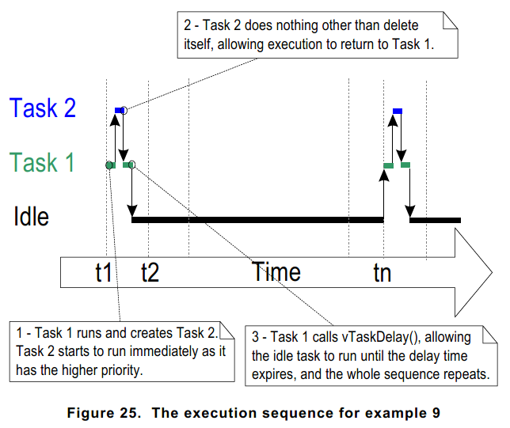

#### 3.9 线程本地存储（Thread Local Storage）

这一节内容在最终版本中将会讲述。

wocao!看到现在这个发现手册竟然不是最终版本。

算了，继续看吧！

#### 3.10 调度算法（重要）

##### 3.10.1 调度器总是选择就绪态中优先级最高的任务进入运行态。

任务在阻塞态等待事件，当事件发生后自动转入就绪态。事件有时间事件和同步事件。

**Temporal events**：发生在特定的时间，例如，延时到期，通常用于实现周期或超时的行为。

**Synchronization events**：发生在当任务或者中断服务程序发送信息时，信息的发送可以使用任务通知、队列、事件组或者某种类型的信号量。它们经常被用来表示异步行为，例如数据到达某一外设。

##### 3.10.2 配置调度算法

调度算法时用于决定哪一个就绪态的任务进入运行态的软件程序。

调度算法可以在FreeRTOSConfig.h头文件中通过配置**configUSE_PREEMPTION和configUSE_TIME_SLICING**两个常量选择所使用的调度算法。除了这两个关键常量外，configUSE_TICKLESS_IDLE也对调度算法有影响，当使用它时，可以使滴答中断完全关闭以达到扩展周期的效果。**configUSE_TICKLESS_IDLE**是一个高级选项，它可以用在必须有最小耗电的应用中。

##### 3.10.3 使用时间分片优化抢占机制

大多数的小型实时应用程序都采用被称作“Fixed Priority Pre-emptive Scheduling with Time Slicing”的调度算法。也就是配置上面那两个参数为1时系统所使用的调度算法。

Fixed Priority：所谓固定优先级，就是调度算法不改变被调度任务所分配的优先级，但也不阻止任务自己改变自己或者其它任务的优先级。

Pre-emptive：所谓抢占，就是当一个进入就绪态的任务的优先级比正在运行的任务优先级高，则会立即抢占运行态。被抢占的任务则自然切出运行态并进入就绪态以允许其他任务进入运行态。

Time Slicing：时间分片用来使相同优先级的任务共享运行时间，任务不会进入阻塞或者挂起态。调度器会在每个时间片结束时选择一个新的同优先级的就绪态任务进入运行态，一个时间片就是两个滴答中断之间的时间长度。

调度机制可以参看下面两个图：

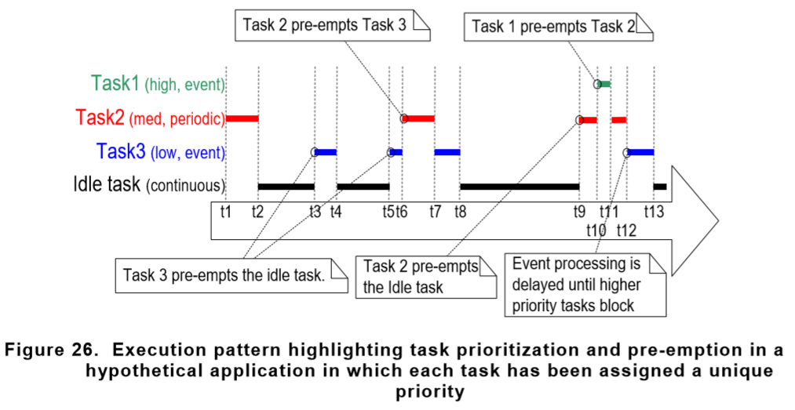

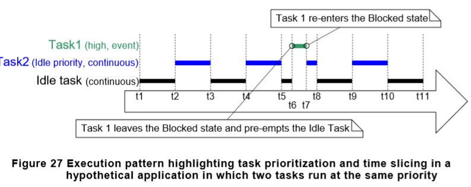

有关上图详细的解释，尽在手册中。

图27中的情形是不太合适的，因为分配给空闲任务的运行时间太多了，因此可以利用钱买你提到的可选的高级选项configIDLE_SHOULD_YIELD来优化系统的调度算法。当该常量设置为0是，既是图27所示，配置为1时，则如下图28所示：

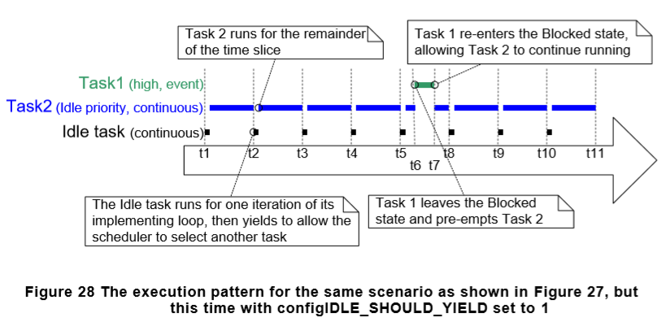

当配置为1时，如果有同空闲任务优先级的任务进入就绪态时，空闲任务将自动的在其循环的每次迭代中退出运行态，不管它的时间片还剩下多少。（**空闲任务会执行一个循环**）

从图中也可以看出，任务2的执行时间不等于整个时间片，而是空闲任务退出运行态时剩余的的时间段。

##### 3.10.4 优先级抢占调度（无时间片）

与前面看过的带时间片的调度算法相比，无时间片是不能在相同优先级的任务之间共享处理时间的。当然，需要在FreeRTOSconfig.h头文件中将configUSE_TIME_SILCING设置为0。

滴答中断的发生预示了一个时间片的结束。不使用时间片时调度器只有在以下两种情况下才会选择一个新任务进入运行态。

- 一个更高优先级的任务进入就绪态。

- 运行态的任务进入阻塞态或者被挂起。

不使用时间片轮调，会少产生很多上下文切换。因此，也降低了调度器的处理开支。但，如下图所示，不使用时间片轮调会造成分配给具有相同优先级任务的运行时间相差很大。所以，不建议你使用这种算法，除非你是很有经验的开发者。

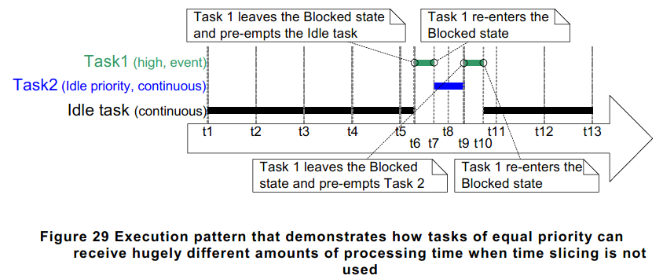

##### 3.10.5 协作调度（Co-operative Scheduling）

FreeRTOS也提供了协作调度机制，要使用该调度机制只需在FreeRTOSconfig.h头文件中设置configUSE_PREEMPTION为0，configUSE_TIME_SLICING为任意值。

当使用协作调度算法时，任务的上下文切换将只发生在运行态任务进入阻塞态或者处于运行态的任务通过调用taskYIELD()函数被显示地挂起（手动请求调度器重新调度）时。其他任何情况下，任务不会被抢占，时间片调度机制也不会被使用。下图展示了该调度算法的行为。

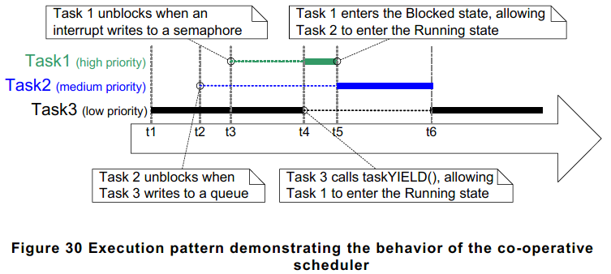

在多任务应用中，程序开发者应格外小心同一个资源不能同时被多个任务同时使用，例如两个任务都向一个串口写入数据，任务1写入“abcdefghijklmnop”，任务2写入“123456789”：

1. 任务1处于运行态，向串口输入“abcdefg”之后，离开运行态进入阻塞态，此时数据没写完。

2. 任务2紧接着进入运行态，并在离开运行态时写入“123456789“到串口。

3. 任务1重新进入运行态并继续写入之前未写完的字符。

在以上的情形中其实向串口写入的字符串是”abcdefg123456789hijklmnop“，这通常不是我们想要的结果。

自然的，使用协作调度时可以避免这种情况的发生。因此在以上例子这类情况发生时，使用该机制要比使用抢占式调度机制更好。

### 4 队列管理

队列（Queues）提供了一个任务到任务、任务到中断、中断到任务的通信机制。

#### 4.1 存储数据（Data Storage）

队列可以保存有限的保存**固定大小**的数据项。队列可以保存的最大数据项数量成为它的长度。长度和每个数据项的大小可以在队列创建时设定。

Queues经常被用作先进先出（First In First Out）缓存，使用时数据写入到队列的末尾，读出时从头部开始读取。下图既是一个FIFO队列的示意图，向队列的头部写入数据也是有可能的，此时会将原来处于队列头部的数据覆盖掉。

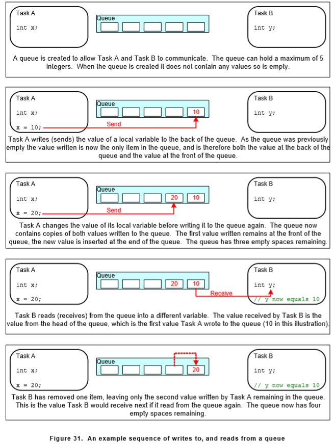

有以下两种方法可以实现队列行为：

1. 通过拷贝：通过拷贝意思是数据是通过按字节拷贝的方式发送到队列。
2. 通过引用：只是发送指向数据的指针进入队列，而并不是数据本身。

为简单，FreeRTOS使用拷贝的方式实现。其优点有以下几点：

- 堆栈变量可以直接发送到一个队列上，尽管堆栈变量在声明它的函数退出之后它也会不存在，但是，队列里有拷贝。
- 数据可以直接发送到队列，无需先分配缓存保存该变量。
- 发送数据的任务可以立即重新使用发送到队列的变量或者缓冲区。
- 完全解耦发送任务和接受任务，应用程序开发着不需要考虑哪个任务“拥有”数据，或者哪个任务负责发送数据。
- 拷贝型队列也可以使用引用，当剩余的空间不足以容纳需要拷贝的数据时，可以将该数据的引用（指针）拷贝到队列。
- RTOS负责分配数据所使用的内存。
- 在内存有保护的系统中，任务存取保存在RAM上的数据时将会有限制。只有在发送任务和接收任务同时有数据所存储区域的使用权时才可以使用引用型队列。拷贝型队列则没有以上的限制，内核经常有运行的完全特权，允许使用队列跨内存保护边界传送数据。

**可以被多个任务存取**

队列是具有自身权限的对象，任何任务或者中断服务程序都可以访问它们。任何数量的任务都可以向同一个队列写数据，任意数量的任务也可以从队列中读取数据。但实际上，大部分情况是有多个任务写入，很少由多个任务从同一个队列中读取数据。

**阻塞读取队列的任务**

当任务要从队列读取数据时，任务可以选择一个指定的阻塞（等待）时间。如果队列已经是空的，则该任务将保持在阻塞状态以等待从队列中可获得的数据。一个任务等待队列中的数据而进入阻塞态时，当有其他的任务或者中断向队列写入数据后，之前阻塞的任务会自动的进入就绪态。另外，当指定的时间到期而数据还不能够获取时，也将自动从阻塞态进入就绪态。

可以有多个任务读取同一个队列，因此可能会有多个任务因等待同一队列中的数据而处于阻塞状态。在这种情况下，当队列中有数据可读时只有一个任务可以退出阻塞态。退出阻塞态的任务当然是所有因此被阻塞的任务中优先级最高的那个。如果优先级是一样的，则等待时间最长的那个退出阻塞态。

**阻塞写入队列的任务**

同上面一样，当队列中没有空间可以写入时，任务会进入阻塞态一段时间，等待队列有可写入的空间。这种情况下队列空间已经占用完。

多个任务可以写入同一个队列，因此可能有多个要完成发送操作的任务被一个空间被占满的队列阻塞。在这种情况下，当队列中有内存空间供写入时，等待写入的任务中优先级最高的那一个将退出阻塞态。如果优先级一样，等待时间最长的则退出阻塞态。

**被多个队列阻塞**

多个队列可以组成集合，在等待集合中的任一队列变成可获取时，允许任务进入阻塞态。

#### 4.2 使用队列

##### 4.2.1 xQueueCreate()函数

一个队列在使用之前，你必须先创建它。

队列可以通过队列句柄被使用，队列句柄的变量类型是QueueHandle_t。xQueueCreate()函数可以创建一个队列并返回一个QueueHandle_t类型的句柄，以引用刚才创建的队列。FreeRTOS V9.0.0之后的版本增加了**xQueueCreateStatic()**函数，允许在编译时静态地分配队列所需的内存。当队列被创建时，FreeRTOS分配从FreeRTOS堆内存中分配RAM给队列。分配的内存用来存储队列中包含的结构或者数据项。如果FreeRTOS中没有足够的内存分配给队列时，**xQueueCreate()**函数将返回NULL。其函数原型如下图所示：

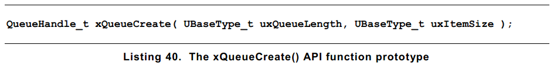

**参数**

uxQueueLength：被创建的队列包含的数据项最大值。

uxItemSize：被创建的队列中每个数据项可以存储的字节数。

**返回值**

NULL：如果返回NULL，则表示没有足够的内存满足创建队列所需要的数据结构和存储区域的堆内存大小。

non-NULL：返回一个非空值表示创建队列成功。返回值应保存为该队列的句柄。

在队列被创建以后，可以调用**xQueueReset()**函数使队列返回刚被创建时的空状态。

##### 4.2.2 xQueueSendToBack() & xQueueSendToFront()

从名字中可以看出，xQueueSendToBack()用来将数据反送到队列的最后（末尾）处，xQueueSendToFront()用来将数据发送到队列大头部。

**xQueueSend()相当于xQueueSendToBack()。**

**注意**：千万不要在中断服务程序中调用xQueueSendToBack()和xQueueSendToFront()函数。更安全的做法是使用xQueueSendToBackFromISR()和xQueueSendToFrontFromISR()，将在第六章讲述。

函数原型如下所示：

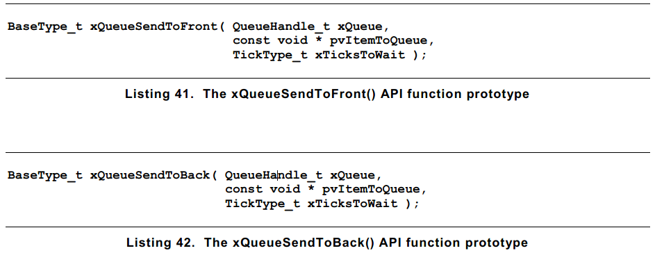

**参数**

xQueue：别写入数据的队列的句柄。该句柄是调用xQueueCreate()函数创建队列时的返回值。

pvItemToQueue：指向要写入队列的数据的指针。队列能够存储的数据项的大小在其创建时已经给定，所以会有很多字节的数据从pvItemToQueue指向的数据拷贝到队列的存储区域。

**xTicksToWait**：如果队列已经存满，需要等待队列可以被访问造成任务被阻塞，该值表示任务被阻塞时要持续的最长时间。如果该值设置为0，当队列满的时候，写入函数会立即返回。**如果设置该值为portMAX_DELAY，则在队列满的时候，任务（函数）可能会一直等待（不退出）**，这种方式需要在FreeRTOSconfig.h头文件中将INCLUDE_vTaskSuspend设置为1。

**返回值**

有以下两种可能的返回值。

pdPASS：只有当数据成功发送到队列时才会返回pdPASS。

errQUEUE_FULL：当队列已满，数据不能被写入队列时返回errQUEUE_FULL。

##### 4.2.3 xQueueReceive()函数

xQueueReceive()函数用来从队列中接收（读取）一个数据项。读取之后该数据项将在队列中删除。其函数原型如下图所示。

注意：绝不能从中断服务程序中调用xQueueReceive()函数。应选用安全的适用于中断的xQueueReceiveFromISR()函数。该函数将在第六章讲述。

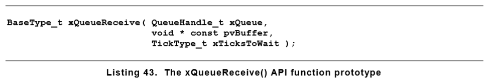

**参数**

xQueue：将要被读取数据的队列的句柄。该句柄是调用xQueueCreate()创建队列时返回值。

pvBuffer：一个指向内存的指针，接收到的数据将被复制到其中。队列中每个数据的项大小在其被创建时设定。该指针指向的内存大小必须足够大以容纳读取的数据项。

xTicksToWait：当队列中没有数据可读时，该值指定了任务等待队列从空状态到可读取状态的最大事件，在这段事件内任务将处于阻塞态。

如果将该值设置为0，那么当队列为空时，xQueueReceive()函数将立即返回。

如果该值设置为portMAX_DELAY，那么当队列一直为空时，将会使任务一直等待下去，使用该功能需要在FreeRTOS.h头文件中将INCLUDE_vTaskSuspend设置为1。

**返回值**

pdPASS：如果数据在指定的时间内（xTicksToWait）成功的从队列中读出，将会返回pdPASS。

errQUEUE_EMPTY：如果在指定的时间内（xTicksToWait）不能从队列中读出数据（队列一直为空）。则返回errQUEUE_EMPTY。

##### 4.2.4 uxQueueMessagesWaiting()

uxQueueMessagesWaiting()函数用来询问（查询）一个队列当前存储的数据项数目。其函数原型如下图所示：

**注意**：在中断服务程序中调用uxQueueMessagesWaitingFromISR()函数，绝不能调用uxQueueMessagesWaiting()函数。

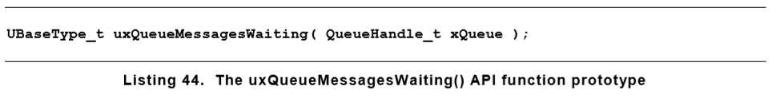

**参数**

xQueue：被查询队列的句柄。该句柄为创建该队列时，xQueueCreate()函数的返回值。

**返回指**

** ：被查询的队列当前存储的数据项数量，如果队列为空，则返回0。

#### 4.3 从多个源头接收数据

FreeRTOS开发者普遍会使一个任务从多个源头接收数据。接收数据的任务需要知道它接收的数据来自哪里？并以此判断如何处理该数据。一个简单的解决办法是使用一个队列传输一个同时包含数据值和其来源的结构体。该方法如下图所示：


从图中可以看出：

- 创建的队列Queue保存的数据项为结构体Data_t。该结构体的成员一是数据本身的值，另一个是枚举类型的变量，在一条消息中指示要发送到队列的数据的含义。

- 中央控制器任务用于执行系统的主要功能。它必须对队列中传递给它的系统状态的输入和更改做出反应。

- CAN总线任务用来封装CAN总线接口功能。当CAN总线任务接收并解码一条信息，它将已经解码的消息以Data_t结构发送给控制器任务。传输的结构体中eDaTaID用于让控制器任务知道该数据是什么类型，在上图中表示电机的转速，结构体中IDataValue用来让控制器任务知道电机的真实转速值。

- 人机交互（HMI）任务用来封装所有的人机交互接口功能。机器操作员也许会以多种方式输入命令和查询值，必须在HMI任务中检测和解释这些命令和值。当输入一个新命令时，人机交互任务会以Data_t结构发送给控制器任务一个命令。eDataID用于告知控制器任务数据的含义，在上图中代表该消息是”设置新的指针值“，IDataValue为实际要设置的指针值。

#### 4.4 处理大尺寸或可变大小的数据

##### 4.4.1 队列指针

如果队列中要存储的数据很大，你最好使用队列来传输指向数据的指针而不是真实的数据。使用指针在数据处理时间和创建队列所需的RAM空间上更加高效。不过，当传输指针时，需要格外注意以下几点：

1. **指针所指向的数据是被明确定义过的**

当有多个任务通过指针共享同一内存时，必须确保不能有多个任务同时修改该内存中保存的内容，或执行一些导致该内存中数据无效或者前后不一致的操作。理想的情况下是，只有发送任务被允许访问该指针指向的内存，直到该内存中的数据进入队列，同样只有接受任务被允许访问该指针指向的内存在该内存被送入队列之后。

2. **指针所指向的RAM内存仍然有效**

如果指针指向的内存是动态分配的，或者是从预分配的缓存区池中获取的，那么指定有一个任务释放掉该内寸。当内存被释放掉之后，所有的任务都不允许访问该内存。

绝不能将指针指向分配给一个任务的堆栈。因为堆栈变化之后，数据将会变为无效。

使用手册中有列子，很哇塞！

##### 4.4.2 使用队列发送不同类型和长度的数据

先前的例子中给出了两个非常有用的队列使用模式，发送结构体到队列、发送指针到队列。结合这两种模式可以使队列接受任意的数据类型以及任意的数据源。FreeRTOS+TCP TCP/IP栈提供了一个实用的列子，展示了如何结合两种模式的使用方法。

更多详细例子尽在内核手册，一定要去查看:key:.

#### 4.5 从多个队列中获取数据

##### 4.5.1 队列集合（Queue Sets）

应用开发者经常需要一个单独的任务去接收不同大小的数据，及不同含义的数据，当然这些数据来自不同的源头。之前的小节展示了使用一个单独的队列灵活而高效的接受结构类型的数据。然而，由于各种限制应用开发者的选择有限，使用不同的队列处理不同来源的数据是必须的。例如，集成到设计中的第三方代码可能会假定存在专用的队列。这种情况下就要使用队列集合（queue set）了

队列集允许任务从多个队列接收数据，而无需任务依次轮询每个队列以确定哪个队列（如果有的话）包含数据。

相比于单个队列，使用队列集合效率和灵活性都会降低，因此，在非必要的情况下建议使用单个队列传输数据。

下面将通过以下几点介绍队列集合的使用：

1. 创建队列集合
2. 添加队列到集合

信号量也可以添加到队列集合中，信号量将在后面的章节介绍。


3. 从队列集合中读取数据，以确定集合中那些队列包含数据。

当集合中的队列接收数据时，接收数据队列的句柄被发送到队列集合，在一个任务向该队列读取数据时返回该句柄。因此，如果一个队列的句柄从集合中返回，那么该句柄所在的队列包含数据，任务可以直接从队列中读取数据。

注意：除非队列集合中的队列句柄已经从队列集合中读取出，其他情况下不要从该队列读取数据。

**要使用队列集合需要在FreeRTOSconfig.h头文件中将configUSE_QUEUE_SETS设置为1.**

**xQUEUECreateSet()函数**

在使用队列集合之前必须明确地创建它。

利用句柄引用队列集合，句柄的数据类型为QueueSetHandle_t。xQueueCreateSet()函数创建一个队列集合并返回一个引用该集合的QueueSetHandle_t变量的句柄。其函数原型如下：


**参数**

uxEventQueueLength：该变量定义了创建的队列集合在任一时间可以保存的最大队列句柄数量。只有集合中的队列接收数据时，接收数据的队列句柄才会发送到队列集合。如果队列已满，则取法接受数据，因此如果队列集合中的所有队列都已满，则不能将队列句柄发送到队列集中。因此，队列集放在同一时间持有的最大项数是集合中每个队列长度的总和。

**返回值**

NULL：如果返回NULL，表示由于没有足够的堆内存分配给队列集合用于保存数据结构和存储区，创建队列集合失败。

A non-NULL：非NULL值，表示创建队列集合成功，返回的值应该被保存为该队列集合的句柄。

**xQueueAddToSet()函数**

xQueueAddToSet()函数用来添加队列或信号量到一个队列集合。其函数原型如下：

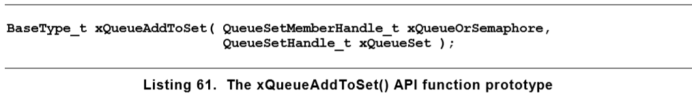

**参数**

xQueueOrSemaphore：要添加到队列集合中的队列或信号量的句柄。队列句柄和信号量句柄都可以被转换为QueueSetMemberHandle_t类型。

xQueueSet：队列或信号量将要被添加到的队列集合的句柄。

**返回值**

pdPASS：只有当队列或信号量成功添加到队列集合中时返回pdPASS。

pdFAIL：如果队列或信号量不能被添加到队列集合中，返回pdFAIL。队列和二进制信号量只有当它们是空的时候才可以添加到集合。计数信号量只有当它的计数为零时才可以被添加到集合中。队列和信号量一次只能是一个集合的成员。

**xQueueSelectFromSet()函数**

xQueueSelectFromSet()函数用于从队列集合中读出一个队列句柄。

当集合中的队列或者信号量接收数据时，接收数据的队列或者信号量的句柄将被发送到队列集合中，在任务调用xQueueSelectFromSet()函数时返回发送到集合中的句柄。如果调用xQueueSelectFromSet()函数返回了一个句柄，那么通过该句柄引用的队列或者信号量一定包含数据，任务可以直接利用该句柄读取队列或者信号量中的数据。其函数原型如下图所示：

注意：不要从集合中的队列或信号量中读取数据，除非队列或信号量的句柄已经从xQueueSelectFromSet()调用中返回。只有当句柄从xQueueSelectFromSet()函数中返回时才可以读取队列或者信号量。

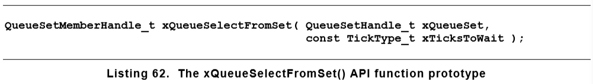

**参数**

xQueueSet：将要从中读取队列句柄或者信号量句柄的队列集合句柄。队列集合句柄会在调用xQueueCreateSet()函数创建队列集合时返回。

xTicksToWait：当队列集合为空时，任务因等待接收队列或信号量句柄而进入阻塞态的最大持续时间。如果xTicksToWait的值为0，那么当队列集合中的队列和信号量都为空时，xQueueSekectFromSet()函数会立即返回。

设置xTicksToWait的值为portMAX_DELAY会使任务一直等待，直到集合中有数据可读，要使用portMAX_DELAY需在FreeRTOSConfing.h头文件中将INCLUDE_vTaskSuspend的值设置为1。

**返回指**

Non-NULL：返回一个非空值，则该返回值将是包含数据的队列或者信号量的句柄。返回的句柄是一个QueueSetMemberHandle_t类型的数据，它可以被转换为QueueHandle_t类型或者SemaphoreHandle_t类型。

NULL：如果返回NULL，那么表示不能从队列集合中读取句柄。

#### 4.6 利用队列创建邮箱（长度为1的队列）

在嵌入式社区对于邮箱没有一个统一的说法，在不同的操作系统中邮箱“mailbox”有不同的意义。在FreeRTOS中邮箱被用来指长度为1的队列。一个队列被称作邮箱可能是因为它是在应用程序中使用，而不是因为它与队列在功能上有差异。（用的地方不一样，叫法就不一样。）

- 队列用来发送一个任务到另一个任务的数据，或者中断服务程序到任务的数据。发送者发送一个数据项到队列，接收者从队列中取出数据项。数据通过队列从发送者到接收者。
- 邮箱保存的数据可以被任何任务或中断服务程序读取。数据不通过邮箱传输，数据会一直在邮箱中，直到被重写。发送者重写邮箱中的数据值。接收者读取邮箱中的数据，并不会像读取队列那样读取之后将该项删除。

**xQueueOverwrite()函数**

类似于xQueueSendBack()函数，xQueueOverwrite()函数将数据发送到一个队列，与xQueueSendToBack()不同的是，如果要写入的队列已经满了的话，xQueueOverWrite()函数不会因此进入阻塞状态或者立即返回，它将会将数据重写入队列。

xQueueOverwrite()函数应只用在长度为1的队列中。这种限制避免了当队列已经满时，实现的功能要对队列中的哪一个数据项重写做出判断的需要。其函数原型如下图所示：

注意：在中断服务程序中一定要使用中断安全版本的xQueueOverwriteFromISR()函数，不能使用xQueueOverwrite()函数。

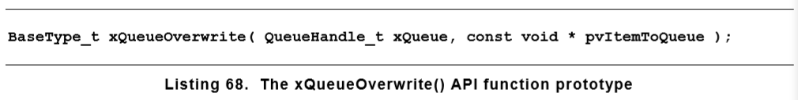

**参数**

xQueue：被写入或发送数据的队列句柄。该句柄在调用xQueueCreate()函数创建句柄时返回。

pvItemToQueue：将要写入队列的数据的指针。队列在创建时就已经设置好了它可以报存的数据项大小，所以指针所指的数据将会复制若干字节到队列的存储区。

**返回指**

pdPASS：就算队列已经满了，xQueueOverwrite()函数也能向队列写数据，该函数一定返回psPASS。

**xQueuePeek()函数**

xQueuePeek()函数用来从队列中接收（读取）数据项，并且读取之后数据项并不会被删除。xQueuePeek()函数从队列的头部接收数据，并不改变存储在队列中的数据，也不改变读出的数据在队列中的位置。其函数原型如下图所示：

注意：在中断服务程序中一定要使用xQueuePeekFromISR()函数，绝不能使用xQueuePeek()函数。

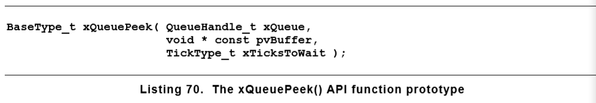

xQueuePeek()函数的参数与返回值与xQueueReceive()函数相同。

### 5 软件定时器

软件定时器被用来在将来的一个设定的时间安排一个函数的执行，或者以一个固定的频率周期性地执行函数。通过软件定时器调用执行的函数被称作软件定时器的回调函数。

软件定时器由内核控制，实施。软件定时器不需要硬件支持，与硬件定时器或者用剑计数器都没有关系。

需注意，秉承着FreeRTOS在保证最大效率的前提下使用新颖巧妙的设计的理念，软件定时器只有在其回调函数真正执行时才占用处理时间，其他情况下不会使用处理时间。

软件定时器的功能是可选的，如果你要使用它的话：

1. 将FreeRTOS源代码中FreeRTOS/Source/timers.c文件作为构建你的项目的一部分。
2. 在FreeRTOSConfig.h头文件中将configUSE_TIMERS设置为1。

在本章将学习到以下内容：

- 软件定时器与任务的各自特点及对比。
- RTOS演示任务。
- 定时器命令序列。
- 一次性软件定时器与周期性定时器的区别。
- 如何创建、开始、重置以及修改软件定时器的周期。

#### 5.1 软件定时器的回调函数（Software Timer Callback Functions）

软件定时器**回调函数**同样也是由C语言实现。唯一特别的是它的函数原型，**必须返回void**，并且**将该软件定时器的句柄作为其唯一的参数**。回调函数的原型如下所示：

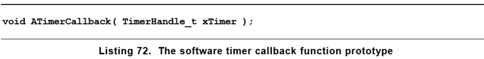

软件定时器回调函数从开始执行到结束，按正常的方式退出。回调函数应很小，并且绝不能进入阻塞状态。

注意：我们会看到，当FreeRTOS调度器开始运行后，任务中执行的软件定时器回调函数将被自动创建。因此，软件定时器回调函数是绝不能调用FreeRTOS的应用接口函数，因为这将会造成调用任务进入阻塞状态。当使用xQueueReceive()函数接收数据时，设置xTicksToWait参数为0时，该函数可以用在回调函数中。在回调函数中使用如vTaskDelay()函数时不行的，调用延时函数将会时调用任务经常进入阻塞态。

#### 5.2 软件定时器的属性和状态

##### 5.2.1 周期性软件定时器

软件定时器的周期是从定时器开始到其回调函数执行的这段时间。

##### 5.2.2 一次性定时器和自动重载定时器

**一次性定时器**

一经开始，一次性定时器将只执行其回调函数一次。一次性定时器可以被再次手动开始。它自己并不会从新开始。

**自动重载定时器**

一经开始，自动重载定时器将在它的定时耗尽之后将自动重新开始，这就表示了他的回调函数将被周期性地执行。

下图展示了one-shot timer和auto-reload timer之间行为的不同。途中竖直的虚线表示滴答中断的发生时刻。


##### 5.2.3 软件定时器状态

软件定时器的状态有以下几种：

**休眠状态（Dorman）**

休眠状态的定时器，可以使用它的句柄引用，但是它不在运行状态，因此它的回调函数不会被执行。

**运行状体（Running）**

当软件定时器进入运行状态或者被重置后，在它的定时周期结束后将会执行它的回调函数。

下面两个图分别展示了one-shot timer和auto-reload timer在休眠和运行两个状态之间转换的可能。两种定时器最关键的不同在于当定时器定时结束后进入的状态，one-shot timer将会执行回调函数之后进入休眠状态，而auto-reload timer将会在回调函数执行完毕之后重新进入运行态。

xTimerDelete()函数将删除一个定时器，定时器可在在任何时刻被删除。


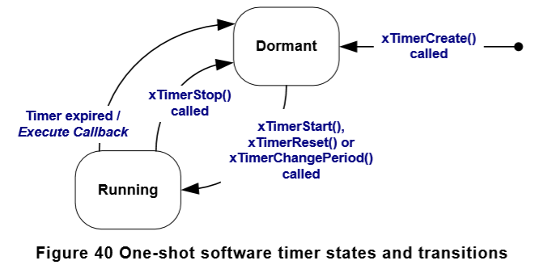

#### 5.3 软件定时器的上下文（context）

##### 5.3.1 RTOS守护进程（定时器服务任务）

所有的软件定时器回调函数都在一个相同的RTOS守护进程（定时器服务任务）上下文中执行。

守护进程任务是一个标准的FreeRTOS任务，它在调度器开始的时候被制动创建。守护进程任务的优先级和堆栈大小在编译时由configTIMER_TASK_PRIORITY和configTIMER_TASK_DEPTH两个常量分别设定。两个常量都在FreeRTOSConfig.h头文件中定义。

软件定时器回调函数绝不能调用FreeRTOS的应用程序接口函数，如果调用会造成使用软件定时器的任务进入阻塞状态，同样也可能会使守护进程任务进入阻塞状态。

##### 5.3.2 定时器命令队列

软件定时器应用程序接口函数从**调用任务（calling task）**发送命令到守护进程任务所使用的队列，被称为定时器命令队列。定时器命令队列如下图所示。命令包括开启定时器、停止定时器、重置定时器。

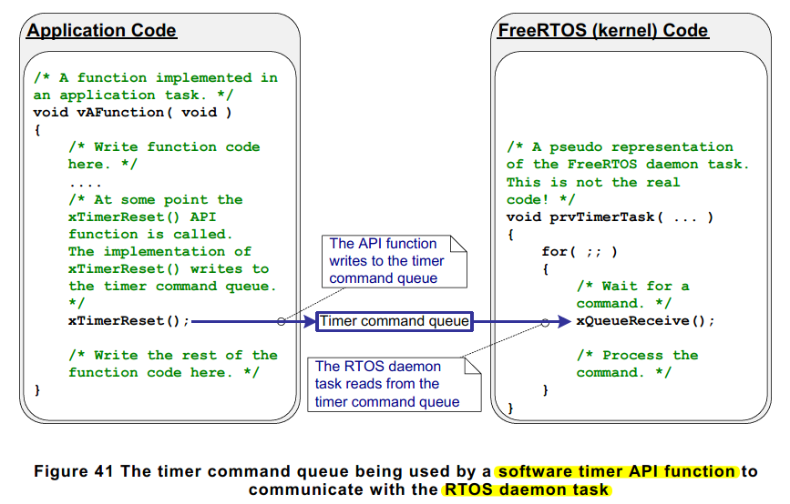

定时器命令队列是一个标准的FreeRTOS队列，当调度器开始的时候被自动创建。定时器命令队列的长度在编译时由FreeRTOSConfig.h头文件中的configTIMER_QUEUE_LENGTH常量配置。

##### 5.3.3 守护进程任务调度

守护进程程序同其他任何FreeRTOS任务一样被调度；当它处于就绪态任务中且优先级最高时就可以进入运行态，它只负责处理命令或执行定时器回调函数。下面两个图展示了设置configTIMER_TASK_PRIORITY常量不同的值（优先级）对定时器任务的影响。

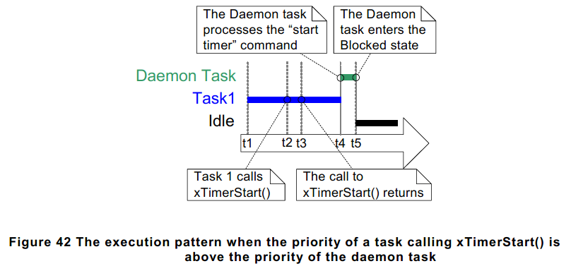

上图展示了当守护进程任务的优先级比调用xTimerStart()函数启动定时器的任务优先级低的时候，系统的执行模式。从图中可以看出Task1优先级>Deamon Task优先级>Idle优先级。

1. **t1时刻**

   Task1处于运行态，deamon任务处于阻塞态。

   如果有一个命令发送到定时器命令队列中，守护进程任务将离开阻塞态，在这种情况下它将处理命令，另一种情况是定时器时间耗尽，它将执行软件定时器的回调函数。

2. **t2时刻**

   Task1调用xTimerStart()。

   xTimerStart()函数发送一个命令到定时器命令队列，使得守护进程任务退出阻塞态。由于Task1的优先级比守护进程任务的优先级高，所以守护进程任务不会抢占Task1。

   Task1继续处于运行态，继续运行，守护进程任务退出阻塞态之后将进入就绪态。

3. **t3时刻**

   Task1执行xTimerStart()函数完毕。Task1从执行xTimerStart()函数开始到结束，一直处于运行态。
   
4. **t4时刻**

   Task1调用了一个应用程序接口函数使其进入了阻塞态。守护进程任务就成了就绪任务中优先级最高的任务，因此调度器选择守护进程任务进入运行态。守护进程任务就可以开始处理Task1发送到定时器命令队列的命令了。

   注意：**计算软件定时器时间到期的起始时刻是从‘开始定时器’命令被发送到定时器命令队列的时刻**，而不是守护进程任务从定时器命令队列中取出‘开始定时器‘命令的时刻。

5. t5时刻

   守护进程任务完成对Task1发送的命令的处理，并尝试从定时器命令队列中接收更多的数据。但是队列已经空了，因此守护进程任务重新进入阻塞态。守护进程任务在有命令发送到命令队列或者软件定时器超时后离开阻塞态。

   此时就绪态中，空闲任务的优先级最高，因此调度器选择空闲任务进入运行态。


上图与上上图类似，但是在此处守护进程任务的优先级高于调用xTimerStart()函数的的任务优先级。

1. **t1时刻**

   Task1处于运行态，守护进程任务处于阻塞态（定时器命令队列为空）

2. **t2时刻**

   Task1调用xTimerStart()函数。

   xTimerStart()函数发送一条命令到定时器命令队列，这将使守护进程任务离开阻塞态，守护进程任务的优先级高于Task1的优先级，因此调度器选择守护进程任务进入运行态。在Task1任务完全执行完xTimerStart()函数之前，它就被抢占了，此时它处于运行态。

   守护进程任务开始处理Task1发送到命令队列中的命令。

3. **t3时刻**

   守护进程完成Task1发送到命令队列的命令，并尝试接受更多的命令进行处理。但是此时定时器命令队列是空的，因此守护进程任务重新进入阻塞状态。

   Task1从就绪态转为运行态。

4. **t4时刻**

   Task1是被守护进程任务抢占了，在抢占之前没有执行完xTimerStart()函数，当它重新进入运行态时，续集执行xTimerStart()函数剩下的退出（return）部分。

5. **t5时刻**

   Task1调用一个应用程序接口函数，使其进入阻塞态。此时空闲任务进入运行态。

发送到定时器命令队列中的命令包含一个**时间戳（time stamp）**。时间戳用于随时计算一个应用程序任务发送一条命令到这条命令被进程守护任务处理完成的时间。例如，如果发送一个’start a timer‘命令来开始一个周期为10个ticks的定时器，时间戳则被用来确保定时器是在**命令在发送后**开始计算这10个tick，**而不是**在**命令被守护进程任务处理之后**才开始这10个tick的计时。

#### 5.4 创建 & 开始软件定时器

##### 5.4.1 xTimerCreate()函数

软件定时器在使用前必须明确的创建它。（FreeRTOS V9.0.0也包含了xTimerCreateStatic()函数，使用该函数创建的定时器时，在编译时其需要的内存将被静态地分配）

软件定时器可以使用一个TimerHandle_t类型的变量来引用它。xTimerCreate()函数用来创建一个软件定时器并返回一个TimerHandle_t类型的变量来引用xTimerCreate()函数创建的定时器。刚创建的软件定时器处于休眠状态。其函数原型为下图所示。

软件定时器可以在调度器运行之前创建，也可以在调度器运行之后从任务中创建。


**参数**

pcTimerName：具有描述性的定时器名字。FreeRTOS不会使用该名字。它的存在纯粹是为了debug。通过这个高可读性的名字分辨定时器要比定时器句柄容易的多。

xTimerPeriodInTicks：用ticks数量指定的定时器周期。pdMS_TO_TICKS()宏可以用来将以毫秒为单位的数值转换为ticks数量。

uxAutoReload：设置uxAutoReload参数为pdTRUE则创建的定时器为自动重载定时器。设置uxAutoReload参数为pdFALSE则创建的定时器为一次性定时器。

pvTimerID：每一个定时器都有一个ID值。这个ID是一个viod指针，可以供程序开发人员以任意目的使用。当多个定时器的回调函数是同一个时，这个ID非常有用，因为这个ID可用于提供特定于某个定时器的存储。定时器ID的使用示例将在本章节展示，当然还是去看书，我是不会写在这里的。

当创建定时器时会给pvTimerID一个初始值。

pxCallbackFunction：软件定时器的回调函数是一个用C语言编写的简单函数，它的函数原型在Listing72那张图片上。pxCallbackFunction参数是一个函数指针（实际上，就是函数名），指向的函数用作创建的这个软件定时器的回调函数。

**返回值**

NULL：如果返回NULL，则由于没有足够的堆内存供FreeRTOS分配必要的数据结构给定时器，而使得软件定时器创建失败。

non-NULL：返回一个非NULL值则表示软件定时器创建成功。返回的值是创建的定时器的句柄。

##### 5.4.2 xTimerStart()函数（发送一条命令到队列）

xTimerStart()函数用于启动一个处于休眠状态的软件定时器，或者用于重置（重新启动）一个在运行状态的软件定时器。xTimerStop()函数用于停止一个处于运行状态的软件定时器。停止软件定时器就是将其状态转变为休眠状态。

xTimerStart()函数可以在调度器启动之前调用，但是即使那样，软件定时器其实没有真正的启动，直到调度器启动它才启动。其函数原型如下图所示。

注意：绝不能在中断服务程序中调用xTimerStart()函数。更安全的做法是调用xTimerStartFromISR()。

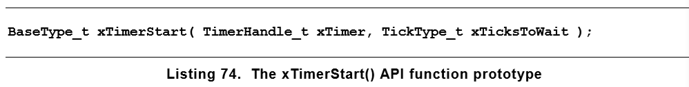

**参数**

**xTimer**：需要开启或者重置的软件定时器句柄。该句柄是调用xTimerCreate()函数创建软降定时器时返回的句柄。

**xTicksToWait**：xTimerStart()函数使用定时器命令队列发送“开启定时器”命令给守护进程任务。xTicksToWait参数指定了调用xTimerStart()函数的任务由于软件定时器命令队列已满而进入阻塞状态等待队列有空间可访问时的最长时间。

如果xTicksToWait参数设置为0，则当定时器命令队列满时，xTimerStart()函数将会立即返回。

阻塞状态的时间单位时ticks，所以你可以使用pdMS_TO_TICKS()。

如果在FreeRTOSConfig.h头文件中将INCLUDE_vTaskSuspend设置为1，那么在调用xTimerStart()函数时，将xTicksToWait参数设置为portMAX_DELAY时，调用xTimerStart()函数的任务在由于定时器命令队列已满而进入阻塞态等待队列有可使用的空间时，如果一直没有空用的空间，该任务将一直处于阻塞态。

如果xTimerStart()函数被调用前调度器并没用启动，那么xTicksToWait参数将被忽略，此时xTickStart()函数的行为等同于将xTicksToWait参数设置为0。

**返回值**

**pdPASS**：如果“start a timer”命令成功发送到定时器命令队列。

如果守护进程任务的优先级大于调用xTimerStart()函数的任务，那么调度器将保证在xTimerStart()函数返回之前处理“start a timer”命令。

**pdFAISE**：如果“start a timer”命令不能被写入定时器命令队列（队列已满），则会返回pdFALSE。

#### 5.5 定时器ID（Timer ID）

每一个定时器都有一个ID，它是应用开发者可以以任何目的使用的标签值。ID被存在一个void指针（void *）中，因此可以直接存储一个int类型的值作为指针，指向你想要的数据对象，或用作函数指针。

当软件定时器被创建时会给定一个初始ID-这个ID可以在之后使用vTimerSetTimerID()函数修改，这个ID也可以使用pvTimerGetTimerID()函数获取。

与其他API函数不同，vTimerSetTimerID()函数和pvTimerGetTimerID()函数可以直接访问软件定时器，这两个函数不需要发送命令到定时器命令队列。

##### 5.5.1 vTimerSetTimerID()函数 & pvTimerGetTimerID()函数

vTimerSetTimerID()函数原型如下图所示：


**参数**

xTimer：要被更新ID值的软件定时器句柄。该句柄是调用xTimerCreate()函数创建软件定时器时的返回值。

pvNewID：要设置的新的软件定时器ID。

pvTimerGetTimerID()函数原型如下图所示：

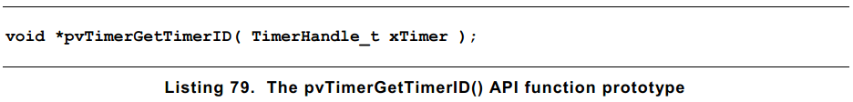

**参数**

xTimer：被询问ID的软件定时器句柄。

**返回值**

ID：被询问ID的软件定时器的ID。

同一个回调函数可以分配给多个软件定时器。当这种情况发生时，回调函数的参数就可以用于判决哪一个定时器时间到期了。

#### 5.6 改变定时器的周期

每一个官方的FreeRTOS端口都提供一个或多个样例工程。大多数的工程示例都有自检功能，他们使用LED给使用项目的人一个项目状态的视觉反馈。当自检没有问题时，LED等缓慢闪烁（时间间隔长），如果自检出现失败时，LED快速闪烁。

一些示例项目将自检实现为一个任务，在任务中通过vTaskDelay()函数控制LED灯的闪烁频率。还有些示例工程将自检实现为软件定时器的回调函数，利用定时器的周期控制LED灯的闪烁速率。

##### 5.6.1 xTimerChangePeriod()函数

xTimerChangePeriod()函数用于改变一个软件定时器的周期。

如果使用xTimerChangePeriod()函数改变一个正在运行的定时器的周期，那么该定时器将会使用新的周期重新计算他的到期时间。重新计算到期时间的起始时间与调用xTimerChangePeriod()调用的时间相关，而不是在定时器原始的启动时刻开始重新计算。

如果使用xTimerChangePeriod()改变一个处于休眠状态的定时器，那么该定时器将计算一个到期时间，并且转入运行态（**调用函数xTimerChange()函数会启动处于休眠状态的定时器**）。

注意：在终端服务程序中，要使用中断-安全版本的xTimerChangePeriodFromISR()函数，决不能使用xTimerChangePeriod()函数。

xTimerChangePeriod()函数的原型如下：

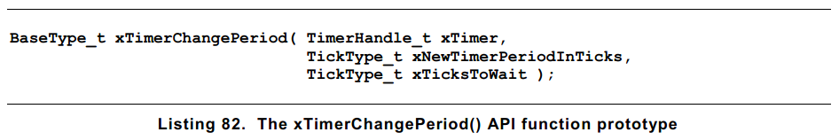

**参数**

**xTimer**：将要被更新周期值的软件定时器句柄。调用xTimerCreate()函数创建定时器时的返回值。

**xTimerPeriodInTicks**：软件定时器的新周期值，单位是ticks。pdMS_TO_TICKS()宏是个好东西。

**xTicksToWait**：xTimerChangePeriod()函数使用定时器命令队列发送“改变周期”命令到守护进程任务。xTicksToWait参数指定了调用xTimerChangePeriod()的任务当定时器命令队列已满时，进入阻塞状态以等待队列中有可访问的空间的最大阻塞时间。同其他函数一样，该参数也可以设置为0和portMAX_DELAY。

如果xTimerChangePeriod()函数在调度器开启之前调用，那么xTIcksToWait参数将被忽略，此时xTimerChangePeriod()函数的行为相当于将xTicksToWait参数设置为0。

**返回值**

pdPASS：只有命令成功发送到定时器命令队列时才返回pdPASS。

pdFALSE：如果“改变周期”命令由于定时器命令队列已满而不能写到队列时将会返回pdFALSE。

#### 5.7 重置软件定时器

重置软件定时器意味着重新开启这个定时器；定时器的到期时间将从定时器重启时重新计算。如下图所示，定时器开启时其周期为6tick，然后在其最终的到期时间到来（回调函数被执行）之前两被次重启。


##### 5.7.1 xTimerReset()函数

xTimerReset()用于重新开始定时器。xTimerReset()同样也可以用于开启一个处于休眠状态的定时器。其函数原型如下图所示。

注意：绝不能在中断服务程序中使用xTimerReset()函数，要使用中断-安全版本，xTimerResetFromISR()函数。

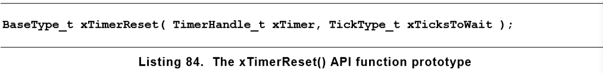

**参数**

xTimer：要重置会开启的定时器句柄。

xTicksToWait：调用xTimerReset()函数的任务，使用定时器命令队列发送“reset”命令到守护进程任务时的最大阻塞时间。同样该值可以被设置为0或portMAX_DELAY。

**返回值**

pdPASS：只有在重置命令成功发送到定时器命令队列时才会返回pdPASS。

pdFALSE：重置命令未能成功发送到定时器命令队列时返货pdFALSE。

### 6 中断管理（Interrupt Management）

**Events(事件s)**

当环境中有事件发生时，嵌入式操作系统必须采取相对应事件的操作。例如，一个报文到达以太网外设（事件）会需要将其输入到TCP/IP协议栈进行处理（操作）。高级点的操作系统将必须处理来自不同源头的事件，所有的事件都会有不同处理开销和响应时间需求。在不同的操作系统中，必须做出使得事件处理实现策略最佳的判断：

1. 如何检测事件的发生？大部分都是用中断的方法，不过轮询的方式也是会用到的。
2. 当使用中断处理事件时，有多少代码需要在终端服务程序内执行，有多少需要在中断服务程序（Interrupt Service Routine, ISR）外部执行呢？通常的做法是希望中断服务程序越短越好。
3. 事件时如何与main（non-ISR）代码进行通信，又如何构建这段代码使得它可以以最佳地适应对可能出现的异步事件进行处理。

FreeRTOS没有给应用程序的开发者强加任何的事件处理策略，反而提供了允许以一个简单且可维护的方式实施所选策略的特性。

**分清任务优先级和中断优先级的区别是非常重要的**

- 任务是一个软件特征，与运行FreeRTOS的硬件没有关系。任务的优先级是在软件中由应用开发者分配的，软件算法（调度器）决定哪一个任务进入运行态。
- 尽管中断服务程序是由软件编写的，但是它确是一个硬件特性，因为要运行哪个中断服务程序、在何时运行是由硬件控制的。**任务只有在没有中断服务程序运行的时候才会运行。**因此最低优先级的中断就会中断最高优先级的任务的运行，在任何情况下任务都不可能抢占中断服务程序的运行。

所有运行FreeRTOS的架构都支持中断处理，不过各个架构的中断入口、中断优先级分配等相关详细内容会有差异。

#### 6.1 在ISR中使用的FreeRTOS API

**The Interrupt Safe API**

在一个中断服务程序中会经常用到FreeRTOS提供的应用程序接口函数，但是大多数FreeRTOS API函数在中断服务程序中执行时是无效的--最明显的就是调用某个API函数以使其调用任务进入阻塞态时；如果这个API函数从ISR中被调用而不是在任务中被调用，那么就没有任务会进入到阻塞态。FreeRTOS解决这个问题的办法是提供了两个版本的API函数；一个版本用于在任务中调用，另一个版本用于在ISRs中调用。函数名字后面带有“FromISR”的是在ISRs中使用的版本。

**注意：绝不能再中断服务程序中调用函数名中没有“FromISR”的FreeRTOS应用程序接口函数。**

**使用Interrupt Safe API的好处**

在中断服务程序中使用中断安全版本的API可以使得任务代码和中断服务程序代码更有效率，中断入口也会更加简单。试想一下，如果在程序中只是用一个版本的API函数，那么中断和任务都将调用相同的API函数。当中断和任务可以条用同一版本的API函数时：

- 被调用的API函数需要一个附加的逻辑去判断调用它的是任务还是中断服务程序。这个附加的逻辑会引入通过函数的新路径，使得函数代码更长，更复杂，更难以调试。
- 在任务中调用函数时，函数的某些参数会变得多余，同样地，如果在ISR中调用这个函数时，其他的一些参数也可能会变得多余。
- 每个FreeRTOS端口需要提供一个确定（任务或中断）执行上下文的机制。
- 如果某个架构不容易确定任务或中断服务程序的执行上下文，那么则需要使用额外的、浪费的、更复杂的非标准的中断入口代码，使得执行上下文可以由软件提供。

**使用Interrupt Safe API函数的缺点**

虽然使用两个相同功能的API函数版本可以使得任务和中断服务程序更加高效，但是也会引入一个新的问题，在任务和中断服务程序中有时调用一个非FreeRTOS API的函数是不可避免的，但是问题就是这个非FreeRTOS API的函数会调用FreeRTOS API函数。

通常集成第三方代码时这会成为一个问题，这也是当软件的设计不受程序开发者控制的唯一时刻。如果这种问题发生的时候可以通过以下几种技术中的一个解决：

1. 将中断处理延迟到任务，因此API函数就只需要在任务的上下文中调用即可。
2. **如果你使用的FreeRTOS端口支持中断嵌套，那么使用带有"FromISR"的API函数，这种函数可以在任务和中断服务程序中调用。**
3. 第三方的代码通常包含了FreeRTOS的抽象层，该层可以用于实现对调用某个函数的（任务或中断）上下文测试，然后调用适合该上下文的API函数。

**pxHigherPriorityTaskWoken 参数**

如果一个上下文切换是由中断执行的，那么在中断退出时任务运行的上下文可能会与中断开始时任务的上下文不同。因为中断可能中断一个任务，从另一个不同的任务返回。

一些FreeRTOS API函数可以把任务从阻塞态切入到就绪态。例如，如果有一个任务在等待队列中有可获得的数据时进入阻塞态，那么xQueueSendToBack()函数就可以发送数据到相应的目标队列，使得等待数据的任务进入就绪态。

如果通过FreeRTOS API函数使得任务退出阻塞态，而这个任务的优先级又比当前正在运行的任务优先级高，那么按照FreeRTOS的调度规则，将会发生一个向更高优先级任务的切换。这时向更高优先级任务的切换的真实发生，取决于API函数被调用的上下文。

- 如果这个函数是从任务中调用的

如果在FreeRTOSConfig,h头文件中将configUSE_PREEMPTION设置为1，那么在调用函数后-在函数退出之前，将处于运行态的任务会自动切换到高优先级的任务

- 如果这个函数是从中断中调用

将处于运行态的任务将不会自动切换到处于就绪态的最高优先级任务。但是，将会通过设置一个变量告知应用开发者此处应该执行一个上下文切换。中断安全应用程序接口函数（后面带有“FromISR”）有一个被叫做pxHigherPriorityTaskWoken指针参数就是为了这个目的而设计的。

如果需要发生上下文切换时，interrupt safe应用程序接口函数将设置*pxHigherPriorityTaskWoken变量为pdTRUE。为了检测到上下文切换的发生，在使用参数pxHigherPriorityTaskWoken时，必须在第一次使用它时，将它指向的变量值初始化为pdFALSE。

FreeRTOS API函数只可以设置*pxHighPriorityTaskWoken参数设置为pdTRUE。如果中断服务程序中调用了多个FreeRTOS API函数，那么相同的变量可以作为pxHigherPriorityTaskWoken参数在每个API函数调用中传递，pxHigherPriorityTaskWoken参数只需要在首次使用之前初始化为psFALSE就行。

在interrupt safe版本的API函数中不会发生自动上下文切换的原因有以下几个：

1. 避免不必要的上下文切换

在必须需要任务运行之前，中断可能执行多次。例如，任务处理从UART中断驱动接收的字符串；如果每当UART中断服务程序接收到一个字符都切换到任务使其对接收到的字符进行处理是很不必要且浪费的，因为任务只需要在字符串接收完毕之后进行处理即可。

2. 对执行序列的控制

中断何时发生不可控，有经验的FreeRTOS开发者可能想要在他的应用程序中的某一个特定的位置暂时避免一个不可预测的上下文切换切到另一个任务。（这个也可以使用FreeRTOS调度器locking机制实现）

3. 可移植性

这是在所有的FreeRTOS端口中都可以使用的最简单的方法。

4. 效率

在中断服务程序中允许调用多个FreeRTOS API函数并且允许产生多个上下文请求。

5. 在RTOS滴答中断中执行

在后面将会见到，在RTOS滴答中断中添加应用程序代码是可能的。在滴答中断中尝试上下文切换的结果取决于使用的FreeRTOS端口。最好的情况就是不必要的调用一次调度器。

pxHigherPriorityTaskWoken参数的使用是可选的，不使用时需将pxHigherPriorityTaskWoken指向NULL。

**portYIELD_FROM_ISR()宏 & portEND_SWITCHING_ISR()宏**

**这两个宏用于在ISR中请求上下文切换**。略：😄。

taskYIELD()宏在任务中被调用，用于请求上下文切换。portYIELD_FROM_ISR()和portEND_SWITCHING_ISR()是两个功能同taskYIELD()的中断安全版本的宏。这两个宏的使用方法和作用相同。一些FreeRTOS端口只提供了两个中的一个宏。更新的FreeRTOS端口则会两个都提供。手册中使用的是portYIELD_FROM_ISR()。两个宏的声明如下图所示：

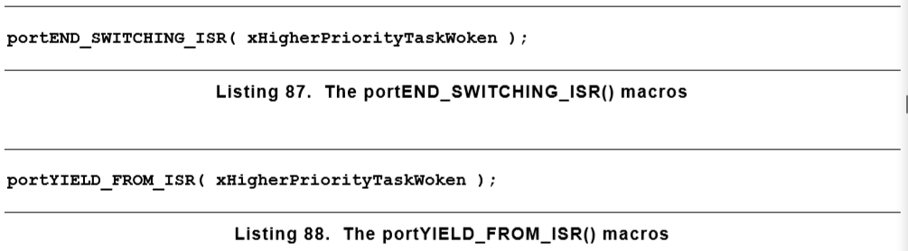

xHigherPriorityTaskWoken参数被中断安全版的API函数操作之后，可以直接作为调用的portYIELD_FROM_ISR()宏的参数。

如果portYIELD_FROM_ISR()宏的xHigherPriorityTaskWoken参数是pdFALSE(0)，那么调用这个宏将没有任何效果，不会产生上下文切换。如果该参数不是pdFALSE，将会请求上下文切换，那么处于运行态的任务将可能发生变化。中断将始终返回到处于运行态的任务，即使在中断服务程序执行过程中处于运行态的任务发生了变化。

大多数的FreeRTOS端口允许在ISR的任意地方调用portYIELD_FROM_ISR()。一小部分（主要是很小的架构）FreeRTOS端口只允许在ISR的最后调用portYIELD_FROM_ISR。

#### 6.2 递延中断处理（Deferred Interrupr Processing）

一般的做法是使终端服务程序越短越好。其原因有以下几点：

- 就算是给任务分配了很高的优先级，任务的运行也只能是在**硬件**没有处理中断的时候。
- ISRs会干扰（添加“抖动”）任务的启动时间和执行时间。
- 当一个中断服务程序被执行时，可能不会接收另一个新的中断，或者多个新的中断，这取决于运行FreeRTOS系统的架构。
- 一些FreeRTOS端口支持中断嵌套，但是中断嵌套会增加系统复杂度，降低可控性。因此中断越短，中断嵌套就越不必要。
- 应用开发者需要考虑任务和ISR同事访问资源（如变量、外设和内存缓冲区）的后果，且需要避免这种情况的发生。

中断服务程序必须记录中断产生的原因，并清除该中断。中断所需要的任何其他处理经常会放在一个任务中执行，这就使得中断服务程序可以尽快的退出。这中操作就被叫做"deferred interrupt processing"，因为中断中的必须要处理的操作从ISR中**递延**到了任务中。

递延中断处理到任务中允许应用开发者相对于应用程序中的其他任务对该处理进行优先级排序，并且还能再任务中使用所有的FreeRTOS API函数。

如果执行中断处理的的任务的优先级高于所有的其他任务，那么这个执行中断处理的任务将会立即执行，就像这些处理是在中断服务程序中执行一样。下图展示的就是这种情况，图中Task1是应用中的一个普通的任务，Task2是中断处理所递延到的任务。

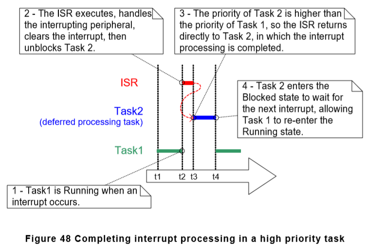

在上图中，中断处理在t2时刻开始，真正结束是在t4时刻，这样说是因为只有t2到t3时刻之间的处理是在中断服务程序中的，其他的处理都递延到了Task2中。如果不使用“递延中断处理”，那么t2到t4时刻将都在中断服务程序中进行处理。

何时应将所有的处理全放在中断服务程序中，又何时将部分处理递延到任务中最好，这没有一个绝对的标准。不过在以下情况发生时使用Deferring processing to a task是很有用的：

- 当中断中的处理不是很重要时。例如，中断仅仅时存储了一个模数转换的结果，那么这个操作最好放在ISR中进行，但是如果这个结果必须要经过一个软件滤波器，那么这个滤波器的操作放在一个任务中可能是合适的。
- 当执行向控制台输出或者分配内存等操作时，这些操作不能放在中断内部执行。
- 当中断处理的时间不可预测时，例如预先不知道中断处理会进行多久。

#### 6.3 用于同步的二进制信号量

中断安全版本的Binary Semaphore API可以用来使任务退出阻塞态，每当特定的中断发生的时候，有效地使任务中断同步。这就使得在这个同步的任务中执行处理中断事件的大部分操作，进而使得只在ISR中直接执行的部分操作又快又短。在这种情况下，二元信号量用于将中断处理递延到任务中。

在上面那个图中，如果中断处理是硬实时的，那么递中断所递延的任务的优先级应该设置到比较高，以确保任务总是抢占系统中其他任务的运行。在ISR中可以调用portYIELD_FROM_ISR()（请求上下文切换），确保ISR直接退出到该中断处理所递延到的任务。这就有效的保证了中断处理可以连续完整的执行（时间上连续，无退出），就好像所有的操作都在中断服务程序中执行一样。下图复现了上图的情况，但是描述不一样，下图描述了二元信号量如何控制递延处理任务的执行。

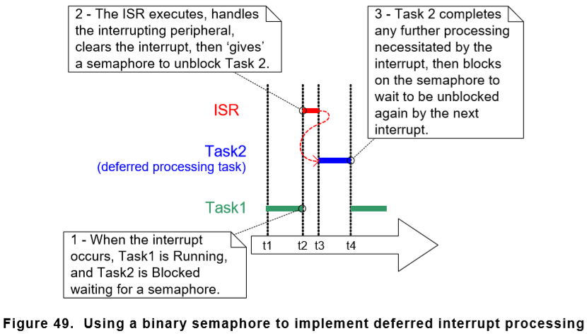

递延处理任务使用‘take’调用信号量的方式使自己进入阻塞状态，以等待事件（中断）发生。当事件发生时，中断服务程序在相同的信号量上使用‘give’操作，以使任务解阻塞进而使得处理中断的程序得以执行。

“Taking a semaphore”和“giving a semaphore”两个概念在不同的使用场景中有不同的含义。在当前中断同步场景中，可以将二元信号量看作长度为1的队列。这个队列在任何时候最多只包含一个数据项，因此这个队列要么是空，要么是满。

在其他的信号量使用场景中会与现在所使用二进制信号量不同，不同之处在于，任务使用信号量之后经常是必须释放信号量。

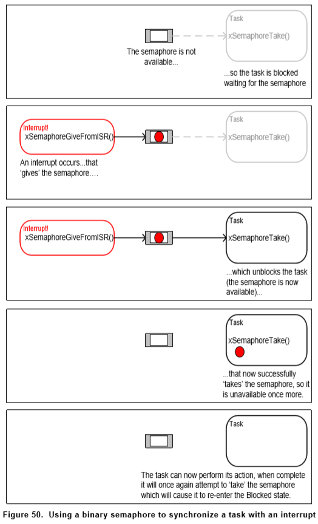

##### 6.3.1 xSemaphoreCreateBinary() API函数

在FreeRTOS V9.0.0之后的版本中包含了xSemaphoreCreateBinaryStatic()函数，这个函数可以在编译的时候静态地为要创建的二进制信号量请求（静态）内存。FreeRTOS各种类型的信号量的句柄都存储在一个SemaphoreHandle_t类型的变量中。

同样，在使用他之前，必须创建它。xSemaphoreCreateBinary() API函数用于创建binary semphore。其函数原型如下图所示


**参数**

void

**返回指**

NULL：如果返回NULL，创建信号量失败，因为没有足够的堆内存可以分配给信号量，不能满足其存储数据的内存需求。

non-NULL：如果创建成功，则会返回一个非NULL的值，这个非空的值应存储为所创建的信号量的句柄。

##### 6.3.2 xSemaphoreTake() API函数

‘’Taking‘一个信号量意味着’‘obtain’‘或者“receive”这个信号量。信号量只有在可获取时才能被taken。

除了递归互斥体外的所有类型的信号量，都可以使用xSemaphoreTake()函数“Taken“信号量。

**xSemaphoreTake()函数据不能在中断服务程序中调用。**其函数原型如下图所示：

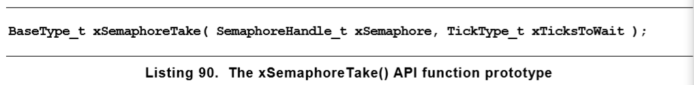

**参数**

xSemaphore：要被”taken“的信号量。信号量可以被一个SemaphoreHandle_t类型的变量引用，不过在使用这个变量之前，必须明确地声明它。

xTicksToWait：如果要Taken的信号量不能获取，那么xTickToWait参数就指定了因此而进入阻塞状态的最大时间。

设置该参数为portMAX_DELAY，那么在任务无法获取信号量的时候，会使任务一直处于阻塞状态知道能够获取所需的信号量。不过要使用portMAX_DELAY，需要在FreeRTOSConfig.h头文件中将INCLUDE_vTaskSuspend设置为1。

**返回指**

pdPASS：pdPASS中有在调用xSemaphoreTake()函数成功获取到信号量时返回。

pdFALSE：信号量获取不到。

##### 6.3.3 xSemaphoreGiveFromISR() API函数

二进制信号量和计数信号量可以通过xSemaphoreGiveFromISR()函数'given'释放。

xSemaphoreGiveFromISR()函数时xSemaphoreGive()函数的中断安全版本，因此这个函数需要的pxHigherPriorityTaskWoken参数在这节最开始就已经介绍。其函数原型如下所示：

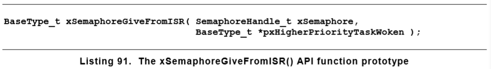

**参数**

xSemaphore：要被释放的信号量句柄。这个句柄类型为SemaphoreHandle_t，在使用这个句柄引用信号量时必须先明确声明它。

pxHigherPriorityTaskWoken：可能会有多个任务等待获取同一个信号量而进入阻塞状态。调用xSemaphoreGiveFromISR()函数可以释放信号量，使得信号量可以被获取，也使得等待这个信号量能够被获取的任务退出阻塞态。如果调用xSemaphoreGiveFromISR()函数使得任务退出阻塞态，并且这个任务的优先级比当前运行的（被中断的）任务的优先级高，那么，在xSemaphoreGiveFromISR()函数内部将会设置pxHigherPriorityTaskWoken指针为pdTRUE。

如果在xSemaphoreGiveFromISR()函数中设置pxHigherPriorityTaskWoken参数为pdTRUE，那么在中断退出之前应该执行上下文切换，确保中断退出后，运行的任务是就绪态中优先级最高的那一个。

**返回值**

pdPASS：只有在调用xSemaphoreGiveFromISR()函数成功时才会返回psPASS。

pdFAIL：如果一个信号量已经是可获取的，不可以在被释放，此时xSemaphoreGiveFromISR()函数将返回pdFAIL。

#### 6.4 计数信号量（Counting Semaphores）

如同将二进制信号量看作长度为1的队列，技术信号量可以被看作是长度（远）超过1的队列。任务不关心你存入这个”队列“中的具体数据是什么，它只关心你存入到队列中的数据项的数量。**如果你要使用技术信号量，你需要在FreeRTOSConfig.h头文件中将configUSE_COUNTING_SEMAPHORES设置为1。**

**每当计数信号量被“给定”时，就会使用队列中的一个未使用的空间。队列中的数据项的数量就是信号量的"计数“值。**

计数信号量特别适用于以下两种情况：

1. **事件计数**

每当事件发生时，事件处理handler（中断？任务？）就会给出一个信号量，每当给一个信号量就会使信号量的计数值增加（1）。任务每处理完一个事件就会去获取信号量，每获取一个信号量之后信号量的计数值就会减少（1）。**计数值是已经发生的事件数与已处理的事件数之间的差值。**这个可以从下图中看出：

用于记录事件发生次数的计数信号量的计数值（count value）在创建时都会被初始化为0。

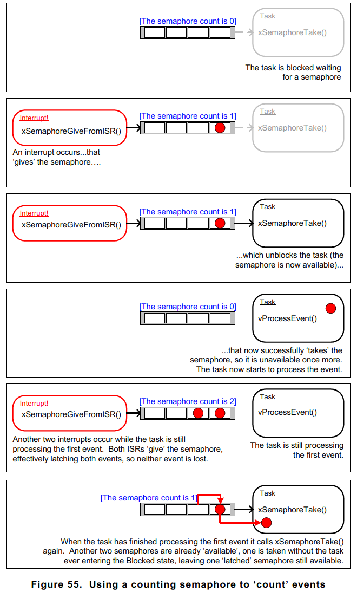

2. **资源管理（Resource management）**

**在这种情况下，计数值表示可被获取的资源数量。**为了获取对资源的控制，任务必须首先获得一个信号量-因此信号量的计数值要减少（1）。当计数值降到0时，就表示没有可用的资源了。当任务使用这个资源结束之后，需要将信号量”give“回去-因此信号量的计数值增长。

如果将计数信号量用于管理资源，那么这个计数信号量在被创建的时候它的计数信号量的初始值将被设置为可以被使用的资源的数量。

##### 6.4.1 xSemaphoreCreateCounting() API函数

从FreeRTOS V9.0.0版本开始包含了xSemaphoreCreateCountingStatic()函数，该函数允许在编译时静态地分配创建计数信号量所需要的内存。**所有类型的FreeRTOS信号量的句柄都可以用一个SemaphoreHandle_t类型的变量存储。**

在一个信号量可以被使用时，必须先创建它。要创建一个计数信号量，你需要使用xSemaphoreCreateCounting()函数。其函数原型如下所示：


**参数**

uxMaxCount：计数信号量的计数最大值。类似于队列的长度。当信号量用于对事件进行计数或者锁存时，uxMaxCount参数就代表了可以被锁存的最大事件数量。当信号量用于管理对资源集合的访问时，uxMaxCount应该设置为可获取资源的总数。

uxInitialCount：创建信号量时给定的初始值。当信号量用于锁存事件或者对事件进行计数，uxInitialCount参数应该被设置为0-当信号量被创建的时候，还没有事件发生。当这个信号量被用作管理资源集合的访问时，uxInitialCount的值应该与uxMaxCount相等-也就是当这个信号量被创建的时候，所有的资源都是可以被访问的。

**返回值**

NULL：信号量需要一些内存去存储它的数据结构，当没有足够的堆内存可供FreeRTOS分配给需要创建的信号量时，会返回NULL。

non-NULL：返回一个非NULL值表示创建信号量成功，这个返回的非NULL的值应该作为这几个信号量的句柄被存储在一个SemaphoreHandle_t类型的变量中。

#### 6.4 递延Work到RTOS守护进程任务

在前面展示的例子（在手册）中，使用递延中断技术时要求应用开发者为每一个中断创建一个同步任务。要达到递延中断的目的使用xTimerPendFunctionCallFromISR() API函数也是可以的，该函数将中断处理递延到RTOS的守护进程任务-这就省去了为每一个中断创建一个任务的需要。递延中断处理到守护进程任务的操作被称作“centralized deferred interrupt processing”。

**deferred interrupt processing的优点有：**

1. 低资源占用

   它不需要为每一个中断创建单独的处理中断的任务。

2. 简化用户模型

   递延的中断处理函数是标准的C语言函数。

**deferred interrupt processing的缺点有：**

1. 低灵活度

   不可能为每一个递延中断处理函数任务分配各自的优先级。每个递延中断处理函数的优先级同守护进程任务的优先级一样。在第5中的介绍中，守护进程任务的优先级由FreeRTOSConfig.h头文件中的configTIMER_TASK_PRIORITY常量参数设定，在编译时分配完成。

2. 低可控性

   xTimerPendFunctionCallFromISR()函数发送一条命令到定时器命令队列的尾部。已经在定时器队列的命令将会在守护进程任务在xTimerPendFunctionCallFromISR()函数将”执行函数“命令发送到队列之前处理完成。

由于不同的中断对实时性的要求不相同，因此在同一个应用程序中是哦那个两种递延中断的方法也是很常见的。

##### 6.4.1 xTimerPendFunctionCallFromISR() API函数

xTimerPendFunctionCallFromISR()函数是xTimerPendFunctionCall()函数在中断中使用的安全版本。两个函数都允许应用开发者编写的函数在RTOS的守护进程任务的上下文中执行。需要执行的函数和函数输入参数的值都通过定时器命令队列发送到守护进程任务。函数何时能够真正的运行还是要取决与守护进程任务和程序中其他任务的优先级的对比。其函数原型如下图所示：

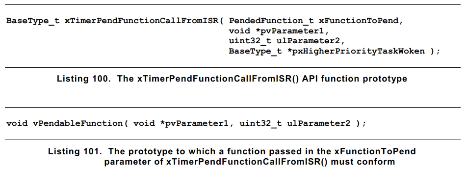

**参数**

xFunctionToPend：要在守护进程任务中执行的函数指针（函数名就是函数指针）。这个函数指针指向的函数的原型必须符合上图Listing 101的格式。

pvParameter1：这个参数值将作为要在守护进程任务中执行的函数的pvPatameter参数的实参。这个参数是void *类型的指针，允许任何数据类型使用，如果你不喜欢这个void *类型，你可以使用结构体指针代替它。

ulPatameter2：这个参数值将会被当作要在守护进程任务中执行的函数的ulPatameter2参数的实参。

pxHigherPriorityTaskWoken：xTimerPendFunctionCallFromISR()函数向定时器命令队列写数据。如果RTOS守护进程因等待定时器命令队列有可以获得的数据（实际上没有可获得的数据）而进入阻塞状态，那么向定时器命令对列写入数据将是的守护进程任务退出阻塞态。如果守护进程任务的优先级比当前处于运行态的（被中断了的）任务优先级高，那么在xTimerPendFunctionCallFromISR()函数内部将会把*pxHigherPriorityTaskWoken参数设置为pdTRUE。

**返回值**

pdPASS：如果“执行函数”命令写入到了定时器命令队列，返回pdPASS。

pdFAIL：如果“执行函数”命令不能被写入到定时器命令队列则返回pdFAIL，原因可能是定时器命令队列已经满了。更多详情请参考手册第五章节。

Example 18 略。

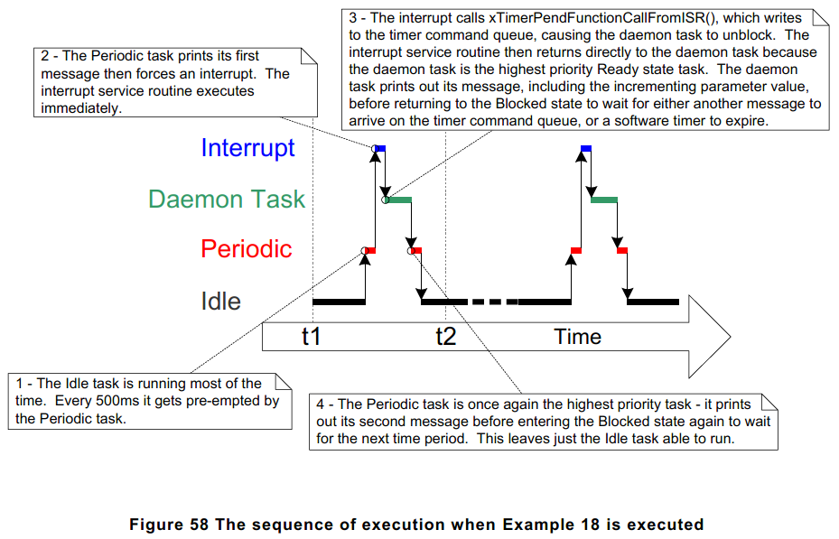

#### 6.5 在中断服务程序中使用队列

二进制和计数信号量用于事件通信。队列除了用于事件通信之外，还可以传输数据。

xQueueSendToFrontFromISR()和xQueueSendToBackFromISR()两个函数是xQueueSendToFront()和xQueueSendToBack()两个函数的在中断服务程序中使用的安全版本。同样的，xQueueReceiveFromISR()与xQueueReceive()函数也是如此。**他们只是使用的地方不同，他们的功能是相同的。**

xQueueSendToFrontFromISR()和xQueueSendToBackFromISR() API函数原型如下:

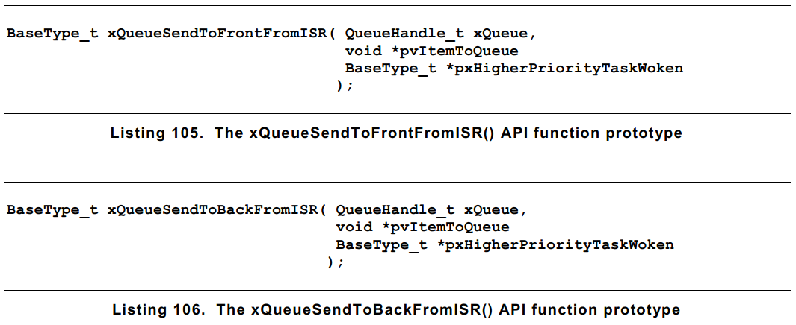

**参数：**

xQueue：数据要被发送（写入）到的队列句柄。这个句柄是在调用xQueueCreate()函数创建队列时的返回值。

pvItemToQueue：指向将要被拷贝到队列中去的数据的指针。队列中每个数据项可以容纳的数据大小都在队列创建时已经设定，因此将会有很多字节的数据从pvItemToQueue指向的地方拷贝到队列的数据存储区。

pxHigherPriorityTaskWoken：一个空队列可能会使一个或者多个任务处于阻塞状态，等待这个多列中有可以访问的数据。调用xQueueSendToFrontFromISR()或者xQueueSendToBackFromISR()函数可以发送数据到队列使其可以被访问，因此就可以使某个任务退出阻塞态。如果调用该API函数使一个任务退出了阻塞态，并且这个任务的优先级比当前运行（已经被中断）的任务优先级高，那么在API函数内部可以将*pxHigherPriorityTaskWoken的值设置为pdTRUE。

**返回值：**

pdPASS：只有数据被成功发送到多列时才会返回pdPASS。

errQUEUE_FULL：如果数据因队列已经存满而不能成功发送到队列中，那么将返回errQUEUE_FULL。

##### 6.5.1 在ISR中使用队列时的注意事项

队列提供了一个简单方便的从中断服务程序到任务传输数据的方式，但是如果数据传输的频率很高，那么使用队列是没有效率的。

在FreeRTOS download上的许多演示应用都包含一个简单的UART驱动，该驱动使用队列从UART的接收ISR中传递字符。在那些例程中使用队列的原因有：1.作为在中断服务程序中使用队列的演示；2.故意加载系统，以测试FreeRTOS端口。在中断服务程序中使用队列的这种方式肯定不是为了表达一个高效的程序设计，除非数据来的很慢，其他情况不推荐使用这种方式去编写代码。更加有效的合适编写代码的技巧，包括：

- 使用直接内存存取（Direct Memory Access, DMA）硬件去接收和缓存字符。这种方法几乎没有软件开销。只有在检测到传输中断之后，使用direct to task notification可以解除处理缓存的任务的阻塞。
- 拷贝每次接收到的字符到线程安全的RAM缓存中。同样的，在消息完全接受完之后，可以使用Direct to task notification解除处理缓存的任务的阻塞。
- 直接在中断服务程序中处理接收到的字符，然后直接将处理数据的结果（而不是原始数据）使用队列发送到任务。

Example19 略:smile:


#### 6.6 中断嵌套（Interrupt Nesting）

分配给中断的优先级与任务的优先级一点关系都没有。哪一个中断服务程序将被执行由硬件决定，任务的执行则由软件决定。响应硬件中断的中断服务程序将会中断任务的执行，但是任务绝不会抢占中断服务程序的执行。

支持中断嵌套的端口需要表39中的一个或两个定义在FreeRTOSConfig.h头文件中的常量。configMAX_SYSCALL_INTERRUPT_PRIORITY和configMAX_API_CALL_INTERRUPT_PRIORITY两个常量做定义的性质一样，前者用于老的FreeRTOS端口，后者多用于新的FreeRTOS端口。

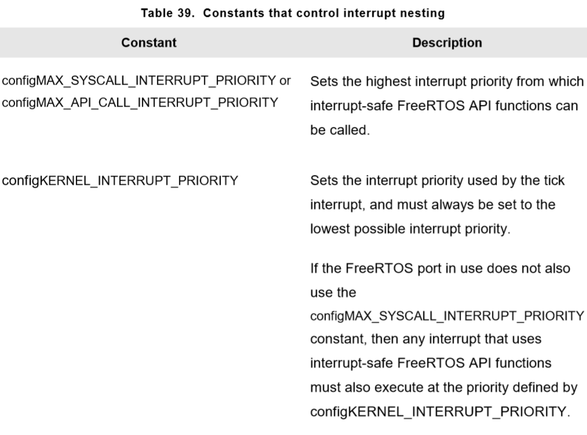

每一个中断都有一个数字的优先级和一个逻辑优先级。

- 数字优先级（numeric priority）

  数字优先级就是分配给中断优先级的数值。例如，如果一个中断的优先级是7，那么numeric priority就是7。

- 逻辑优先级（logical priority）

  中断的逻辑优先级描述了中断优先于其他中断。

  如果同时出现了两个不同优先级的中断，那么，处理器将执行逻辑优先级高的中断服务程序，再执行逻辑优先级低的中断服务程序。

  高逻辑优先级的中断可以中断低逻辑优先级的中断，不能中断同等以及更高逻辑优先级的中断。

中断的数字优先级和逻辑优先级的关系取决于处理起的架构；在一些处理器上，越高数字优先级的中断就有越高的逻辑优先级，然而在其他的处理器架构上，分配的数字优先级余额大，其逻辑优先级则越小。

一个完整的中断嵌套模型的创建，需要将configMAX_SYSCALL_INTERRUPT_PRIORITY的逻辑中断优先级设置的比configKERNEL_INTERRUPT_PRIORITY高。如下图所示，图中展示了：

- 处理器有七种不同的中断优先级
- 分配数字优先级为7的中断有最高的中断逻辑优先级，1则表示最小逻辑优先级。
- configKERNEL_INTERRUPT_PRIORITY被设置为1。
- configMAX_SYSCALL_INTERRUPT_PRIORITY设置为3。

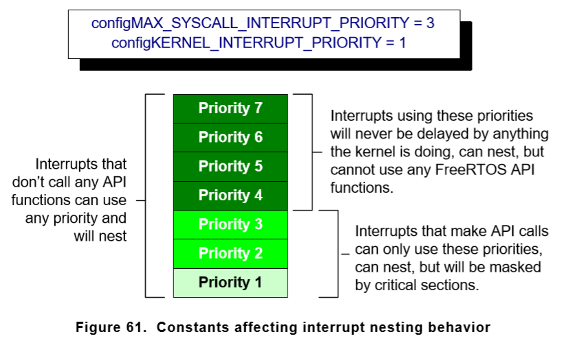

从图中可以看出：

- 优先级处于[1, 3]的中断，当内核或应用程序处于临界区中时，禁止执行。优先级处于临界区的中断服务程序运行时可以使用interrupt-safe FreeRTOS API函数。临界区将在第七章节描述。
- 优先级处于4及4以上的中断，不受临界区的影响，所以这些中断的立即执行不会受调度程序的组织，它只受限于硬件本身。处于该区域优先级的中断不能使用FreeRTOS API函数。
- 一般地，在时间精度上有苛刻要求的功能（例如，电机控制）将会分配一个高于configMAX_SYSCALL_INTERRUPT_PRIORITY的优先级，以确保在中断响应时调度器不会引入抖动。

configKERNEL_INTERRUPT_PRIORITY必须设置为最小的中断优先级。

configMAX_SYSCALL_INTERRUPT_PRIORITY不允许设置为最高中断优先级。

### 7 资源管理（Resource Management）

在一个多任务系统中，如果一个任务开始访问一个内存资源到完全访问结束这段期间退出了运行态，这将会造成一个潜在的错误。如果一个任务使一片内存资源前后不一致（未完全访问），那么当另一个任务访问这片内存时将会导致类似数据损坏等错误。

例如在以下的几种情况：

1. 访问外设（Accessing Peripherals）

   当两个任务试图在Liquid Crystal Display（LCD）上写入信息时：

   - 任务1开始执行并向LCD写入字符串“Hello world”。
   - 当任务1写到“Hello w”时被任务2抢占了运行态。
   - 任务2向LCD写入“Abort, Retry, Fail?”之后进入阻塞态。
   - 任务1恢复运行态，并从被抢占的地方继续向LCD输出剩下的字符串“ord”。

   最终，LCD显示的字符串为“”。

2. "读-改-写"操作

   下图是一行C代码，并展示了一个C代码如何被编译成汇编语言代码的示例。从图中可以看出变量PORTA的值首先从内存中读取到寄存器，在寄存器中将值修改，最后把这个值从寄存器再写到内存中。这就是一个“读-改-写”操作。

   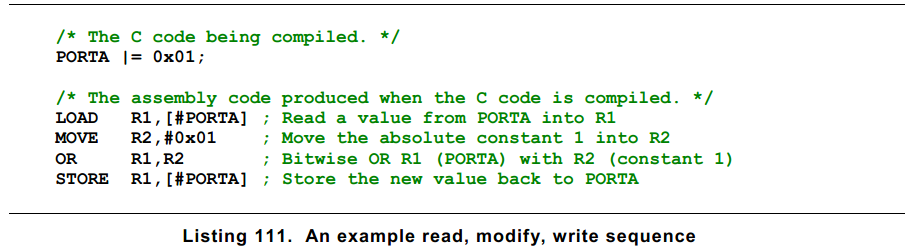

   因为完成以上操作需要执行多条指令，所以这是一个“non-atomic”操作，并且可以被中断。如果有两个任务都试图更新寄存器所映射的名为PORTA的内存值。

   - 任务1将PORTA的值加载到寄存器-读。
   - 在任务1完成改-写操作之前被任务2抢占。
   - 任务2更新完PORTA的值之后，进入阻塞态。
   - 任务1继续从被抢占的地方继续执行。在将更新后的值协会PORTA之前，他会修改已经保存在寄存器中的PORTA值的副本。

   在这种情况下，任务1更新并写回内存的是过时的PORTA值。在任任务1拷贝PORTA的值之后任务2将PORTA的值更新了，此时任务1还没有将修改的值写入到PORTA使用的寄存器。当任务1更新PORTA时，将重写任务2已经执行的修改，有效的破坏了PORTA的寄存器值。

   这个例子中使用的一个外部寄存器，在变量之间进行“读-改-写”操作时也是同样的道理。

3. 变量的**非原子操作（Non-atomic Access）**

   更新结构体的多个成员，或更新一个长度大于架构位数的变量（例如在16位的机器上更新一个32位的变量），这都是非原子操作的例子。如果它们被中断了，那么可能会造成数据丢失或损坏。

4. **可重入函数（Function Reentrancy）**

   如果一个函数可以在多个任务或者多个任务和中断中都可以被安全的调用，那么这样一个函数就是可重入的函数。可重入函数也叫做“thread safe”线程安全函数，因为它可以在多个线程中执行并且没有数据或逻辑操作（与或非）损坏的风险。

每一个任务都会维持一个自己的堆栈和一组自己的处理器（硬件）寄存器的值。如果一个函数指访问了自己堆栈中的数据或寄存器中的数据，那么这个函数就是可重入的，是线程安全的。下面两个图分别展示了可重入函数和非可重入函数的例子。

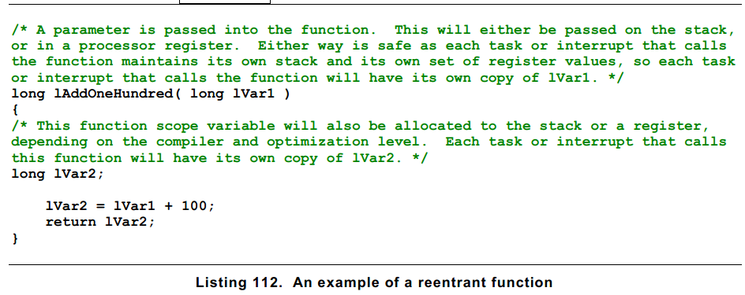

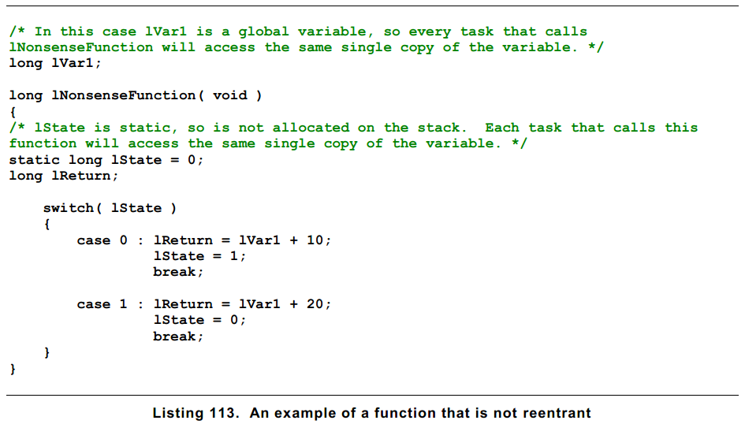

**互斥（Mutual Exclusion）**

为了确保任务之间或任务与中断之间共享的资源在任何时间访问时都有能保持数据一致性，必须使用‘mutual exclusion’技术管理。目标就是确保，一旦有任务开始访问共享的非可重入且非线程安全的资源时，直到当前任务访问资源结束后，同样的任务才能再访问这个资源。每个访问这个资源的任务时相互排斥的。

FreeRTOS提供了一些特点可以被用来实现互斥，但是最好的实现互斥的方法是在设计应用程序时，不使用共享的资源，并且每个资源只能被一个任务访问。

#### 7.1 临界区 & 挂起调度器

##### 7.1.1 Basic Critical Sections

基础临界区是一段通过分别调用taskENTER_CRITICAL()和taskEXIT_CRITICAL()宏作为上下边界，所包围起来的代码区域。临界区也可以称之为很重要的区域。

宏taskENTER_CRITICAL()和taskEXIT_CRITICAL()没有输入也没有输出。他们的使用方法如下图所示。

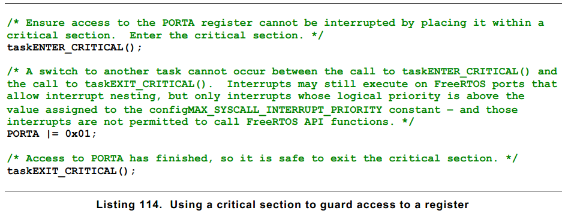

手册中示例项目使用一个叫做vPrintString()的函数向标准的输出写入字符串-当FreeRTOS Windows端口使用时是终端窗口。vPrintString()函数再许多痹痛的任务中被调用；因此，理论上是可以使用一个临界区去保护对标准输出的访问实现。如下如所示。

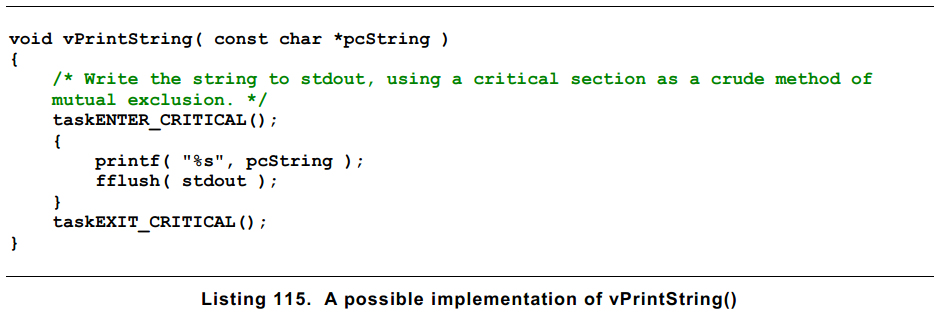

在此处实施临界区是一种非长粗鲁的提供互斥的方法。他的工作方式是完全禁用中断或者禁用到由configMAX_SYSCALL_INTERRUPT_PRIORITY（取决于FreeRTOS所使用的端口）设置的中断优先级。因抢占而发生的上下文切换只可能发生在中断中，因此只要中断一直被禁用，那么调用taskENTER_CRITICAL()的任务将会被保证一直处于运行态，直到临界区结束。

基础的临界区必须保证非常简短，要不然的话会影响中断的响应时间。taskENTER_CRITICAL()和taskEXIT_CRITICAL()必须成对使用。在上图中，其实使用临界区的方式保护标准输出是很不合适的，因为向终端写东西是一个相当长的操作。后面将会探索更适合的解决方法。

将临界区嵌套是安全的，因为内核会保存嵌套的深度。当嵌套的深度退回到0时临界区才会结束-当调用一个taskEXIT_CRITICAL()执行时都对应的退出一个taskENTER_CRITICAL()的调用。

调用taskENTER_CRITICAL()和taskEXIT_CRITICAL()是唯一合法的改变运行FreeRTOS系统的处理器中断使能状态的方法。通过其他方法改变中断使能状态将会使宏的嵌套计数失效。

taskENTER_CRITICAL()和taskEXIT_CRITICAL()没有以‘FromISR’结尾，因此不能在中断服务程序中被调用。taskENTER_CRITICAL_FROM_ISR()和taskEXIT_CRITICAL_FROM_ISR()是interrupt safe版本。中断安全版本只在允许中断嵌套的FreeRTOS端口中提供，在不支持中断嵌套的FreeRTOS端口中则被弃用。

taskENTER_CRITICAL_FROM_ISR()会返回一个值，这个值必须输入到与之成对存在的taskEXIT_CRITICAL_FROM_ISR()宏调用中。如下图所示：

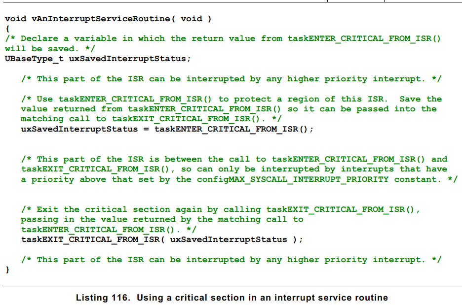

执行进入并随后退出临界区的代码比执行实际受临界区保护的代码浪费更多的处理时间。基本临界区的进入和退出都很快，而且总是具有确定性，这使得它们在受保护的代码区域非常短时使用非常理想。??????

##### 7.1.2 Suspending (or Locking) the Scheduler

<<<<<<< HEAD
临界区也可以通过挂起调度器来创建。挂起调度器有时也叫做’锁定‘调度器。

Basic临界区保护了一段代码，使其不能被其他任务和中断所访问。由挂起调度器实现的临界区仅保护这段代码不被其他任务访问，中断则仍然可以访问。

如果临界区太长，不能通过简单地禁用中断来实现，则可以通过挂起调度器来实现。然而，当调度器被挂起时，中断活动会使恢复（或“取消挂起”）调度器成为一个相对较长的操作，因此必须考虑在每种情况下哪个是最好的方法。

##### 7.1.3 vTsakSuspendAll() API函数

挂起调度器的函数原型：

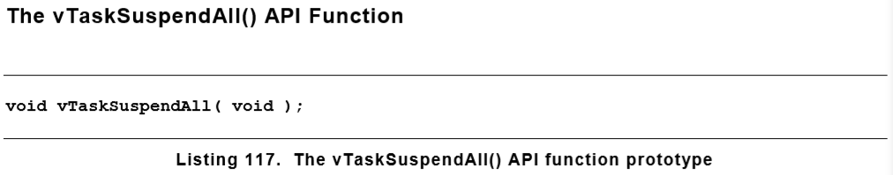

通过调用vTaskSuspendAll()函数挂起调度器。挂起调度器将阻止上下文切换的发生，但是中断仍然是可以使用的。在调度器挂起期间，如果在中断中有请求上下文切换，那么这个请求将也被观其，直到调度器重新可以使用（取消挂起）时才会处理这个上下文切换的请求。

**当调度器被挂起时，绝不能调用FreeRTOS的API函数。**

##### 7.1.4 xTaskResumeAll() API函数

重新使用调度器的函数原型：


通过调用xTaskResumeAll()函数重新使用（取消挂起）调度器。

**返回指**

pdTRUE or pdFALSE：在调度器被挂起期间请求的上下文切换将也被挂起，并且只有												在调度器被重新使用时才会处理这个上下文切换。如果在调用												xTaskResumeAll()之后处理了挂起的上下文切换返回												pdTRUE，反之返回pdFALSE。

嵌套的调用vTaskSuspendAll()和xTaskResumeAll()是安全的，因为FreeRTOS内核会记录嵌套的深度。因此只有当嵌套深度归0时调度器才会被真正的重新启用-即每一次调用xTaskResumeAll()的执行，将对应一个调用的vTaskSuspendAll()。

下图展示了实际上的vPrintString()函数，在该函数中挂起调度器以保护对终端输出的访问。

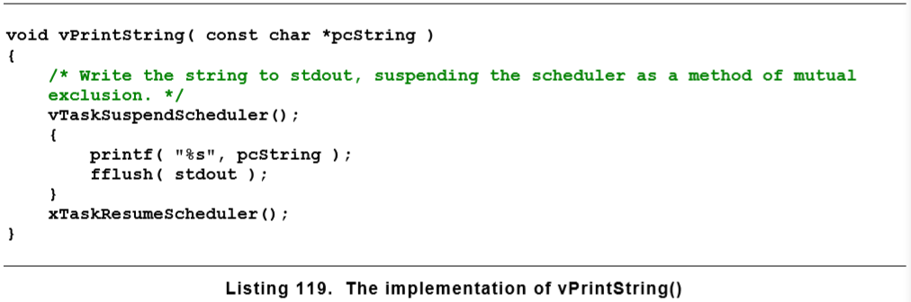

#### 7.2 互斥器（二元信号量）Mutexes (and Binary Semaphores)

互斥器是一类特殊的二元信号量，用于控制两个或多个任务对其共享资源的访问。MUTEX源于MUTual EXclusion。要使mutexes可以使用，必须在FreeRTOSConfig.h头文件中将configUSE_MUTEXES设置为1。

当使用互斥器时，可以将互斥器看作是与共享资源相关联的一种令牌。如果一个任务要合理的访问这个共享的资源，它必须先成功地获取令牌（成为令牌持有者）。当令牌持有者使用资源完毕时，它必须’交出（give）‘令牌。只有令牌被交回之后才可以被其他任务成功获取，进而安全地访问这个共享的内存。没有成功获取令牌的任务是不被允许使用共享资源的。这个机制如下图所示：

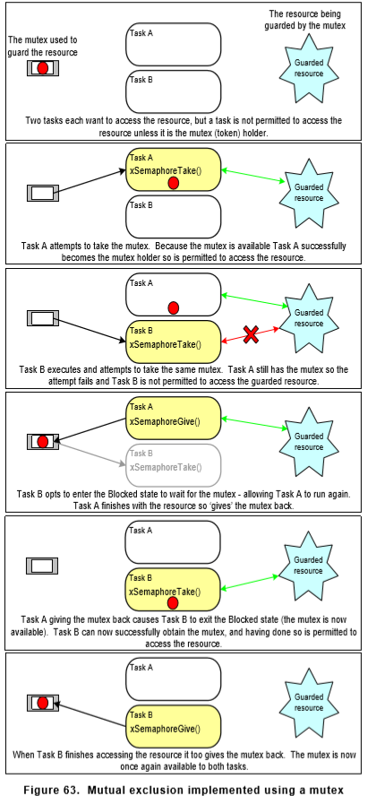

尽管互斥器与二元信号量有很多相似的特性，但上图所展示的应用场景（用与互相排斥的互斥器）跟二元信号量的应用场景（用于同步的二元信号量）完全不同。最主要的不同是当信号量被获取之后所发生的操作：

- 用于互斥的信号量用完之后必须送回。
- 用于同步的信号量用完之后一般丢掉且不用返回。

该机制完全通过应用程序开发者的原则工作。毫无疑问，除非成为互斥锁的持有着，任务在任何时间都不能访问共享资源，每个任务都是这样。

##### 7.2.1 xSemaphoreCreateMutex() API函数

FreeRTOS V9.0.0也包含了xSemaphoreCreateMutexStatic()函数，这个函数可以在编译时静态地分配创建互斥锁所请求的内存：互斥器是信号量的一种类型。所有类型的FreeRTOS信号量都保存在SemaphoreHandle_t类型的变量中。

在互斥器可以被使用之前，必须先创建它。创建互斥器类型的信号量，使用xSemphoreCreateMutex() API函数。函数原型如下：

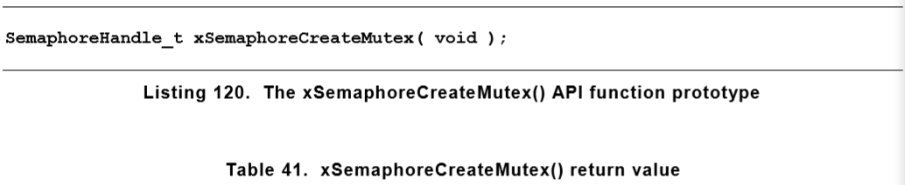

**返回指：**

NULL：如果不能创建互斥器则返回NULL，原因是没有足够的堆内存可供FreeRTOS分配给互斥器所需的数据结构使用。

non-NULL：如果成功创建了互斥器，那么将放回non-NULL。返回的值作为该创建的互斥器的句柄存储于SemaphoreHandle_t类型的变量中。

例20，略！

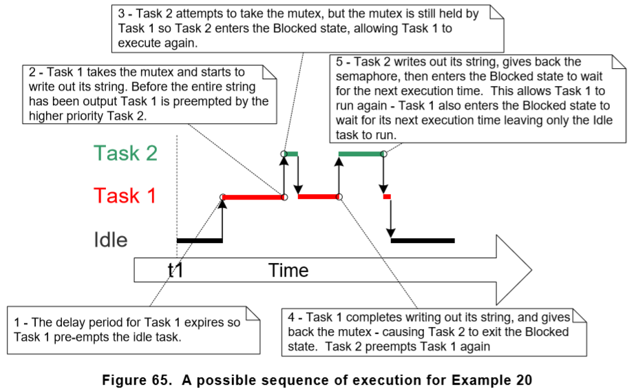

**优先级倒置（Priority Inversion）**

上图中暴露出了一个使用互斥锁来提供互斥的潜在缺陷。在执行序列中可以看到高优先级的任务2的运行必须等待低优先级的任务1释放互斥锁的控制权。低优先级的任务以这种方式延迟高优先级的任务2被叫做‘优先级反转’。如果一个中等优先级的任务开始执行时高优先级任务正在等待信号量，那么这种不希望发生的行为会进一步夸大-结果是高优先级任务在等待一个低优先级任务-而低优先级任务甚至无法执行。这种糟糕的情况如下图所示：

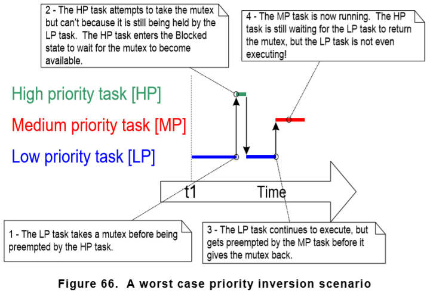

优先级倒置是一个典型的问题，不过在小型的嵌入式系统的设计时，这种情况都可以通过考虑如何有效的访问资源来避免。

**优先级继承（Priority Inheritance）**

在FreeRTOS中互斥器和二元信号量非常相似-不同之处在于互斥器包含基本的‘priority inheritance’机制，而二元信号量则没有。优先级继承是最小化优先级倒置负面影响的一种方法。优先级继承不能根治优先级倒置问题，它仅仅是通过确保优先级倒置总是有时间限制来减少它的影响。然而，优先级继承会是系统的运行分析变得复杂，并且依靠它来实现系统的正确运行是不好的做法。

优先级继承是通过暂时将低优先级的互斥量拥有者（LP任务）的优先级提高到想要获取同一互斥量的高优先级任务的优先级。如此，低优先级任务就继承了等待获取同一互斥量的高优先级任务的优先级。如下图所示，当低优先级的任务释放互斥信号量之后，其优先级将自动重置为原来的优先级。

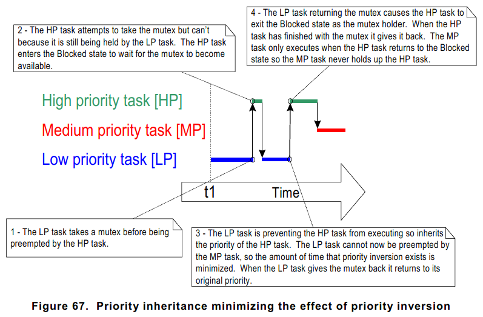

如上所述，优先级继承功能影响使用互斥锁的任务的优先级。因此，互斥锁绝不能在中断服务程序中使用。

**死锁（Deadlock or Deadly Embrace）**

Deadlock是使用互斥锁的另一个潜在缺陷。

当两个任务都在等待另一个任务所拥有的资源而无法继续执行时，就会发生死锁。考虑这样一个情形，任务A、任务B要执行一个动作，都需要获取互斥锁X、Y：

1. 任务A执行并成功获取互斥锁X。
2. 任务A被任务B抢占。
3. 任务B在获取互斥锁X之前成功获取互斥锁Y-由于互斥锁X被任务A占用，任务B获取不到。任务B选择进入阻塞态等待互斥锁X被释放。
4. 任务A继续执行。尝试获取互斥锁Y-但是互斥锁Y被任务B占用，任务A获取不到。任务A也选择进入阻塞态等待互斥所Y被释放。

最终，任务A、任务B都在等待对方占用的互斥锁被释放掉而都不能运行。

同优先级倒置，避免死锁的最好办法是在设计时考虑其发生的潜在可能，并确保在设计的系统中不会发生死锁现象。在实际中，无限的等待获取一个互斥锁是不好的。因此，使用一个比预期等待互斥锁稍微长的超时时间-如果不能在此时间内获得互斥锁，那么这将是实际错误的征兆，而这个设计错误可能是死锁。

实际上，在小型的嵌入式系统中死锁不是什么大问题，因为系统设计者对整个应用程序有一个很好的理解，在死锁发生时也能够识别死锁发生的区域并移除它。

**递归互斥锁（Recursive Mutexes）**

任务本身也可能发生死锁。当任务第一次调用互斥锁且未释放之前，再次调用同一互斥锁时会发生死锁。

1. 任务成功获取互斥锁。
2. 占用互斥锁时，任务调用了一个库函数。
3. 这个库函数尝试调用同一互斥锁，任务因此进入阻塞状态等待互斥体可以被获取。

最终，任务因等待自身已占用的互斥锁而发生死锁。

这种类型的死锁可以用过使用递归互斥锁代替标准的互斥锁避免。递归互斥锁可以被同一任务多次“take”，并且在每一个调用“take”之后，调用一个“give”，才能返回。

标准的互斥锁和递归互斥锁的创建和使用方法相似：

- 标准互斥体使用xSemaphoreCreateMutex()创建，递归互斥体使用xSemaphoreCreateRecursiveMutex()创建。两个函数拥有相同的函数原型。
- 标准的互斥体使用xSemaphoreTake()占用。递归互斥体使用xSemaphoreTakeRecursive()占用。两个函数拥有相同的函数原型。
- 标准互斥体和递归互斥体的释放分别使用xSemaphoreGive()和xSemaphoreGiveRecursive()函数，两个函数具有相同的函数原型。

下图展示了如何创建和使用递归互斥体。

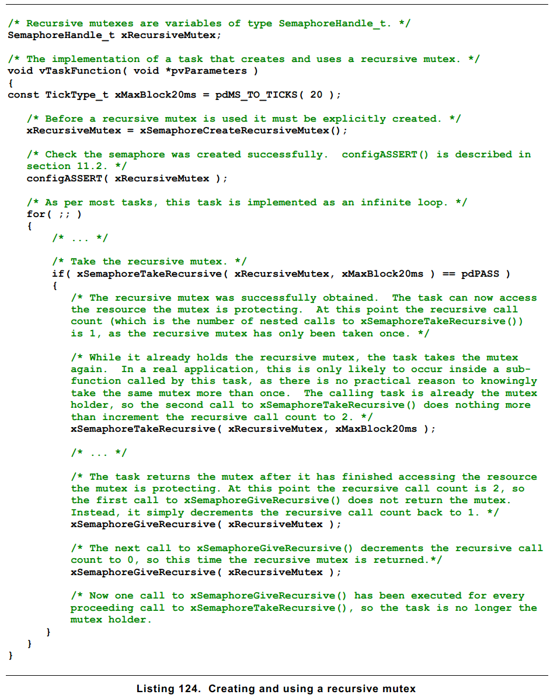

**互斥器与任务调度（Mutexes and Task Scheduling）**

如果两个优先级不同的任务使用同一个互斥锁，那么FreeRTOS调度策略会明确任务的执行顺序；即高优先级的任务竟会被选择进入运行态。例如，一个高优先级的任务等待被低优先级任务占有的互斥体时将进入阻塞态，一旦低优先级任务将互斥体释放之后，高优先级任务将立即抢占运行态。高优先级任务将成为互斥锁的拥有者。这种情况在上面的时序图中可以看到。

然而，当任务具有相同的优先级时，通常会对任务的执行顺序做出错误的判断。如果任务1和任务2具有相同的优先级，任务1等待任务2占有的互斥锁，当任务2释放互斥锁时任务1不会抢占任务2的运行。任务2将会继续保持在运行态，而任务1则简单的从阻塞态转为就绪态。如下图所示，其中每个铅垂线表示一个时钟中断。

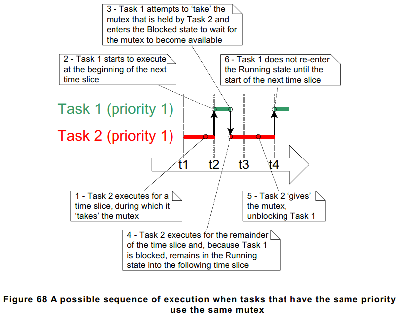

从上图中可以看出，FreeRTOS的调度器并没有在互斥锁可以被获取的时候立即使任务1进入运行态。因为：

1. 任务1和任务2具有相同的优先级，因此只要任务2不进入阻塞态，那么到任务1的上下文切换不会发生，直到下一个时钟中断的到来（假设FreeRTOS.h头文件中已将变量configUSE_TIME_SLICING设置为1）。
2. 如果在一个tight loop中使用互斥锁，并且每次在互斥锁被释放的时候进行上下文切换，那么任务处于运行态的时间将只有一小段。这样一来，如果有两个或两个以上的任务在一个tight loop中使用同一互斥锁，那么运行时间将被浪费在不停的处理任务之间的上下文切换上。

如果互斥锁在一个tight loop中被多个（超过一个的）任务使用，并且任务的优先级相同，那么，必须小心确保每个任务接收到大致相同的处理时间。任务可能不会有相同的处理时间可以从下图中看出，图中展示的执行序列在两个任务具有相同的优先级时可能会放生，创建任务的代码如下下图所示。

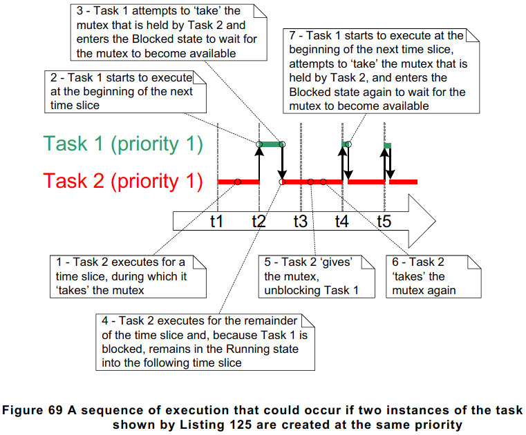

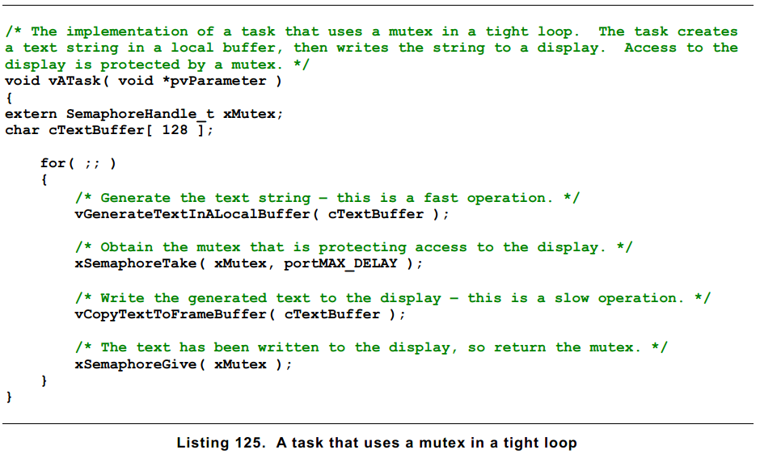

上面时序图中step7表示任务1有一次进入了阻塞态-这发生在xSemaphoreTake() API函数内部。从图中也可以看出任务1只有在时间片开始时且任务2释放掉互斥锁同时发生的情况下，才能进入运行态，其他时间任务1将无法获取互斥锁。时序图中的情况可以在调用xSemaphoreGive()函数之后添加一个和taskYIELD()函数来避免。如下图所示，当tick计数值改变且任务还是互斥体拥有者时将调用taskYIELD()函数。

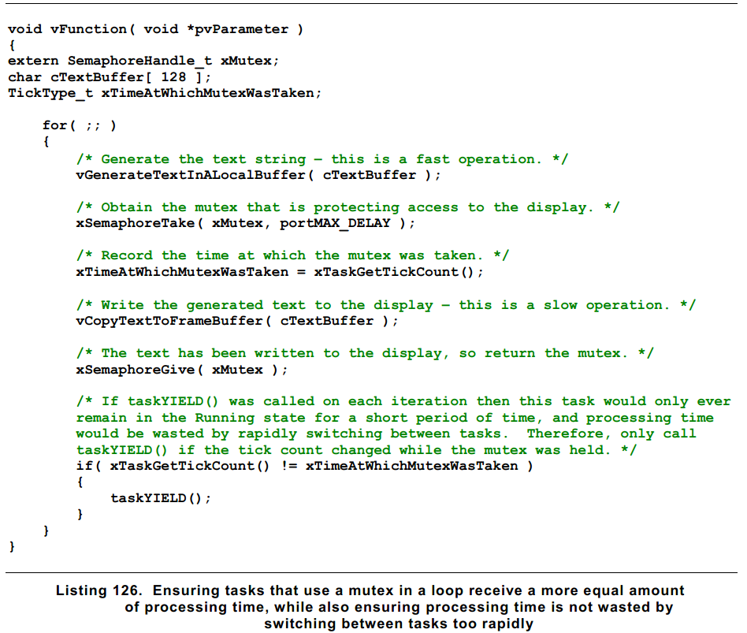

#### 7.3 看门任务（Gatekeeper Tasks）

Gatekeeper tasks提供了一个实现互斥锁并且没有优先级倒置或死锁的干净方法（clean method）。

gatekeeper task是一个**资源唯一拥有者**的**任务**。只有gatekeeper任务允许直接存取资源-其他需要访问这片资源的任务需要使用gatekeeper提供的服务间接访问。

例21.略。

使用gatekeeper task重新编写的vPrintString()函数如下图所示：

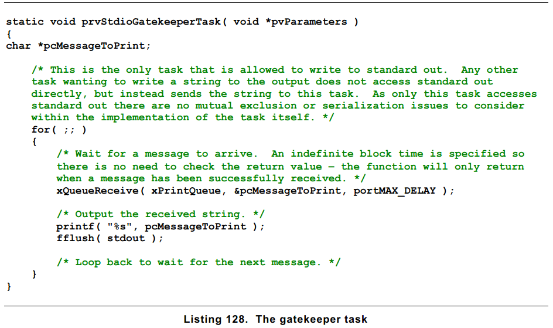

tick hook时钟钩子（tick callback时钟回调）函数是在每一个滴答中断发生时内核调用的函数。

如果要使用tick hook function，需要：

1. 在FreeRTOSConfig.h头文件中将configUSE_TICK_HOOK变量设置为1。
2. 使用要求的函数名以及函数原型，给出钩子函数的实现。函数原型如下图所示。

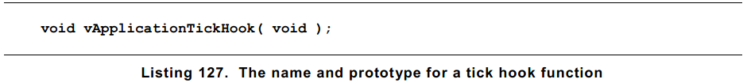

时钟钩子函数实现如下图所示。

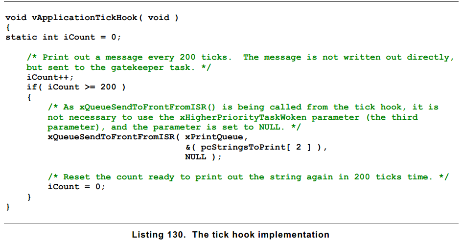

时钟钩子函数在时钟中断中被执行，因此必须使钩子函数非常简短，必须只使用适量的堆栈空间，且只能调用以“FromISR()”结尾的FreeRTOS API函数。

在时钟钩子函数执行之后经常会立即执行调度器，因此在时钟钩子函数中调用的中断安全版本的FreeRTOS API函数不需要使用pxHigherPriorityTaskWoken参数，可以将这个参数设置为NULL。

向xPrintQueue队列中写数据的任务如下图所示。

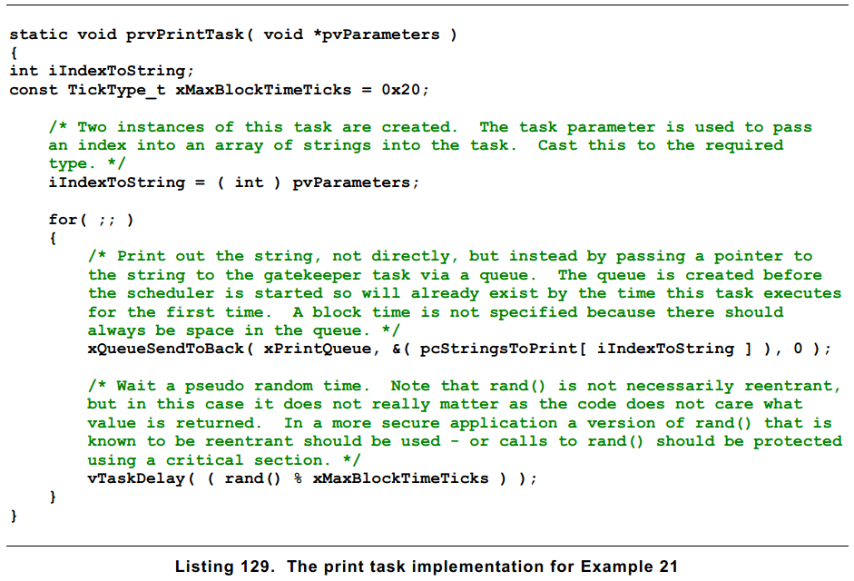

### 8 事件组（Event Groups）

在实时嵌入式操作系统中必须对发生的事件采取一些动作。之前的章节描述了FreeRTOS允许事件与任务通讯的一些特性。例如信号量和队列，这两个都有以下性质：

- 使一个任务因等待某个单一的事件发生而进入阻塞态。
- 当事件发生时可以激活某个单一的任务-这个激活的任务是等待事件发生的任务中优先级最高的那一个。

事件组是FreeRTOS允许事件与任务通讯的另一特性，不同于队列和信号量的是;

- 事件组使一个任务因等待一个或者多个事件组合的发生而进入阻塞态。
- 当同一事件发生，或事件组合发生时，事件组会激活所有的因等待事件发生而进入阻塞态的任务。

事件组的这种独特的性质在同步多任务时很有用，向多个任务广播事件，使得一个任务因等待事件组中的任何一个事件的发生而进入阻塞态，也可使得一个任务因等待很多动作完全结束而进入阻塞状态。

事件组也提供了在一个应用中降低RAM使用的可能，因为基本上一个单一的事件组可能会替代许多二元信号量。

事件组功能是可选的。要使用事件组功能需要在构建FreeRTOS源文件时将event_groups.c文件作为你工程的一部分。

#### 8.1 事件组的特性

##### 8.1.1 事件组，事件标志&事件位（Event Groups,Event Flags & Event Bits）

事件标志是一个指示事件是否已经发生过的布尔值（1/0）。事件组是事件标志的组合。

事件标志只能是1或者0，使得事件标志的状态可以使用一位进行存储，因此一个事件组中的事件标志的状态可以存储到一个变量中；事件组中的每一个事件标志的状态分别由这个变量中的一位表示，变量类型是**EventBits_t**。在这个变量中，如果某一位被设置为1，表示该位代表的事件已经发生了，0则表示未发生。

下图所示为一个EventBits_t类型的变量每一位与每个事件标志的映射。

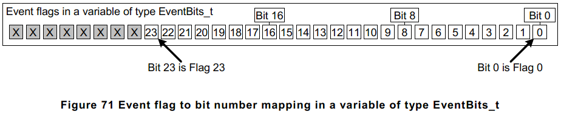

**事件组中的每一位的含义（所代表的事件）取决于应用开发者。**

**EventBits_t数据类型**

事件组中可以使用的位的数量取决于在编译时在FreeRTOSConfig.h头文件中配置给configUSE_16_BIT_TICKS变量的值。

- 如果configUSE_16_BIT_TICKS设置为1，那么事件组中中有8位可以使用。
- 如果configUSE_16_BIT_TICKS设置为0，那么事件组中中有24位可以使用。

**多任务访问**

事件组是具有自身权限的对象，知道它们存在的任何任务或ISR都可以访问它们。任何数量的任务都可以设置同一事件组的标志位，也可以从事件组中读取标志位。

**A Practical Example of Using an Event Group**

略。FreeRTOS+TCP TCP/IP栈的实现提供了一个如何使用事件组即简化程序设计，又减少资源使用的实例。

#### 8.2 使用事件组管理事件

##### 8.2.1 xEventGroupCreate() API函数

在FreeRTOS V9.0.0版本中也包含xEventGroupCreateStatic()函数，这个函数可以在编译时静态地为创建的事件组分配内存。事件组在能够被使用之前必须明确的创建它。

Event groups使用变量类型为EventGroupHandle_t的变量来引用它。xEventGroupCreate() API函数用于创建事件组，该函数返回一个EventGroupHandle_t类型的变量来引用它创建的事件组。函数原型如下图所示：


**参数**

void：无输入参数

**返回值**

NULL：如果返回NULL，则由于没有足够的内存可以供FreeRTOS分配给事件组数据结构所需要的大小，而没有创建成功。

non-NULL：如果创建事件组成功，那么将返回一个非空值，这个返回的非空值将被存储为EventGroupHandle_t类型的变量中，用作所创建事件组的句柄。

##### 8.2.2 xEventGroupSetBits() API函数

xEventGroupSetBits() API函数可以设置事件组中的一个或多个位，经常用于通知任务那些被设置的位所代表的事件已经发生了。其函数原型如下图所示：

**注意**：在中断服务程序中绝不能调用xEventGroupSetBits()函数，应该使用中断安全版本的xEventGroupSetBitsFromISR()。

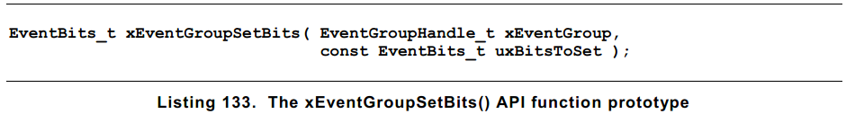

**参数**

xEventGroup：将要被设置位的事件组句柄。这个句柄是调用xEventGroupCreate()函数创建事件组时返回的值。

uxBitsToSet：指定一个或者多个事件位的位掩码，用于将事件组的某些位置1。使用uxBitsToSet的值与事件组原来的值做位与运算改变事件组的值。

比如说，uxBitsToSet的值为0x04（0100），这将会使是第三事件位置1（如果原来为0），其他的事件位保持不变。

**返回值**

调用xEventGroupSetBits()函数结束时事件组的值。注意，这个返回值可能不一定设置了uxBitsToSet指定的位，因为在其他的任务中可能清除了其中的某些位。

##### 8.2.3 xEventGroupSetBitsFromISR() API函数

xEventGroupSetBitsFromISR()函数是中断安全版的xEventGroupSetBits()函数。

释放一个信号量是一个确定性的操作，因为它可以预先知道释放该信号量最多可以使一个任务离开阻塞状态。当将一个事件组的某些位置1时，不能够预先知道有多少任务因此退出阻塞状态，所以将事件组中的某些位置1这个操作具有不确定性。

FreeRTOS的设计和实现准则是不允许在中断服务程序中或当中断被禁用时执行具有不确定性的操作（非确定性操作）。因此，xEventGroupSetBitsFromISR()函数不直接在中断服务程序内设置事件位，而是将设置操作递延到RTOS的守护进程任务中。xEventGroupSetBitsFromISR()函数原型如下图所示：

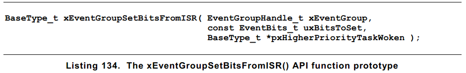

**参数**

**xEventGroup**：需要被设置事件位的事件组句柄。这个事件组句柄是调用xEventGroupCreate()函数创建事件组时返回值。

**uxBitsToSet**：指定事件组中将要被设置为1的一个或多个事件位的位掩码。事件组的值通过uxBitsToSet参数与当前事件组的值进行按位或操作进行更新。

**pxHigherPriorityTaskWoken**：xEventGroupSetBitsFromISR()函数不会直接在中断服务程序设置事件位，而是将设置事件位的操作通过发送命令到定时器命令队列递延到RTOS的守护进程任务中。如果守护进程任务因等待定时器命令队列变成可获取状态而处于阻塞状态，那么向定时器命令队列写入命令将使守护进程任务退出阻塞状态。如果守护进程任务的优先级高于当前正在运行的任务（即被中断的任务），那么在xEventGroupSetBitsFromISR()函数内将设置*pxHigherPriorityTaskWoken参数位pdTRUE。

**如果在xEventGroupSetBitsFromISR()函数中设置pxHigherPriorityTaskWoken参数位pdTRUE，那么在中断退出之前应该执行上下文切换。这保证了中断直接返回到守护进程任务，因为守护进程任务是当前就绪态中优先级最高的任务。**

**返回值**

**pdPASS**：如果成功将数据发送到定时器命令队列将会返回pdPASS。

**pdFALSE**：如果设置位“set bits”命令因为队列已满而不能够写入到定时器命令队列时返回pdFALSE。

##### 8.2.4 xEventGroupWaitBits() API函数

xEventGroupWaitBits() API函数可以使任务读取事件组的值，并且可以选择等待事件组中的一个或多个事件位被设置而进入阻塞态，如果它等待被设置的那些位还没有被设置。其函数原型位：

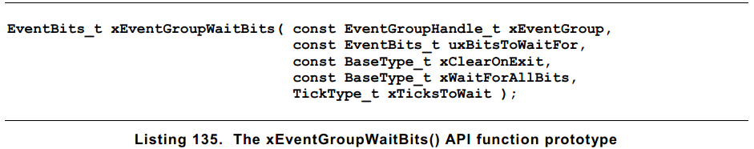

调度器通过一个被叫做“unblock condition”的条件判断一个任务是否要进入阻塞态，以及何时退出阻塞态。这个unblock condition通过uxBitsToWaitFor和xWaitForAllBits两个参数值的组合来给定。：

- uxBitsToWaitFor参数指定要测试事件组中的哪些事件位。
- xWaitForAllBits参数指定是否使用按位或测试，或按位与测试。

如果在调用xEventGroupWaitBits()函数时满足unblock condition，那么任务将不会进入阻塞状态。

调用该函数的任务使用uxBitsToWaitFor参数指定要等待的事件位，该任务可能需要在满足unblock condition条件之后将这些位清除回零。使用xEventGroupClearBits() API函数可以清除事件位，但是在应用程序代码中使用这个函数手动清除事件位会导致**竟态条件**，如果：

- 有多个任务使用同一个事件组。
- 事件组中的位在一个不同的任务或在中断服务程序中被设置。

使用xClearOnExit参数可以避免潜在的race conditions的放生。如果设置xClearOnExit为pdTRUE那么测试和清除调用任务中出现的事件位是原子任务“atomic operation”（不可以被其他任务或中断中断的操作）。

**参数**

**xEventGroup**：事件组句柄，包含了要被读取的事件位。

**uxBitsToWaitFor**：指定事件组中要等待的事件位的位掩码。

**xClearOnExit**：如果调用函数的unblock condition达到了，且xClearOnExit参数设置为pdTRUE，那么由uxBitsToWaitFor参数指定的事件位将在调用任务退出xEventGroupWaitBits() API函数之前清除回零。如果xClearOnExit参数设置为pdFALSE，那么事件组中的事件位在xEventGroupWaitsBits() API函数中将不会被改变。

**xWaitForAllBits**：uxBitsToWaitFor参数指定要在事件组中等待的事件位。xWaitForAllBits不同的取值决定了什么情况下任务可以退出阻塞态。

- pdFALSE：当达到uxBitsToWaitFor参数指定的事件位中的**任一**位时，（或阻塞时间到期）即可退出阻塞态。
- pdTRUE：当达到uxBitsToWaitFor参数指定的事件位中的**所有**位时，（或阻塞时间到期）即可退出阻塞态。

**xTicksToWait**：xTicksToWait参数指定了任务在等待达到unblock condition时，处于阻塞状态的最大时间。如果xTicksToWait参数设置为0或者unblock condition在调用xEventGroupWaitBits()函数时就达到了，函数将回立即返回。

**返回值**

**事件组的值**

- 如果调用xEventGroupWaitBits()函数的任务达到了unblock condition，那么将返回达到unblock condition时事件组的值（如果xClearOnExit是pdTRUE，则是未清除回零的值）。在这种情况下，返回值也是符合unblock condition的。
- 如果调用xEventGroupWaitBits()函数的任务因等待unblock condition达到时间超时而返回，那么返回值是xTicksToWait参数指定的时间耗尽之后事件组的值。在这种情况下，返回值不会符合unblock condition。

列22略。

#### 8.3 使用事件组同步任务

有时需要设计一个要求两个或更多任务相互同步的程序。例如，考虑这样一种设计，其中任务A接收一个事件，然后将该事件所需的一些处理委托给其他三个任务：任务B、C、D。如果在任务B、C、D没有全部完成它们各自的对前一个事件的处理之前，任务A不能接收另一个事件，那么这四个任务需要相互同步。每个任务的同步带你将在该任务完成其处理之后，并且在其他每个任务完成相同的处理之前不能继续进行。任务A只有在所有四个任务都达到同步点之后才能接收另一个事件。

在FreeRTOS+TCP示例项目中可以招到一个需要这种任务同步类型的简洁示例。展示了两个任务共享一个TCP套接字；一个任务发送数据到套接字，另一个任务从这个套接字中接收数据。在确定其他任务不会再次尝试访问该套接字之前，任一任务关闭TCP套接字都是不安全的。如果两个任务都想要关闭套接字，那么必须通知到另一个任务它的意愿，那么在关闭套接字之前就需要等待另一个任务停止对套接字的访问。下图中的伪代码展示了将数据发送给希望关闭套接字的任务的场景。

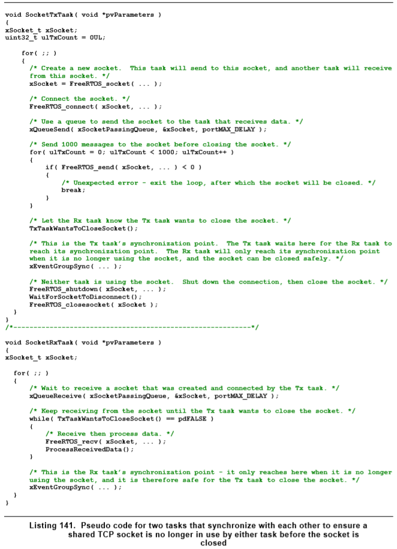

上图中展示的情景比较简单，只有两个需要相互同步的任务，但是，如果其他任务正在执行的处理以来于正在打开的套接字，那么很容易看出这个场景将如何变得更加复杂，并且需要更多的任务来加入同步。

**事件组可以用来创建同步点：**

- 必须参与同步的每个任务在事件组中被分配一个唯一的事件位。
- 当每个任务到达自己的同步点时设置它自己的事件位。
- 设置完自己的事件位之后，进入阻塞状态等待其他同步任务的事件位也被设置好。

然而，xEventGroupSetBits()和xEventGroupWaitBits() API函数不能用于这种场景。如果使用它们，那么设置事件位（表示一个任务到达了它的同步点）和测试事件位（判断其他同步任务是否达到了其同步点）将会作为两个分开的操作执行。为了展示这个问题，考虑以下场景，任务A、B、C使用事件组来尝试同步：

1. 任务A和B已经到达了它们各自的同步点，因此事件组中也已被设置，它们现在处于阻塞态等待任务C到达其同步点并设置其相应的事件位。
2. 任务C到达其同步点并设置其事件位。任内C一旦设置了其事件位，任务A和B将离开阻塞态，并清除所有的三个事件位的设置。
3. 然后任务C调用xEventGroupWaitBits()函数等待所有的三个事件位被设置，但是此时，所有的三个事件位已经被清除了，任务A和B已经离开了各自的同步点，因此同步以失败告终。

为了成功的使用一个事件组去创建同步点，设置事件位，以及随后的事件位测试，必须将这些操作作为一个单一的且不可被中断的操作。xEventGroupSync() API函数应运而生。

##### 8.3.1 xEventGroupSync() API函数

xEventGroupSync()函数用来使两个或更多的任务使用事件组来同步彼此。这个函数使得一个任务设置一个或多个事件组中的事件位，然后等待这个事件组中的事件位组合的其他位被设置成为一个单一且不可被中断的操作。

xEventGroupSync()函数的uxBitsToWaitFor参数指定了调用函数的unblock condition。这个参数指定的事件位将在xEventGroupSync()函数返回之前被清除归零，只有当xEventGroupSync()函数达到了unblock condition之后才会返回。其函数原型如下图所示。

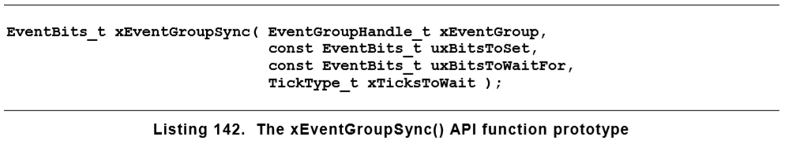

**参数**

xEventGroup：要被设置以及测试的事件组句柄。该句柄由xEventGroupCreate()函数创建事件组时返回。

uxBitsToSet：指定事件位的位掩码，即事件组中要被设置为1的事件位。事件组的值将通过与该参数进行按位或操作更新。

uxBitsToWaitFor：指定事件位的位掩码，是事件组中要被测试的事件位。例，如果调用函数想等待事件位0、1、2被设置，那么给定该参数为0x07（0111）。

xTicksToWait：等待达到unblock condition的最大阻塞态时间。

**返回值**

事件组的值

- 如果调用任务的unblock condition达到了，那么xEventGroupSync()函数的返回值是调用任务达到unblock condition时事件组的值（在事件位被自动清楚归零之前）。在这种情况下，返回指是符合调用任务的unblock condition的。
- 如果调用任务的unblock condition没有达到，xEventGroupSync()函数因阻塞时间到期而返回，那么返回值将是阻塞时间到期时事件组的值。在这种情况下，返回值仍然是不符合调用任务的unblock condition。

例23，任务同步，略。

### 9 任务通知 Task Notifications

**通过中介对象进行通信**

包含多列，事件组，各种类型的信号量。

当使用中介对象进行通信时，时间和数据不是直接发送给任务或者中断服务程序，而是发送到通信对象。同样的，任务和终端服务程序也从通信对象中接收时间或者数据，而不是直接接收从任务或者中断服务程序中发出的事件或对象。如下图所示。

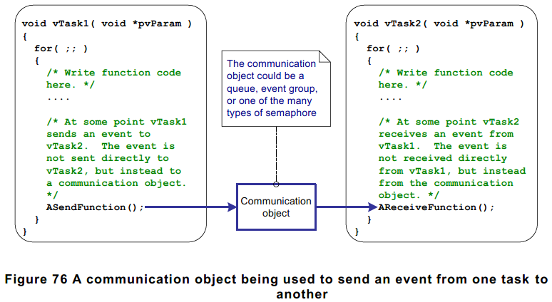

**任务通知-任务直接通信 Task Notifications**

任务通知使得任务之间可以相互影响，并且不需要信号量通信对象就可以与中断服务程序同步。利用任务通知，一个任务或者终端服务程序可以支接将事件发送到接收任务中，如下图所示：

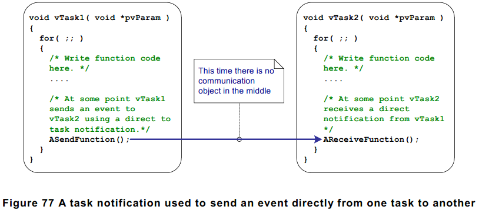

任务通知功能是可选的。在FreeRTOSConfig.h文件设置configUSE_TASK_NOTIFICATIONS为1即可将任务通知功能包含入项目中。

当configUSE_TASK_NOTIFICATIONS变量设置为1时，每个任务有一个可以是“Pending"或者”Not-Pending“的**”Notidication State“**和一个32位无符号整型的**”Notification Value“**变量。当一个任务接收到一个通知后，它的通知状态被设置为pending。当任务读取其通知值时，它的通知状态被恢复为not-pending。

任务可以选择一个超时时间进入阻塞态等待其通知状态被设置为pending。

#### 9.1 任务通知的优缺点

1. **任务通知的性能优势**

使用任务通知发送事件或数据到一个任务要比使用队列，信号量或事件组进行相同的操作明显快的很多。

2. **任务通知的内存占用优势**

使用任务通知发送时间或者数据到一个任务所需要的RAM内存要比使用队列，信号量或事件组去执行同等的操作所使用的RAM少得多。这是因为每一个通信对象（队列，信号量或事件组）在能够被使用之前必须线创建它们，然而使用任务通知功能的开销则是每个任务需要有8字节的RAM内存。

3. **任务通知的短处**

虽然任务通知比通信对象更快且省RAM内存，但是任务通知不能在所有的场景中使用。以下记录了一些无法使用任务通知的场景：

- 发送数据或事件到一个ISR

通信对象可以用来从ISR中发送事件或数据到任务，也可以发送事件或数据从任务到ISR

任务通知可以用来从ISR发送事件或数据到任务，但是**不能从任务中发送事件或者任务到ISR中**。

- 启用多个接收任务

通信对象可以被任一知道它句柄（可能是队列句柄，信号量句柄或事件组句柄）的任务或者中断服务程序访问。任意数量的任务和中断服务程序可以访问发送到给定通信对象中的事件或数据。

任务通知直接发送事件或数据到接收任务，因此只能由被发送通知的任务访问。然而，在实际中这确实很少用，因为在实际中有很多任务和ISR将数据或事件发送到同一个通信对象中，但是很少有多个任务和ISR从同一个通信对象中接收数据或者事件。

- 缓冲多个数据项

一个队列通信对象可以同时容纳多个数据项。数据发送到队列中，没有被取出时，就缓存在队列对象内部。

任务通知通过更新接受任务的“通知值”发送数据到任务。任务的通知值只能保存一个值。

- 向多个任务广播

事件组通信对象可以用来同时发送事件到多个任务。

任务通知直接发送事件到接收任务，因此只能被接收事件的任务访问。

- 进入阻塞态等待发送完成

如果通信对象暂时处于一种状态，即不能在想其写入数据或事件（例如，当一个队列已满而不能再有数据被发送到队列中），那么试图写入该对象的任务可以选择进入阻塞态，以等待它们的写入操作完成。

如果一个任务试图发送一个任务通知到一个已经notification pending的任务中，那么发送任务不可能进入阻塞态等待接收任务重置它的通知状态。你看，这就是一个在实际中使用任务通知的一个局限。

#### 9.2 使用任务通知

**任务通知API选项**

任务通知是一个很强大的功能，经常可以用来替代二元信号量、计数信号量、事件组，甚至有时可以替代一个队列。这种广泛的使用场景可以通过xTaskNotify()函数和xTaskNotifyWait()函数实现。其中xTaskNotify()函数用来发送任务通知，xTaskNotifyWait()函数用来接收任务通知。

然而，在大多数应用中，并不需要xTaskNotify()和xTaskNotifyWait()函数提供的全部（使用）灵活性，更简单的函数就足够了。因此，xTaskNotifyGive()函数提供了一个简单的但灵活性低的用于替代xTaskNotify()函数的实现。ulTaskNotifyTake()函数被用来作为可替代xTaskNotifyWait()函数的更简单但灵活度低的实现方法。

##### 9.2.1 xTaskNotifyGive()  & vTaskNotifyGiveFromISR() API函数

xTaskNotifyGive()函数直接发送一个通知到任务，并且增加（+1）接收任务的通知值。调用xTaskNotifyGive()将接收任务的通知状态设置为pending，如果之前没有pending的话。

提供的xTaskNotifyGive()API函数使得任务通知可以被用来作为一个轻量且快速的二元或计数信号量的替代品。其函数原型如下：

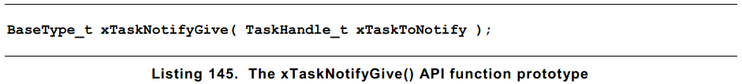

**参数**

xTaskToNotify：通知被发送到的任务句柄。

**返回值**

pdPASS：xTaskNotifyGive()函数是一个调用xTaskNotify()函数的宏。通过宏传递给xTaskNotify()函数的参数被设置为pdPASS是唯一可能的返回值。xTaskNotify()函数将在后面介绍。

vTaskNotifyGiveFromISR()函数是可以在中断服务程序中使用的xTaskNotifyGive()函数。函数原型如下图所示：

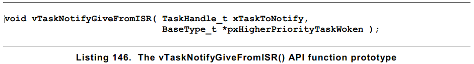

**参数**

xTaskToNotify：通知要发送到的任务句柄。

pxHigherPriorityTaskWoken：如果这个被发送通知的任务在阻塞态中等待接收一个通知，那么在中断服务程序中发送通知将使得这个任务退出阻塞态。

如果调用vTaskNotifyGiveFromISR()函数使得一个任务离开了阻塞态，并且被激活的这个任务的优先级比正在运行的任务（即被中断的任务）优先级高，那么在vTaskNotifyGiveFromISR()函数中将*pxHigherPriorityTaskWoken参数设置为pdTRUE。

##### 9.2.2 ulTaskNotifyTake() API函数

ulTaskNotifyTake()函数允许任务进入阻塞态等地其通知值大于0，也可以在函数返回之前减小（-1）或者清除任务通知值。

ulTaskNotifyTake() API函数使得任务通知可以被用作一个二元或计数信号量的轻量且快速的替代方法。其函数原型如下：

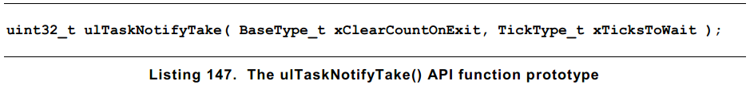

**参数**

xClearCountOnExit：如果xClearCountOnExit被设置为**pdTRUE**，那么调用函数的任务的通知值将在ulTaskNotifyTake()函数返回之前被清除归0。如果xClearCountOnExit被置为**pdFALSE**，并且调用任务的通知值大于0，那么调用任务的通知值在调用ulTaskNotifyTake()函数返回之前减1。

xTicksToWait：调用任务在等待它的通知值大于0时，进入阻塞状态的最大时间。

**返回值**

notification value：返回值是调用任务的通知值在被清除归0或减1之前的值，正如xClearCountOnExit参数所指定的那样。

如果制定了阻塞时间（xTicksToWait参数不为0），当返回值不是0时，可能是调用任务进入阻塞态等待通知值大于0时，在时间耗尽前通知值被更新了。当返回值是0时，可能是等待超时。

例24，25，略。

##### 9.2.3 xTaskNotify() & xTaskNotifyFromISR() API函数

xTaskNotify()函数是xTaskNotifyGive()函数更强大的版本，xTaskNotify()函数可以在以下任意方法中更新接收任务的通知值：

- 增加（+1）接收任务的通知值，在这种情况下xTaskNotify()同xTaskNotifyGive()函数作用相同。
- 设置接收任务通知值的一个或者多位。这使得任务的通知值可以被用来作为事件组的一个轻量且快速的替代品。
- 向接收任务的通知值写入一个新的数值，但是仅在接收任务自上次更新之后已读取其通知值。这使得通知值提供了一个类似长度为1的队列提供的功能。
- 向接收任务的通知值写入一个新的数值，即使接收任务通知值自上次更新之后还没有被任务读取。这使得任务通知值提供了一个类似于xQueueOverwrite() API函数的功能。这种行为有时可以称之为邮箱“mailbox”。

xTaskNotify()相比于xTaskNotifyGive()更灵活、强大，正因它额外的灵活性和功能，它的使用也相对比较复杂。

xTaskNotifyFromISR()是可以在中断服务程序中使用的xTaskNotify()版本，所以它有一个多的pxHigherPriorityTaskWoken参数。

如果任务的通知状态还没有pending，那么调用xTaskNotify()函数总会将接收任务的通知状态设置为pending。两个函数的函数原型如下图所示：

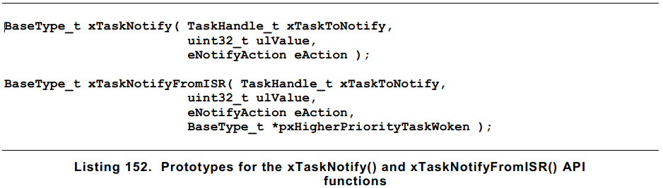

**参数**

xTaskToNotify：通知要被发送到的任务句柄。

ulValue：ulValue参数如何使用取决于eNotifyAction参数的值。

eNotifyAction：一个枚举类型的值，它指定了如何更新接收任务的通知值。

**返回值**

pdPASS：除了下表中的那一种情况下都将返回pdPASS。

eSetValueWithOverwrite：无论在调用xTaskNotify()之前接收任务的接收状态是否为pending，接收任务的通知值都将被设置为xTaskNotify()中传入的ulValue参数。

|    eNotifyAction value    | Resultant Effect on Receiving Task                           |
| :-----------------------: | :----------------------------------------------------------- |
|         eNoAction         | 只将接收任务的通知状态设置为pending，不更新其通知值，ulValue参数将不使用。eNoAction使得任务通知可以被用作一个轻量且快速的二元信号量的替代方法。 |
|         eSetBits          | 接收任务的通知值将与xTaskNotify()函数中传入的ulValue参数做按位或运算。例如，ulValue参数值为0x01，那么接收任务的通知值的bit0将被设置为1。再如，ulValue参数为0x06(0110)，那么接收任务的通知值的bit1和bit2将被设置为1。eSetBits操作使得任务通知可以被用作一个更快且轻量的事件组替代品。 |
|        eIncrement         | 接收任务的通知值将被增加。vTaskNotify()函数的ulValue参数未使用。eIncrement操作使得任务通知值可以被用来作为二元或计数信号量的一个快速且轻量化的替代，此时xTaskNotify()函数等效于xTaskNotifyGive() API函数 |
| eSetValueWithoutOverwrite | 如果接收任务在调用xTaskNotify()函数之前其状态已经是pending，那么xTaskNotify()函数将不做任务操作并返回pdFAIL。如果接收任务在调用xTaskNotify()函数之前其状态不是pending，那么接收任务的通知值将被设置为xTaskNotify()函数中传入的ulValue参数值。 |

##### 9.2.4 xTaskNotifyWait() API函数

xTaskNotifyWait()函数是功能更强的ulTaskNotifyTake()函数版本。在任务的通知状态没有pending的情况下，它使得任务可以选择一个超时时间去等待调用xTaskNotifyWait()函数的任务通知状态变为pending。xTaskNotifyWait()函数提供了在进入函数和退出函数时调用任务的通知值中要清除的位的选项。其函数原型如下所示：

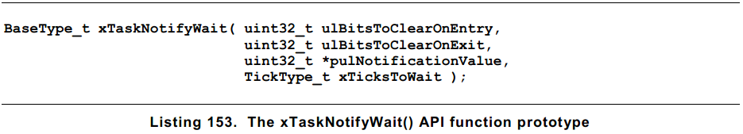

**参数**

**ulBitsToClearOnEntry**：如果调用任务在调用xTaskNotifyWait()函数之前没有一个通知pending，那么在ulBitsToClearOnEntry参数中设置的位将在进入函数时清除任务的通知值。例如，如果ulBitsToClearOnEntry设置位0x01，那么任务的通知值的bit0将被清除归0。如果将其设置为0xffffffff（ULONG_MAX）,将会把调用任务的通知值的所有位清除归0。

**ulBitsToClearOnExit**：如果调用任务收到一个通知而退出xTaskNotifyWait()函数，或者在调用xTaskNotifyWait()函数之前它已经接收了一个任务通知，那么ulBitsToClearOnExit参数指定的任何位在任务退出xTaskNotifyWait()函数之前都会在其通知值中进行清除归0。例如，给定ulBitsToClearOnExit参数0x03，那么任务的通知值的bit0和bit1将值函数退出之前被清除归0。若设置其位0xffffffff(ULONG_MAX)，将会清除任务通知值的所有位。

**pulNotificationValue**：用来输出任务通知值。*pulNotificationValue参数的值是任务通知值在ulBitsToClearOnExit参数设置的位被清除之前的值。pulNotificationValue是一个可选的参数，如果不需要的话可以将其设置为NULL。

**xTickToWait**：调用任务进入阻塞态等待通知状态变为pending的最大时间。

**返回值**

pdTRUE：当接收到任务通知，或任务调用xTaskNjotifyWait()函数时已经有一个通知pending时返回pdTRUE。如果指定了等待时间（xTickToWait不是0），可能时在等待时间耗尽之前收到了任务通知。

pdFALSE：调用任务没有收到任务通知。如果xTickToWait参数不为0，可能是在等待时间耗尽时还没有接收到任务通知。

UART Example.略

外设驱动程序库提供了执行硬件接口通用操作的功能函数。这些库函数通常提供了以下这几种外设：Universal Asynchronous Receivers and Transmitters(UARTs)，Serial Peripheral Interface(SPI) ports，analog to digital converters(ADCs)，and Ethernet ports。通常由此类库提供的函数示例包含了外设初始化，发送数据到外设与从外设接收数据的功能。

一些在外设上的操作需要相当长的一段时间。例如高精度的模数转换，通过UART传输大数据包。在这种情况下驱动库函数可以实现轮询（重复读取）外设的状态寄存器，以确定外设何时完成这些操作。然而，这种方式的轮询几乎总是浪费的，因为它利用了100%的处理器时间并且没有任何生产性的处理。在多任务系统中这种浪费尤其要命，例如轮询外设的任务可能会阻止执行具有生产性处理的低优先级任务。

为了避免潜在的处理器资源浪费，一个有效的RTOS感知设备驱动程序应该是中断驱动的，并且为启动长时间操作的任务提供在阻塞状态下等待操作完成的选项。如此，当执行一个漫长操作的任务进入阻塞态时，低优先级的任务可以被执行，没有任务会占用处理时间，除非它们能有效地利用它。

在RTOS的驱动库中使用一个二元信号量使任务进入阻塞态是常规操作。Listing154的伪代码展示的技巧就是如此，它给出RTOS库函数中利用UART端口上传输数据的一个轮廓。在下图的Listing154中可以看出：

- xUART是一个描述UART外设的结构体，包含了它的状态信息。该结构体的xTxSemaphore成员是一个SemaphoreHandle_t类型的变量。（当然在使用之前肯定要先创建它，信号量、结构体）
- xUART_Send()函数不包含任何的互斥逻辑。如果多个任务都打算使用xUART_Sent()函数，那么程序开发人员必须保证程序自己可以管理互斥。例如，一个任务在调用xUART_Send()函数之前需要先获取互斥锁。
- 在UART传输开始之后，xSemaphoreTake() API函数用来把调用任务送入阻塞态。
- 当UART外设的传输结束中断服务程序执行时，xSemaphoreGiveFromISR() API函数用来在传输完成之后把任务从阻塞态中移出。

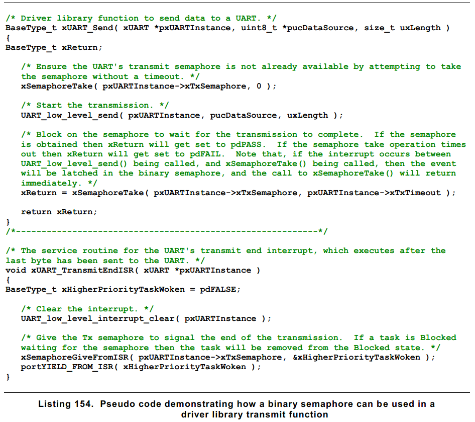

上图中Listing154的技巧在实际中是完全可行的，但是有以下一些缺点：

- 驱动库使用多个信号量，增加了其内存占用。
- 信号量直到被创建时才可以被使用，因此使用信号量的库只有被显示初始化之后才可以被使用。
- 信号量是通用对象，适用于广泛的用例；它有这样的逻辑，使任意数量的任务进入阻塞态等待信号量变成可获取状态，当信号量变成可获取状态时选择（in a deterministic manner）哪一个任务退出阻塞态。执行这个逻辑只需要有限的时间，但在Listing154中展示的情境下这个处理开销是不必要的，因为没有其他的任务需要获取这个信号量。

下图中的Listing155展示了如何使用任务通知代替二元信号量来避免这些缺点的技巧。

**注意：如果一个库使用了任务通知，那么这个库文档必须明确声明调用这个库函数会改变任务的通知状态和通知值。**

在Listing155中：

- xUART结构体的xTxSemaphore成员被替换为了xTaskToNotify成员。它是一个TaskHandle_t类型的变量，用来保存等待UART操作结束的任务的句柄。
- xTaskGetCurrentTaskHandle() API函数用来获取当前处于运行态任务的句柄。
- 该库不创建任何FreeRTOS对象，因此不需要RAM占用，也不需要显式地初始化。
- 任务通知会直接发送到等待UART操作完成的任务中x，所以没有必要的逻辑被执行。

xUART结构体的xTaskToNotify成员会从一个任务和一个中断服务程序中访问，因此需要考虑处理器将如何更新它的值。

- 如果xTaskToNotify通过单一的写内存操作更新，那么这个参数可以在一个临界区外进行更新，就像Listing155中所示。这种情况一般发生在xTaskToNotify是一个32位的变量（TaskHandle_t是32位类型），并且运行FreeRTOS系统的处理器是32位处理器。
- 如果更新xTaskToNotify需要超过一次的写内存操作，那么xTaskToNotify必须在一个临界区内进行更新-要不然中断服务程序可能会在它前后不一致的状态下访问它。这种情况可能是xTaskToNotify是一个32位的变量，但是运行FreeRTOS系统的处理器是16位的，因此需要两个写16位内存操作才能更新一个32位的变量。

在FreeRTOS系统实现的内部，TaskHandle_t是一个指针，其占内存大小sizeof(TaskHandle_t) == sizeof(void *)。

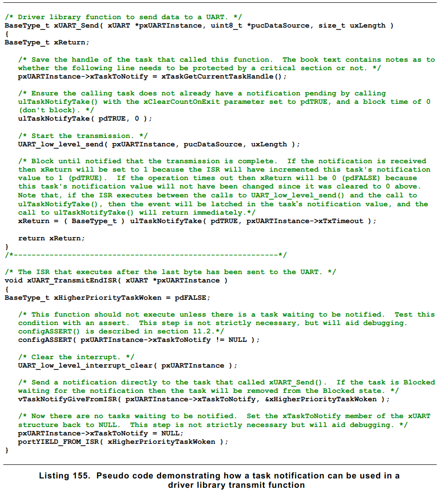

在接收任务中也可以使用任务通知替代信号量，正如下图伪代码Listing156中展示的那样，Listing156提供了一个从UART口接收数据的RTOS库函数框架。从Listing156中可以看出：

- xUART_Receive()函数内不包含任何互斥逻辑。如果有多个任务需要使用xUART_Receive()函数，那么应用开发者必须在应用中管理互斥的情况。例如，任务在调用xUART_Receive()函数之前要求其先获得互斥锁。
- UART的中断服务程序将从UART口接收的字符放入RAM缓存中。xUART_Receive()函数则从RAM缓存中返回这些字符。
- xUART_Receive()函数的uxWantedBytes参数用来指定想要接收字符的数量。如果在RAM缓存中没有需要的那么多数据，那么调用这个函数的任务将进入阻塞态等待缓存中的字符数量达到所要求的通知。其中while()用于重复这个等待操作，直到缓存中接收到了指定数量的字符或者时间超时。
- 调用该函数的任务可能会多次进入阻塞状态。因此这个阻塞时间的调整需要考虑从调用xUART_Receive()函数到当前已经过去的时间。时间调整是为了确保在xUART_Receive()函数内花费的时间不能超过xUART结构体中xRxTimeout成员参数所指定的阻塞时间。这个阻塞时间可以使用TreeRTOS提供的vTaskSetTimeOutState()和xTaskCheckForTimeOut()函数来辅助调整。

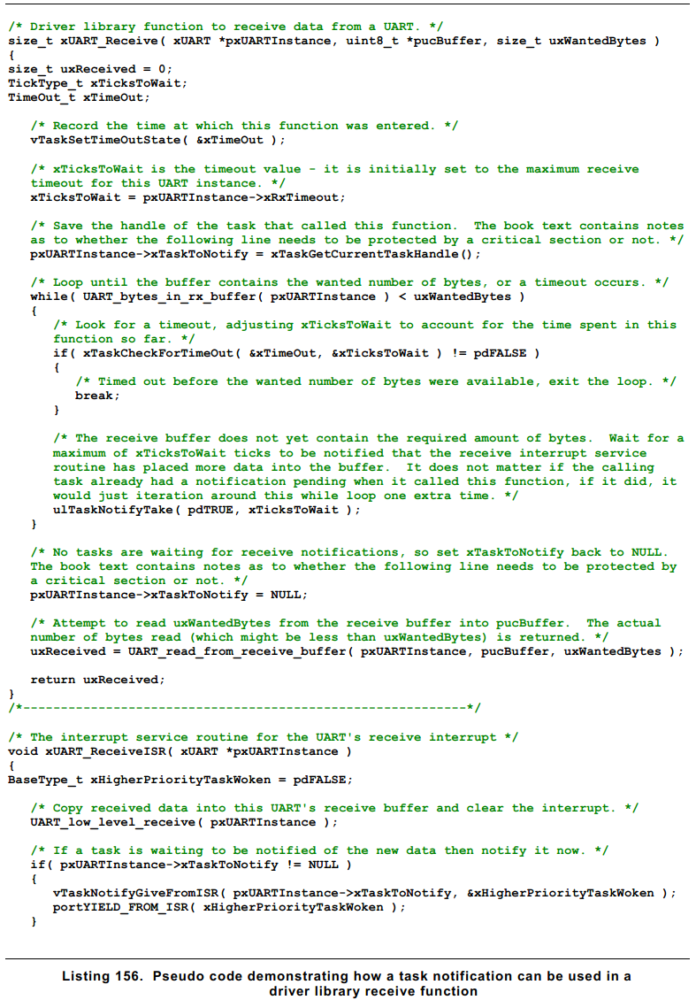


**直接在应用中使用任务通知：**

本节通过展示任务通知在一个包含以下功能的应用程序中的使用来加强任务通知的能力。

1. 应用之间通过一个减速的interent连接来发送数据，请求数据，用作远程数据服务器。这里，把远程数据服务器叫做云服务器。
2. 从云服务器请求数据后，请求任务必须进入阻塞态等待请求数据被接收。
3. 在发送数据到云服务器之后，发送任务必须进入阻塞状态等待云服务器正确收到发送数据的应答。

在下图中展示了软件设计的概要，在途中可以看出：

- 将处理到云服务器的多个interent连接的复杂性封装在一个单一的FreeRTOS任务中。这个任务在FreeRTOS应用中担任了代理服务器的角色，因此把它命名未服务器任务。
- 通过调用CloudRead()函数应用任务从云服务器中读物数据。CloudRead()不直接与云服务器通信，而是发送读数据请求到服务器任务的一个队列中，从云服务器中接收请求的数据时通过任务通知。
- 应用任务通过调用CloudWrite()函数向云服务器中写数据。同样，CloudWrite()函数也不直接与云服务器通信，而是通过队列将写数据的请求到服务器任务，服务器任务将写操作的结果以任务通知的方式返回给应用任务。

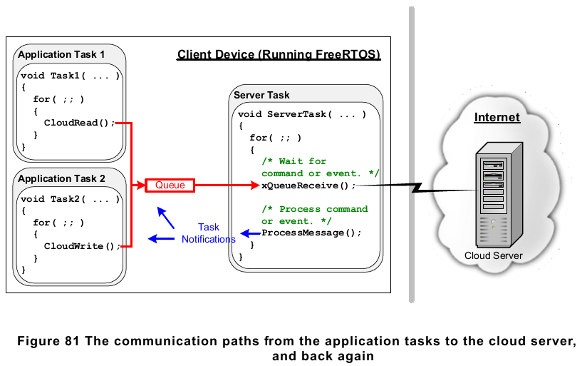

在CloudRead()和CloudWrite()函数中与服务器任务交互使用的结构体如下图所示：

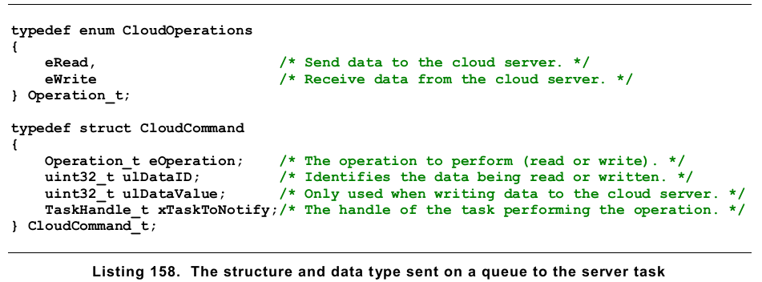

CloudRead()函数的伪代码如下图Listing159所示。这个函数发送请求到服务器任务，然后调用xTaskNotifyWait()函数进入阻塞态等待请求的数据可以被获取的通知。

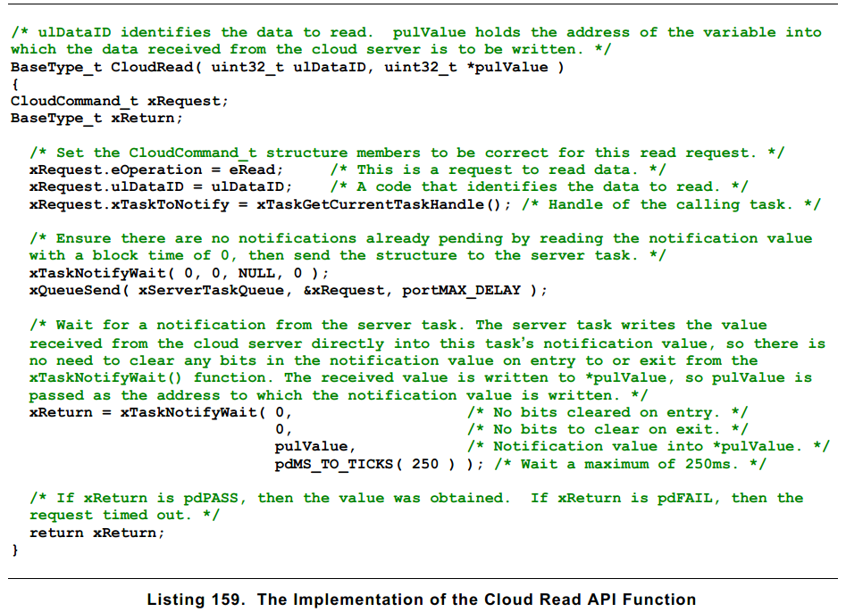

服务器如何处理一个读请求的伪代码如下图Listing160所示。当从云服务器中接收到数据时，服务器任务激活应用任务，并将接收的数据发送到应用任务，通过调用xTaskNotify()函数完成，eAction参数设置为eSetValueWithOverwrite。

Listing160展示的其实是一个简化的场景，它假设了GetCloudData()函数不必必须等待从云服务器中获取一个值。

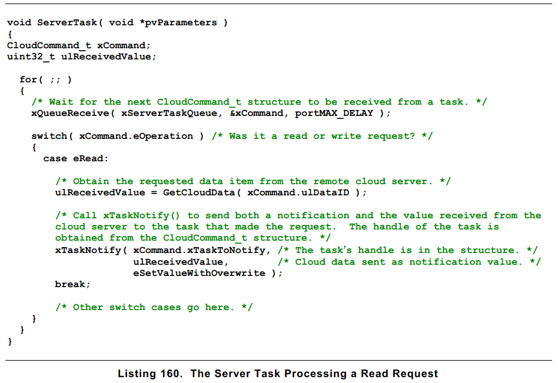

CloudWrite()函数的伪代码如下图Listing161所示。为了展示，使CloudWrite()函数返回一个按位表示的状态码，其中状态码中的每一位都被分配了不同的含义。通过#define语句宏定义的四个状态位如LIsting161上面所示。

任务首先清除这四个状态位，发送它的请求到服务器任务，然后调用xTaskNotifyWait()函数进入阻塞态等待状态通知。

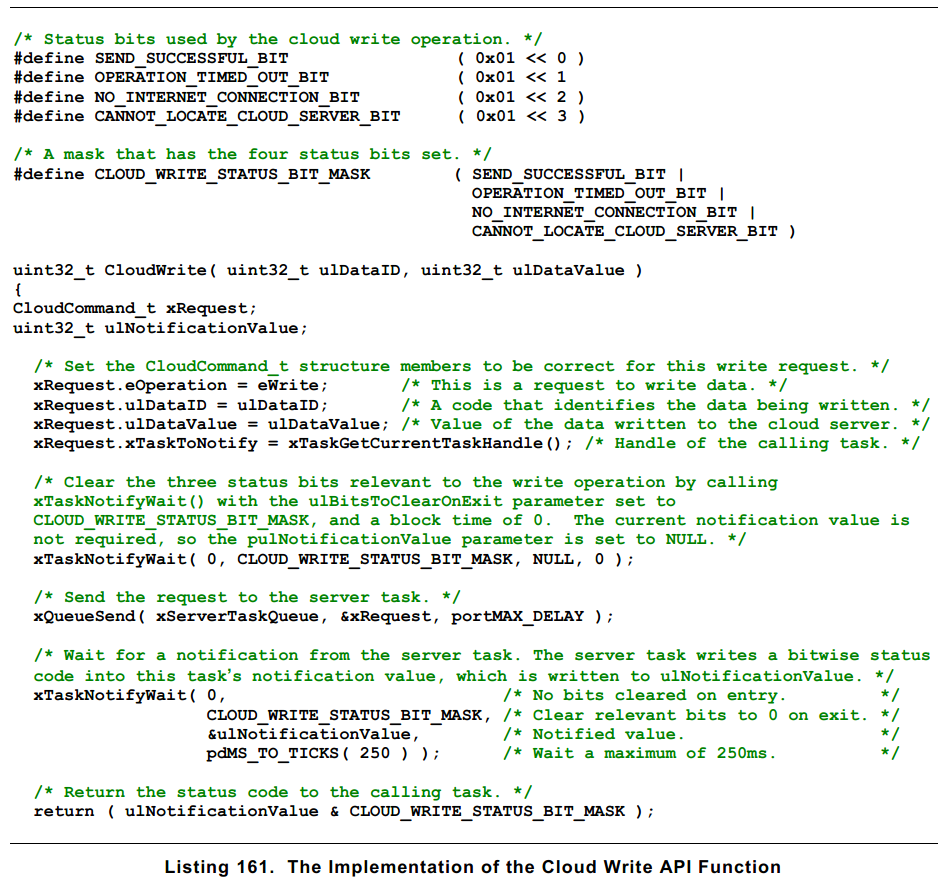

服务器任务如何处理写请求的伪代码如下图中的LIsting162所示。当数据发送到云服务器时，服务器任务激活应用任务，并发送位状态码到应用任务，通过调用xTaskNotify()函数，其eAction参数设置为eSetBits。在急收任务的通知值中，只有在CLOUD_WRITE_STATUS_BIT_MASK常量中定义的位才可以被改变，因此接收任务可以将通知值中的其他位用作其他用途。

Listing162展示的是一个简化的场景，它假设SetCloudData()函数不必一定要等待从远程云服务器中获取一个应答。

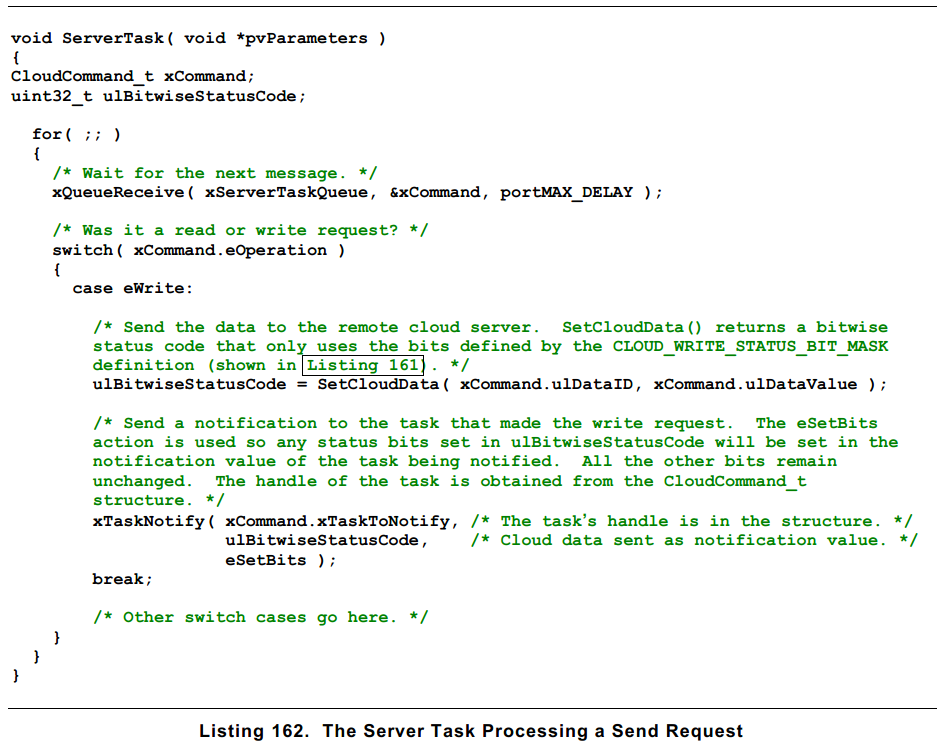

### 10 低电量模式

这个章节在最终的发布版本中介绍。

### 11 开发者支持

P356


