# FreeRTOS Study Log

### 0 简介

**在FreeRTOS中，每一个执行的线程被叫做任务**

**内核对象包括任务、队列、信号量、事件组**

##### 0.1 一些术语的中英对照

|      English      |   中文   |
| :---------------: | :------: |
|  portable layer   | 可移植层 |
| abstraction layer |  抽象层  |
|                   |          |
|                   |          |
|                   |          |
|                   |          |
|                   |          |
|                   |          |
|                   |          |


### 1 数据类型 & 编码风格

**Tab键=4个空格。**

**对于源代码中过多类型转换的说明**

FreeRTOS源代码可以用许多不同的编译器进行编译，所有这些编译器在生成警告的方式和时间上都是不同的。特别是，不同的编译器希望以不同的方式使用类型转换。因此，FreeRTOS源代码中包含的类型转换比通常需要的要多。

#### 1.1 TickType_t & BaseType_t

FreeRTOS配置一个周期性的中断，称为tick interrupt。从FreeRTOS应用启动开始tick interrupt发生的次数称为tick count。tick count被用来度量时间。两个tick interrupt之间的用时称为tick period。TickType_t是用来保存tick count值的数据类型，即指定时间。TickType_t可以是uint16或者uint32，这取决于FreeRTOSConfig.h中变量configUSE_16_BIT_TICKS的值，设置为1则使用uint16，0为uint32，在32位处理器上没有理由使用uint16。

**BaseType_t**通常用作函数返回值的类型，一般是很有限的值，常用于pdTRUE/pdFALSE的布尔运算。BaseType_t的类型一般取决于处理器的位数，8-bit、16-bit、32-bit。

#### 1.2 变量命名规则

FreeRTOS中使用前缀（prefix）告诉你该变量的数据类型。具体如下表所示。

| 前缀（prefix） |    数据类型    | 示例 |
| :------------: | :------------: | :--: |
|      "c"       |      char      |      |
|      "s"       | int16_t(short) |      |
|      "l"       | int32_t(long)  |      |
|      "x"       |   BaseType_t   |      |

**"x"前缀也加在非标准的数据类型前面，例如structures、task handles、queue handles等。**

另外，**如果变量是unsigned也会加前缀"u"，如果变量是指针类型会加"p"**。例如，一个uint8_t类型的变量会加前缀"uc"，指向字符类型的指针会加前缀"pc"。

#### 1.3 函数命名规则

函数的前缀中有该函数返回值的类型和定义该函数的文件。如下表：

|         函数名          | 含义                                                |
| :---------------------: | :-------------------------------------------------- |
|    **x**QueueReceive    | 返回值类型为**BaseType_t**，在**queue.c**中定义     |
| **v**TaskPrioritySet()  | 返回值类型为**void**，在**task.c**中定义            |
| **pv**TimerGetTimerID() | 返回值类型为**指向void的指针**，在**timer.c**中定义 |

另外，**前缀"prv"表示该函数为定义该函数的文件私有的（private），即函数的作用域为该文件内。**

#### 1.4 宏命名规则

大部分的宏都用大写字母，并且加上小写字母前缀表明定义该宏的位置，如下表所示。

| 前缀                               |     定义该宏的位置      |
| :--------------------------------- | :---------------------: |
| port(例如，portMAX_DELAY)          | portable.h或portmacro.h |
| task(例如，taskENTER_CRITICAL())   |         task.h          |
| pd(例如，pdTRUE)                   |       projdefs.h        |
| config(例如，configUSE_PREEMPTION) |    FreeRTOSConfig.h     |
| err(例如，errQUEUE_FULL)           |       projdefs.h        |

**注意**：虽然信号量应用程序接口（semaphore API）几乎全部使用宏来编写，但其命名按照函数的命名规则，而不是宏的命名规则。

下表中的宏在整个FreeRTOS源代码中都可以使用。

|   宏    |  值  |
| :-----: | :--: |
| pdTRUE  |  1   |
| pdFALSE |  0   |
| pdPASS  |  1   |
| pdFAIL  |  0   |

### 2 堆内存管理

FreeRTOS中使用pvPortMalloc()和pvPortFree()代替C标准库中的malloc()和free()函数，它们的函数原型（prototype）是一样的。FreeRTOS提供了五种pvPortMalloc()函数和pvPortFree()函数的实现，用户编写的FreeRTOS应用可以使用其中的一种，或者使用自己提供的。

Heap_1.c中只实现了一个非常基础的pvPortMalloc()版本，没有实现pvPortFree()。因此适用于从不删除任务或者内核对象的应用。

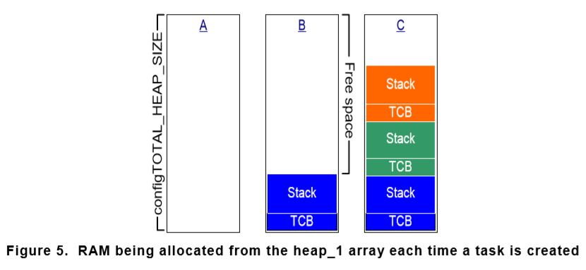

Heap_4.c相当于Heap_2.c的增强版，在设计中推荐使用前者，保留后者是为了向下兼容。相比于Heap_1.c，Heap_2.c中允许释放内存。Heap_2.c不能像Heap_4.c可以把相邻的小内存块合并成大内存块，因此会产生内存碎片，不过它适用于重复创建删除占用相同内存大小任务的应用中。

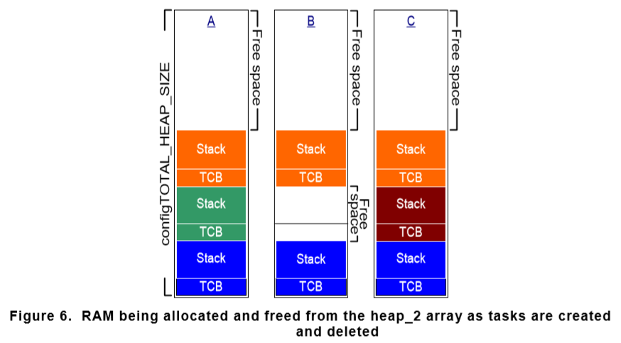

Heap_3.c使用标准库中的malloc() & free()函数，因此堆内存的大小由连接器配置决定，不受configTOTAL_HEAP_SIZE设置的影响。Heap_3.c通过暂时挂起FreeRTOS调度器保证malloc() & free()函数thread-safe。

Heap_4.c同Heap_1.c和Heap_2.c一样将内存分为小块，且被静态分配。如前所述，Heap_4.c可以将临近的内存合并到一起，因此它适用于任务被重复创建和删除的应用，任务所占内存大小可不相同。


Heap_5.c中使用的内存分配与释放算法与Heap_4.c相同，但它不局限于分配单个静态声明的内存区域，它可以从多块分离的内存空间中分配内存。当FreeRTOS运行在系统内存映射不是一个连续的内存块是，它是相当有用的。

（只有）在使用Heap_5.c内提供的pvPortMalloc()函数时，必须提前明确地使用vPortDefineHeapRegions()函数初始化所使用的内存分配方案。在创建任何的内核对象（任务，队列，信号量等）之前必须先调用vPortDefineRegions()，该函数用来指定每一个内存块的开始地址和其大小，所有的内存块供Heap_5.c使用。（更详尽的说明尽在内核手册）

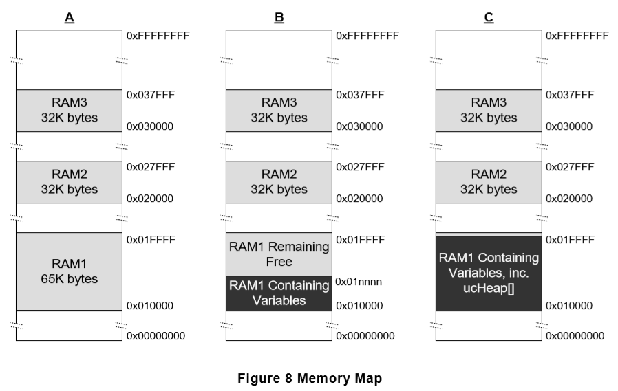

### 3 任务管理

**任务**用普通的C函数实现，唯一特殊的是他们的函数原型，必须返回void，必须给分空指针void *。例如下面：

```
void ATaskFunction(void *pvParameters);
```

**每个任务本身都是一个小程序，它有一个入口点，通常会一直运行在死循环中，并永远不会退出。**FreeRTOS任务绝不允许从它的实现函数中以任何方式退出，不能包含return语句，不允许在函数结束时运行。如果任务不再需要了，可以删除它。下图为创建任务的例子。

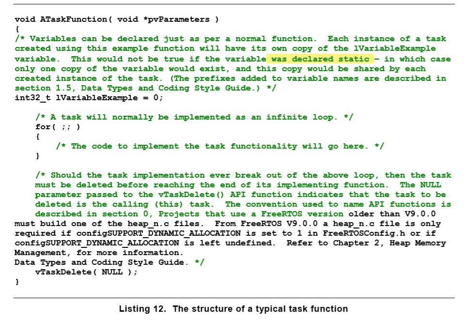

#### 3.1 任务状态（Task States）

一个应用程序可以由许多任务组成。单核处理器运行应用程序时在任一时刻只有一个任务可以执行。这意味着任务可以有运行（Running）和非运行（Not Running）两个状态。

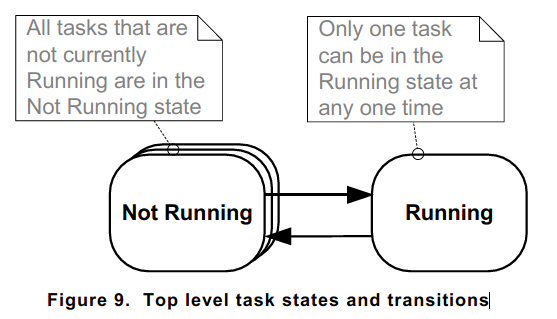

任务从非运行态转化到运行态时称为"switched in"或者"swapped in"。相反的，任务宠运行态转化到非运行态称为"switched out"或"swapped out"。**FreeRTOS scheduler（调度器）是唯一可以转换任务状态的实体**。

#### 3.2 创建任务

**xTaskCreate()函数**

xTaskCreate()函数用于创建任务（此函数可能是最复杂的API Functions），在FreeRTOS V9.0.0中还包含xTaskCreateStatic()函数，该函数在编译时为任务的创建静态分配内存。xTaskCreate()函数原型如下图所示：


**参数**

**pvTaskCode**：任务是简单的C函数，通常实现为一个死循环。pvTaskCode参数为指向该任务的指针（实际上，就是任务的函数名）。

**pcName**：任务的一个描述。在FreeRTOS中不会用到它，他的存在纯粹是为了debugging目的。通过一个可读的名字识别任务相对于通过任务句柄识别的有点是显而易见的。configMAX_TASK_NAME_LEN定义了该名字可以占用的最大长度（包含结束符），如果超过最大值，会被切掉。

**usStackDepth**：任务创建时，内核会为每一个任务都分配一个属于该任务唯一的栈，usStackDepth参数告诉内核该任务需要的栈大小，单位是字words。常量configMINIMAL_STACK_SIZE规定了空闲任务使用的栈大小，该常量也是所有任务栈大小的最小值。

**pvParameters**：任务接受一个指向void的指针。pvParameters的值就是传入任务的值。

**uxPriority**：任务执行的优先级，优先级可以设置为最低的0到最高优先级（configMAX_PRIORITIES - 1），常量configMAX_PRIORITIES由用户定义。如果给定的优先级数值大于（configMAX_PRIORITIES - 1），则会将其优先级设置为最大优先级。

**pxCreatedTask**：pxCreatedTask参数用作当前创建任务的句柄。该句柄可以用来改变该任务的优先级，或删除该任务。如果你的应用程序中用不上该句柄，可将其设置为NULL。

**返回值**

返回值可能是**pdPASS**，表示任务创建成功，也可能是**pdFAIL**，表示任务创建失败，原因是内存不足。

#### 3.3 任务优先级 Task Priorities（重点）

在调度器启动之后，可以通过vTaskPrioritySet()函数改变创建任务时给定的初始任务优先级。任务优先级的最大值configMAX_PRIORITIES在FreeRTOSConfig.h文件中定义，编译时配置为常量。数字越小优先级越低，0代表最低优先级。多个任务可以有相同的优先级，确保设计的灵活性最大。

**FreeRTOS调度器可以使用以下两种方法中的一种来决定哪一个任务处于运行态。configMAX_PRIORITIES的取值由使用的决策方法决定。（可以理解为切换任务的代码？）**

**通用方法**

通用方法用C代码实现，可以被FreeRTOS的所有架构端口使用。通用方法对configMAX_PRIORITIES的最大取值没有限制，但强烈推荐其取值够用就好，过大的优先级会浪费RAM，最坏情况下的执行时间也会加长。

当FreeRTOSConfig.h文件中configUSE_PORT_OPTIMISED_TASK_SELECTION被设置为0或未定义（undefined）时，使用通用方法。另外如果FreeRTOS port只提供该方法，则只能用它。

**结构优化方法**

结构优化方法使用一小段汇编语言，比通用方法更快。configMAX_PRIORITIES的设置不影响最坏情况下的执行时间。但使用结构优化方法时，改值的大小不能超过32。同样也强烈建议够用就好，过大，依然或浪费RAM。

当FreeRTOSConfig.h文件中configUSE_PORT_OPTIMISED_TASK_SELECTION设置为1时，将会使用该方法，不是所有的FreeRTOS ports都提供一个结构优化方法。

FreeRTOS调度器会确保当前可运行的任务中任务优先级最高的进入运行状态，如果由多个任务处于最高优先级，则调度器将轮流运行它们。

#### 3.4 时间度量 & Tick中断（重点，调度器什么时候调度）

在后面的调度算法章节中将会讲述被称为时间片的可选特征。到目前位置，前面的例子（在书中，我没摘抄下来）中都使用的时时间片，从他们的输出中可以观察到时间片的使用。在例子中，两个任务创建时拥有相同的优先级，都可以运行。因此，每个任务运行一个时间片的时间，在时间片开始时进入运行态，在时间片结束时退出运行态。在下图中，t1到t2之间的时间长度为一个时间片。

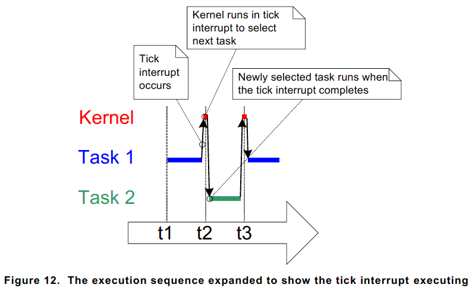

**为了能够选择下一个要执行的任务，调度器本身必须在每个时间片结束时运行。被称为tick interrupt的周期中断，就是为了此目的。**时间片的长度由tick终端频率决定，该常量configTICK_RATE_HZ的值在FreeRTOSConfig.h文件中定义，编译时配置完成。举个栗子，如果**configTICK_RATE_HZ**设置为100，则时间片的长度为10毫秒。两次tick中断之间的长度称为tick周期，其就等于一个时间片的长度。

**注意**：**调度器选择新任务的执行，不只是在时间片结束时，在当前任务处于阻塞状态或者当发生中断并移动一个更高优先级的任务进入就绪态时，调度器会立即选择一个新的任务去执行。**

configTICK_RATE_HZ的值取决于你设计的应用程序，一般取值为100。

调用FreeRTOS应用程序接口时指定的时间总是滴答周期的倍数，该时间经常被叫做“ticks”。pdMS_TO_TICKS()宏可以将以毫秒为单位的时间转换为ticks周期数。转换的精度取决于定义的滴答频率configTICK_RATE_HZ，当滴答频率大于1000时该宏不能被使用。使用该宏指定时间的优点是，当tick频率改变时指定的时间仍然是xx毫秒。

#### 3.5 详述S非运行状态

之前例子（在手册中，未摘抄）中，任务不需要等待什么东西，因此它将经常可以进如运行态，但实际上这种连续性任务是没多大用处的，这种任务的运行会阻碍比它优先级低的任务进入运行态。

为了使任务发挥更大的用处，必须重新编写它们使之成为事件驱动（event-driven）。事件驱动任务只有在触发该任务的事件发生时才会被执行，在其他情况下不会进入运行态。调度器经常选择能够被执行的任务中优先级最高的那个任务。

##### 3.5.1 阻塞状态（Blocked StateS）

任务在等待事件发生被称作阻塞态。任务进入阻塞态可能是等待以下两个事件的发生。

1. 时间（相关）事件--事件可能是延时到期或者到了一个绝对时间。例如，任务可能因为等待10ms延时到期而进入阻塞状态。
2. 同步事件--事件由其他任务或中断引起。例如，任务可能因到等待到达某个队列的数据而进入阻塞状态。

FreeRTOS queue, binary semaphores, counting semaphores, mutexes, recurisive mutexes（递归互斥量）, event group and **direct to task notifications**都可以被用来创建同步事件。

任务也有可能被一个带有延时到期的同步事件阻塞，即同时被两种类型的事件阻塞。例如，任务可能选择等待数据到达一个队列的最大时间为10ms。如果数据在10ms内到达或者超过10ms后没有到达，任务都将离开阻塞状态。

##### 3.5.2 挂起状态（Suspended State）

处于挂起状态的任务将不能被调度器调度。进入挂起状态的唯一方法就是通过调用vTaskSuspend()应用函数，退出挂起状态的唯一方法就是通过调用vTaskResume() 或vTaskResumeFromISR()应用函数。大部分的应用不使用挂起状态。

##### 3.5.3 就绪状态（Ready State）

不在运行态且不在阻塞态且不在挂起态，那就是在就绪态。它们具备了被执行（运行）的能力，时刻准备着去运行。

##### 3.5.4 完整的状态转换图示

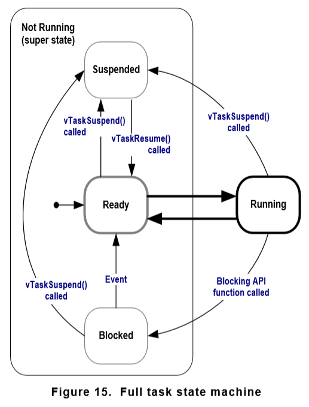

更优秀的例子在内核使用手册中。

**vTaskDelay()函数**

在之前的例子中使用的延时手段会占用处理器的运行时间，在延时这段时间内其实任务没有需要做的工作，这浪会费资源，因此使用**vTaskDelay()**函数来进行延时，并使得调用延时的任务进入阻塞状态，把处理器暂时让出来供其他任务使用。在FreeRTOSConfig.h文件中设置**INCLUDE_vTaskDelay**设置为1时，vTaskDelay()函数才能够被调用。其函数原型如下图所示：

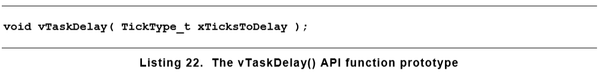

**参数**

xTicksToDelay：调用该延时函数的任务从阻塞态转换为就绪态所持续的滴答中断的数量。例如，一个任务调用函数vTaskDelay( 100 )时滴答计数的值为10000，此时该任务立即进入阻塞态，一直持续到滴答计数增长到10100时。宏pdMS_TO_TICKS()可以用来将以毫秒为单位的时间值转换为相应的滴答中断（周期）数。下图为一个任务函数：


当调度器被调用时，为了保证在任一时刻至少有一个任务可以运行（或者说在就绪状态），空闲任务（idle task）自动被创建。

**vTaskDelayUntil()函数**

vTaskDelayUnitl()的参数指定了精确的滴答计数值，在达到该计数值时，调用vTaskDelayUntil()函数的任务应从阻塞态转为就绪态。vTaskDelayUntil()函数用于有固定执行周期的需求任务（当你想要你的任务以一个固定的频率，周期性的执行），因为调用任务被解除阻塞的时间是绝对的，而不是相对于函数被调用的时间。其函数原型如下图所示：

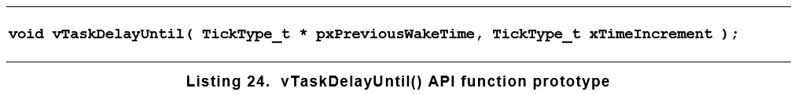

**参数**

pxPreviousWakeTime：该参数的命名建立在vTaskDelayUntil()函数被用于一个以固定频率，周期性地执行任务的假设上。在该假设下，pxPreviousWakeTime参数值为该任务上一次退出阻塞状态（被唤醒）的时刻，该值用作计算下一次该任务退出阻塞状态时刻的参考点。pxPreviousWakeTime参数的值在vTaskDelayUntil()函数中自动更新，该参数的值在首次使用该参数时用当前的滴答计数值初始化后，一般不会被应用代码修改。

xTimeIncrement：该名字的又来同上假设，任务的固定频率由该参数的值所设置。单位为ticks，同样宏pdMS_TO_TICKS()可以将以毫秒为单位的时间转换为tick数量。

***********************************************************************************************************************************************************************************************

下图为结合了周期性任务和连续性任务的示例执行时序图，下图中的例子在手册中。


#### 3.6 空闲任务 & 空闲任务钩子（The Idle Task & the Idle Task Hook）

##### 3.6.1 空闲任务

空闲任务的优先级应尽可能低（0优先级），保证不能影响其他高优先级任务进入运行态。如果你非要创建一个任务优先级域空闲任务相同的应用任务，则FreeRTOSconfig.h文件中定义的静态常量（compile time configuration constant）configIDLE_SHOULD_YIELD可以用于防止空闲任务消耗处理器时间，保证分配CPU给应用任务。

以最低优先级运行可以确保当高优先级任务进入就绪态时，空闲任务就会从运行状态转移出去。当高优先级的任务退出阻塞状态时，空闲任务立即退出运行以保证高优先级的任务被执行。这被称作**高优先级抢占了空闲任务**。**抢占自动发生，并且它不知道抢占了谁**。

注意：如果在程序中使用了vTaskDelete()函数，那么必须确保空闲任务可以进入运行态。这是因为空闲任务要在任务被删除之后清理内核资源。

##### 3.6.2 空闲任务钩子函数

可以通过使用空闲钩子（或空闲回调）函数将特定于应用程序的功能直接添加到空闲任务中，空闲钩子函数会在空闲任务的每一个循环自动调用一次。（将功能添加到空闲钩子函数中，空闲钩子函数会在空闲任务的每一循环自动调用一次）

**空闲任务钩子的常见用途包括：**

- 执行低优先级、后台或连续处理功能。

- 度量空闲处理能力数量。

- 使处理器进入低功耗模式，每当应用不需要工作的时候，提供一个简单的自动节能方法，尽管该方法的效果远低于使用tick-less空闲模式的节能效果。

**使用空闲任务钩子函数的条件：**

空闲任务钩子函数必须遵从以下规则

- 空闲任务钩子函数绝不能试图阻塞或者挂起。阻塞空闲任务可能会造成没有能够进入运行态的任务。
- 如果应用程序使用了vTaskDelete()函数，那么空闲任务钩子必须在一个合理的时间内返回到它的调用者（空闲函数吗）。如果空闲任务永久的在钩子函数里，当有任务被删除时，那它就不能清理内核资源了。

下图为空闲钩子函数的一个实例：

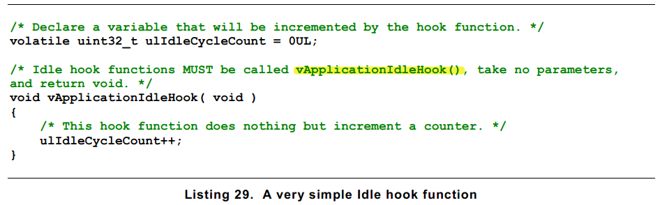

空闲钩子函数必须以vApplicationIdleHook()命名，且没有参数，也返回空void。**自动被调用。**

必须将FreeRTOSconfig,h头文件中的configUSE_IDLE_HOOK设置为1才能调用空闲钩子函数。

#### 3.7 修改任务优先级

在调度器开始调度之后，vTaskPrioritySet()函数可以修改任意任务的优先级。不过要使用vTaskPrioritySet()函数必须在FreeRTOSconfig.h头文件中将INCLUDE_vTaskPrioritySet设置为1。其函数原型如下图所示：

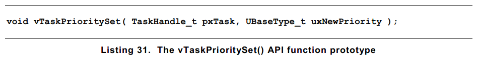

**参数**

pxTask：将要被修改优先级的任务句柄。任务可以通过想改参数传递NULL来修改自己的优先级。

uxNewPriority：任务的新优先级。

uxTaskPriorityGet()函数可以用来询问任务的优先级。要使用该函数，需在FreeRTOSconfig.h头文件中将INCLUDE_uxTaskPriorityGet设置为1。其函数原型如下图所示：


**参数**

pxTask：被询问优先级的任务句柄。任务可以通过NULL作为该参数值询问自己的优先级。

**返回值**

询问时该任务的优先级。

#### 3.8 删除任务

任务可以使用vTaskDelete()函数删除自己，也可以被其他函数删除。只有在FreeRTOSconfig.h头文件中将INCLUDE_vTaskDelete设置为1时，该函数才能被调用。

删除不再存在及不能再进入运行态的任务。当任务被删除之后，释放分配给该任务的内存是idle task的工作。因此，应用程序在任何情况下使用vTaskDelete()函数删除任务时，不能完全starve空闲任务是非常重要的。

**注意：****当任务被删除时，只有内核自己分配给任务的内存会被自动释放。任务自己申请的任何内存或资源需被显式的释放。**就是你在程序中自己申请的变量，需要自己显式地释放。

vTaskDelete()函数的原型如下图所示：

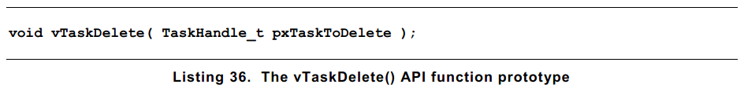

**参数**

pxTaskToDelete：要被删除的函数句柄。任务可以通过输入NULL作为该参数值删除自己。

例子在手册中，下图是例子的执行时序图。

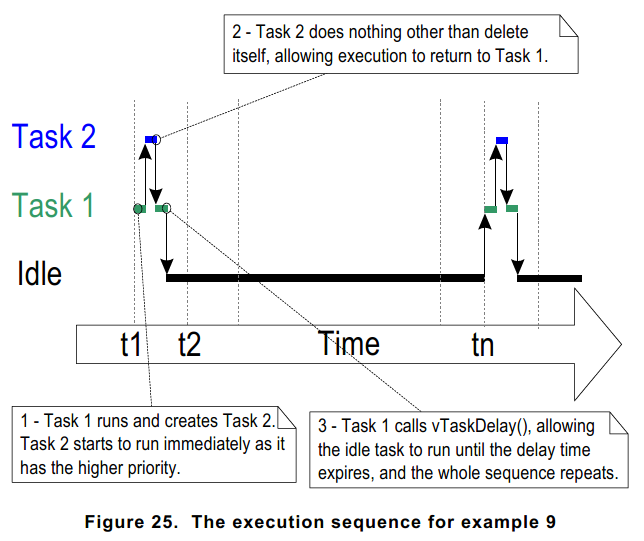

#### 3.9 线程本地存储（Thread Local Storage）

这一节内容在最终版本中将会讲述。

wocao!看到现在这个发现手册竟然不是最终版本。

算了，继续看吧！

#### 3.10 调度算法（重要）

##### 3.10.1 调度器总是选择就绪态中优先级最高的任务进入运行态。

任务在阻塞态等待事件，当事件发生后自动转入就绪态。事件有时间事件和同步事件。

**Temporal events**：发生在特定的时间，例如，延时到期，通常用于实现周期或超时的行为。

**Synchronization events**：发生在当任务或者中断服务程序发送信息时，信息的发送可以使用任务通知、队列、事件组或者某种类型的信号量。它们经常被用来表示异步行为，例如数据到达某一外设。

##### 3.10.2 配置调度算法

调度算法时用于决定哪一个就绪态的任务进入运行态的软件程序。

调度算法可以在FreeRTOSConfig.h头文件中通过配置**configUSE_PREEMPTION和configUSE_TIME_SLICING**两个常量选择所使用的调度算法。除了这两个关键常量外，configUSE_TICKLESS_IDLE也对调度算法有影响，当使用它时，可以使滴答中断完全关闭以达到扩展周期的效果。**configUSE_TICKLESS_IDLE**是一个高级选项，它可以用在必须有最小耗电的应用中。

##### 3.10.3 使用时间分片优化抢占机制

大多数的小型实时应用程序都采用被称作“Fixed Priority Pre-emptive Scheduling with Time Slicing”的调度算法。也就是配置上面那两个参数为1时系统所使用的调度算法。

Fixed Priority：所谓固定优先级，就是调度算法不改变被调度任务所分配的优先级，但也不阻止任务自己改变自己或者其它任务的优先级。

Pre-emptive：所谓抢占，就是当一个进入就绪态的任务的优先级比正在运行的任务优先级高，则会立即抢占运行态。被抢占的任务则自然切出运行态并进入就绪态以允许其他任务进入运行态。

Time Slicing：时间分片用来使相同优先级的任务共享运行时间，任务不会进入阻塞或者挂起态。调度器会在每个时间片结束时选择一个新的同优先级的就绪态任务进入运行态，一个时间片就是两个滴答中断之间的时间长度。

调度机制可以参看下面两个图：

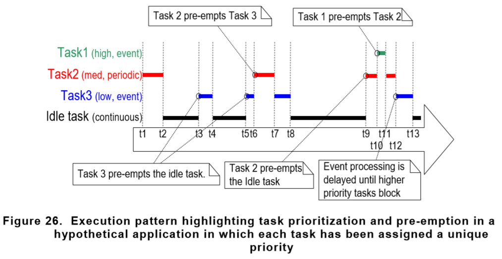

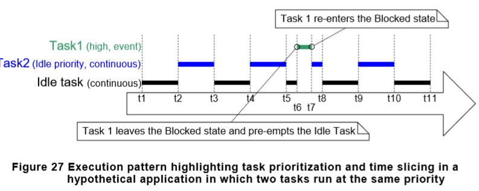

有关上图详细的解释，尽在手册中。

图27中的情形是不太合适的，因为分配给空闲任务的运行时间太多了，因此可以利用钱买你提到的可选的高级选项configIDLE_SHOULD_YIELD来优化系统的调度算法。当该常量设置为0是，既是图27所示，配置为1时，则如下图28所示：

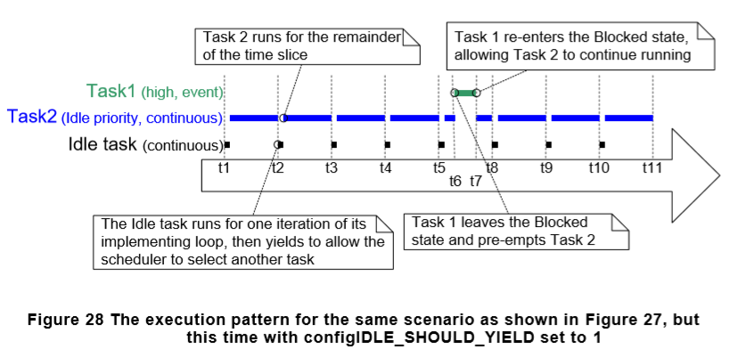

当配置为1时，如果有同空闲任务优先级的任务进入就绪态时，空闲任务将自动的在其循环的每次迭代中退出运行态，不管它的时间片还剩下多少。（**空闲任务会执行一个循环**）

从图中也可以看出，任务2的执行时间不等于整个时间片，而是空闲任务退出运行态时剩余的的时间段。

##### 3.10.4 优先级抢占调度（无时间片）

与前面看过的带时间片的调度算法相比，无时间片是不能在相同优先级的任务之间共享处理时间的。当然，需要在FreeRTOSconfig.h头文件中将configUSE_TIME_SILCING设置为0。

滴答中断的发生预示了一个时间片的结束。不使用时间片时调度器只有在以下两种情况下才会选择一个新任务进入运行态。

- 一个更高优先级的任务进入就绪态。

- 运行态的任务进入阻塞态或者被挂起。

不使用时间片轮调，会少产生很多上下文切换。因此，也降低了调度器的处理开支。但，如下图所示，不使用时间片轮调会造成分配给具有相同优先级任务的运行时间相差很大。所以，不建议你使用这种算法，除非你是很有经验的开发者。

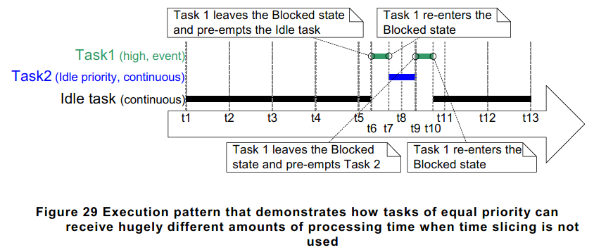

##### 3.10.5 协作调度（Co-operative Scheduling）

FreeRTOS也提供了协作调度机制，要使用该调度机制只需在FreeRTOSconfig.h头文件中设置configUSE_PREEMPTION为0，configUSE_TIME_SLICING为任意值。

当使用协作调度算法时，任务的上下文切换将只发生在运行态任务进入阻塞态或者处于运行态的任务通过调用taskYIELD()函数被显示地挂起（手动请求调度器重新调度）时。其他任何情况下，任务不会被抢占，时间片调度机制也不会被使用。下图展示了该调度算法的行为。

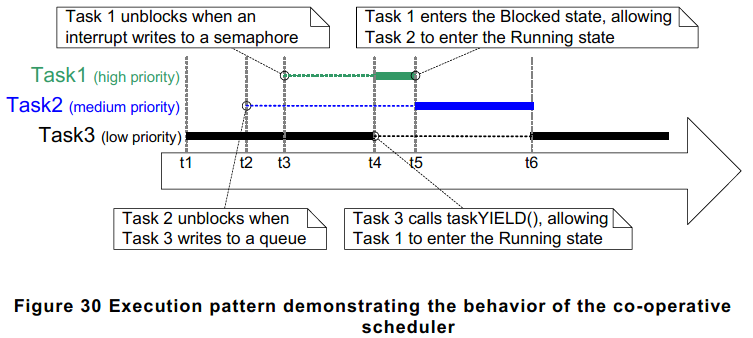

在多任务应用中，程序开发者应格外小心同一个资源不能同时被多个任务同时使用，例如两个任务都向一个串口写入数据，任务1写入“abcdefghijklmnop”，任务2写入“123456789”：

1. 任务1处于运行态，向串口输入“abcdefg”之后，离开运行态进入阻塞态，此时数据没写完。

2. 任务2紧接着进入运行态，并在离开运行态时写入“123456789“到串口。

3. 任务1重新进入运行态并继续写入之前未写完的字符。

在以上的情形中其实向串口写入的字符串是”abcdefg123456789hijklmnop“，这通常不是我们想要的结果。

自然的，使用协作调度时可以避免这种情况的发生。因此在以上例子这类情况发生时，使用该机制要比使用抢占式调度机制更好。

### 4 队列管理

队列（Queues）提供了一个任务到任务、任务到中断、中断到任务的通信机制。

#### 4.1 存储数据（Data Storage）

队列可以保存有限的保存**固定大小**的数据项。队列可以保存的最大数据项数量成为它的长度。长度和每个数据项的大小可以在队列创建时设定。

Queues经常被用作先进先出（First In First Out）缓存，使用时数据写入到队列的末尾，读出时从头部开始读取。下图既是一个FIFO队列的示意图，向队列的头部写入数据也是有可能的，此时会将原来处于队列头部的数据覆盖掉。

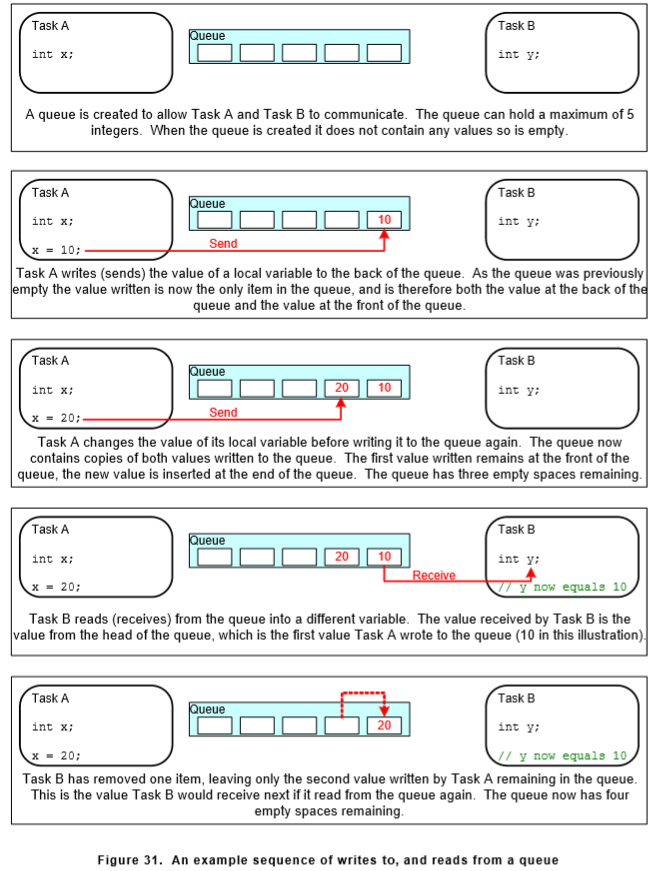

有以下两种方法可以实现队列行为：

1. 通过拷贝：通过拷贝意思是数据是通过按字节拷贝的方式发送到队列。
2. 通过引用：只是发送指向数据的指针进入队列，而并不是数据本身。

为简单，FreeRTOS使用拷贝的方式实现。其优点有以下几点：

- 堆栈变量可以直接发送到一个队列上，尽管堆栈变量在声明它的函数退出之后它也会不存在，但是，队列里有拷贝。
- 数据可以直接发送到队列，无需先分配缓存保存该变量。
- 发送数据的任务可以立即重新使用发送到队列的变量或者缓冲区。
- 完全解耦发送任务和接受任务，应用程序开发着不需要考虑哪个任务“拥有”数据，或者哪个任务负责发送数据。
- 拷贝型队列也可以使用引用，当剩余的空间不足以容纳需要拷贝的数据时，可以将该数据的引用（指针）拷贝到队列。
- RTOS负责分配数据所使用的内存。
- 在内存有保护的系统中，任务存取保存在RAM上的数据时将会有限制。只有在发送任务和接收任务同时有数据所存储区域的使用权时才可以使用引用型队列。拷贝型队列则没有以上的限制，内核经常有运行的完全特权，允许使用队列跨内存保护边界传送数据。

**可以被多个任务存取**

队列是具有自身权限的对象，任何任务或者中断服务程序都可以访问它们。任何数量的任务都可以向同一个队列写数据，任意数量的任务也可以从队列中读取数据。但实际上，大部分情况是有多个任务写入，很少由多个任务从同一个队列中读取数据。

**阻塞读取队列的任务**

当任务要从队列读取数据时，任务可以选择一个指定的阻塞（等待）时间。如果队列已经是空的，则该任务将保持在阻塞状态以等待从队列中可获得的数据。一个任务等待队列中的数据而进入阻塞态时，当有其他的任务或者中断向队列写入数据后，之前阻塞的任务会自动的进入就绪态。另外，当指定的时间到期而数据还不能够获取时，也将自动从阻塞态进入就绪态。

可以有多个任务读取同一个队列，因此可能会有多个任务因等待同一队列中的数据而处于阻塞状态。在这种情况下，当队列中有数据可读时只有一个任务可以退出阻塞态。退出阻塞态的任务当然是所有因此被阻塞的任务中优先级最高的那个。如果优先级是一样的，则等待时间最长的那个退出阻塞态。

**阻塞写入队列的任务**

同上面一样，当队列中没有空间可以写入时，任务会进入阻塞态一段时间，等待队列有可写入的空间。这种情况下队列空间已经占用完。

多个任务可以写入同一个队列，因此可能有多个要完成发送操作的任务被一个空间被占满的队列阻塞。在这种情况下，当队列中有内存空间供写入时，等待写入的任务中优先级最高的那一个将退出阻塞态。如果优先级一样，等待时间最长的则退出阻塞态。

**被多个队列阻塞**

多个队列可以组成集合，在等待集合中的任一队列变成可获取时，允许任务进入阻塞态。

#### 4.2 使用队列

##### 4.2.1 xQueueCreate()函数

一个队列在使用之前，你必须先创建它。

队列可以通过队列句柄被使用，队列句柄的变量类型是QueueHandle_t。xQueueCreate()函数可以创建一个队列并返回一个QueueHandle_t类型的句柄，以引用刚才创建的队列。FreeRTOS V9.0.0之后的版本增加了**xQueueCreateStatic()**函数，允许在编译时静态地分配队列所需的内存。当队列被创建时，FreeRTOS分配从FreeRTOS堆内存中分配RAM给队列。分配的内存用来存储队列中包含的结构或者数据项。如果FreeRTOS中没有足够的内存分配给队列时，**xQueueCreate()**函数将返回NULL。其函数原型如下图所示：

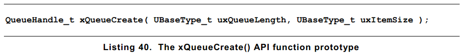

**参数**

uxQueueLength：被创建的队列包含的数据项最大值。

uxItemSize：被创建的队列中每个数据项可以存储的字节数。

**返回值**

NULL：如果返回NULL，则表示没有足够的内存满足创建队列所需要的数据结构和存储区域的堆内存大小。

non-NULL：返回一个非空值表示创建队列成功。返回值应保存为该队列的句柄。

在队列被创建以后，可以调用**xQueueReset()**函数使队列返回刚被创建时的空状态。

##### 4.2.2 xQueueSendToBack() & xQueueSendToFront()

从名字中可以看出，xQueueSendToBack()用来将数据反送到队列的最后（末尾）处，xQueueSendToFront()用来将数据发送到队列大头部。

**xQueueSend()相当于xQueueSendToBack()。**

**注意**：千万不要在中断服务程序中调用xQueueSendToBack()和xQueueSendToFront()函数。更安全的做法是使用xQueueSendToBackFromISR()和xQueueSendToFrontFromISR()，将在第六章讲述。

函数原型如下所示：


**参数**

xQueue：别写入数据的队列的句柄。该句柄是调用xQueueCreate()函数创建队列时的返回值。

pvItemToQueue：指向要写入队列的数据的指针。队列能够存储的数据项的大小在其创建时已经给定，所以会有很多字节的数据从pvItemToQueue指向的数据拷贝到队列的存储区域。

**xTicksToWait**：如果队列已经存满，需要等待队列可以被访问造成任务被阻塞，该值表示任务被阻塞时要持续的最长时间。如果该值设置为0，当队列满的时候，写入函数会立即返回。**如果设置该值为portMAX_DELAY，则在队列满的时候，任务（函数）可能会一直等待（不退出）**，这种方式需要在FreeRTOSconfig.h头文件中将INCLUDE_vTaskSuspend设置为1。

**返回值**

有以下两种可能的返回值。

pdPASS：只有当数据成功发送到队列时才会返回pdPASS。

errQUEUE_FULL：当队列已满，数据不能被写入队列时返回errQUEUE_FULL。

##### 4.2.3 xQueueReceive()函数

xQueueReceive()函数用来从队列中接收（读取）一个数据项。读取之后该数据项将在队列中删除。其函数原型如下图所示。

注意：绝不能从中断服务程序中调用xQueueReceive()函数。应选用安全的适用于中断的xQueueReceiveFromISR()函数。该函数将在第六章讲述。

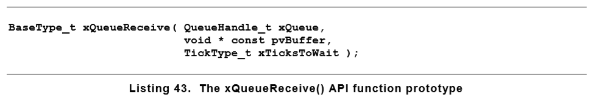

**参数**

xQueue：将要被读取数据的队列的句柄。该句柄是调用xQueueCreate()创建队列时返回值。

pvBuffer：一个指向内存的指针，接收到的数据将被复制到其中。队列中每个数据的项大小在其被创建时设定。该指针指向的内存大小必须足够大以容纳读取的数据项。

xTicksToWait：当队列中没有数据可读时，该值指定了任务等待队列从空状态到可读取状态的最大事件，在这段事件内任务将处于阻塞态。

如果将该值设置为0，那么当队列为空时，xQueueReceive()函数将立即返回。

如果该值设置为portMAX_DELAY，那么当队列一直为空时，将会使任务一直等待下去，使用该功能需要在FreeRTOS.h头文件中将INCLUDE_vTaskSuspend设置为1。

**返回值**

pdPASS：如果数据在指定的时间内（xTicksToWait）成功的从队列中读出，将会返回pdPASS。

errQUEUE_EMPTY：如果在指定的时间内（xTicksToWait）不能从队列中读出数据（队列一直为空）。则返回errQUEUE_EMPTY。

##### 4.2.4 uxQueueMessagesWaiting()

uxQueueMessagesWaiting()函数用来询问（查询）一个队列当前存储的数据项数目。其函数原型如下图所示：

**注意**：在中断服务程序中调用uxQueueMessagesWaitingFromISR()函数，绝不能调用uxQueueMessagesWaiting()函数。


**参数**

xQueue：被查询队列的句柄。该句柄为创建该队列时，xQueueCreate()函数的返回值。

**返回指**

** ：被查询的队列当前存储的数据项数量，如果队列为空，则返回0。

#### 4.3 从多个源头接收数据

FreeRTOS开发者普遍会使一个任务从多个源头接收数据。接收数据的任务需要知道它接收的数据来自哪里？并以此判断如何处理该数据。一个简单的解决办法是使用一个队列传输一个同时包含数据值和其来源的结构体。该方法如下图所示：

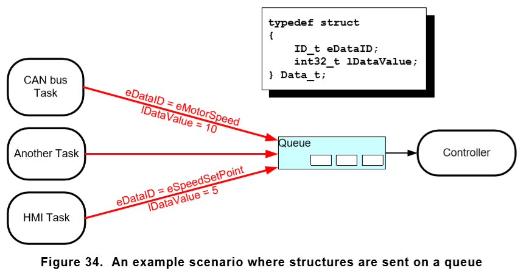

从图中可以看出：

- 创建的队列Queue保存的数据项为结构体Data_t。该结构体的成员一是数据本身的值，另一个是枚举类型的变量，在一条消息中指示要发送到队列的数据的含义。

- 中央控制器任务用于执行系统的主要功能。它必须对队列中传递给它的系统状态的输入和更改做出反应。

- CAN总线任务用来封装CAN总线接口功能。当CAN总线任务接收并解码一条信息，它将已经解码的消息以Data_t结构发送给控制器任务。传输的结构体中eDaTaID用于让控制器任务知道该数据是什么类型，在上图中表示电机的转速，结构体中IDataValue用来让控制器任务知道电机的真实转速值。

- 人机交互（HMI）任务用来封装所有的人机交互接口功能。机器操作员也许会以多种方式输入命令和查询值，必须在HMI任务中检测和解释这些命令和值。当输入一个新命令时，人机交互任务会以Data_t结构发送给控制器任务一个命令。eDataID用于告知控制器任务数据的含义，在上图中代表该消息是”设置新的指针值“，IDataValue为实际要设置的指针值。

#### 4.4 处理大尺寸或可变大小的数据

##### 4.4.1 队列指针

如果队列中要存储的数据很大，你最好使用队列来传输指向数据的指针而不是真实的数据。使用指针在数据处理时间和创建队列所需的RAM空间上更加高效。不过，当传输指针时，需要格外注意以下几点：

1. **指针所指向的数据是被明确定义过的**

当有多个任务通过指针共享同一内存时，必须确保不能有多个任务同时修改该内存中保存的内容，或执行一些导致该内存中数据无效或者前后不一致的操作。理想的情况下是，只有发送任务被允许访问该指针指向的内存，直到该内存中的数据进入队列，同样只有接受任务被允许访问该指针指向的内存在该内存被送入队列之后。

2. **指针所指向的RAM内存仍然有效**

如果指针指向的内存是动态分配的，或者是从预分配的缓存区池中获取的，那么指定有一个任务释放掉该内寸。当内存被释放掉之后，所有的任务都不允许访问该内存。

绝不能将指针指向分配给一个任务的堆栈。因为堆栈变化之后，数据将会变为无效。

使用手册中有列子，很哇塞！

##### 4.4.2 使用队列发送不同类型和长度的数据

先前的例子中给出了两个非常有用的队列使用模式，发送结构体到队列、发送指针到队列。结合这两种模式可以使队列接受任意的数据类型以及任意的数据源。FreeRTOS+TCP TCP/IP栈提供了一个实用的列子，展示了如何结合两种模式的使用方法。

更多详细例子尽在内核手册，一定要去查看:key:.

#### 4.5 从多个队列中获取数据

##### 4.5.1 队列集合（Queue Sets）

应用开发者经常需要一个单独的任务去接收不同大小的数据，及不同含义的数据，当然这些数据来自不同的源头。之前的小节展示了使用一个单独的队列灵活而高效的接受结构类型的数据。然而，由于各种限制应用开发者的选择有限，使用不同的队列处理不同来源的数据是必须的。例如，集成到设计中的第三方代码可能会假定存在专用的队列。这种情况下就要使用队列集合（queue set）了

队列集允许任务从多个队列接收数据，而无需任务依次轮询每个队列以确定哪个队列（如果有的话）包含数据。

相比于单个队列，使用队列集合效率和灵活性都会降低，因此，在非必要的情况下建议使用单个队列传输数据。

下面将通过以下几点介绍队列集合的使用：

1. 创建队列集合
2. 添加队列到集合

信号量也可以添加到队列集合中，信号量将在后面的章节介绍。


3. 从队列集合中读取数据，以确定集合中那些队列包含数据。

当集合中的队列接收数据时，接收数据队列的句柄被发送到队列集合，在一个任务向该队列读取数据时返回该句柄。因此，如果一个队列的句柄从集合中返回，那么该句柄所在的队列包含数据，任务可以直接从队列中读取数据。

注意：除非队列集合中的队列句柄已经从队列集合中读取出，其他情况下不要从该队列读取数据。

**要使用队列集合需要在FreeRTOSconfig.h头文件中将configUSE_QUEUE_SETS设置为1.**

**xQUEUECreateSet()函数**

在使用队列集合之前必须明确地创建它。

利用句柄引用队列集合，句柄的数据类型为QueueSetHandle_t。xQueueCreateSet()函数创建一个队列集合并返回一个引用该集合的QueueSetHandle_t变量的句柄。其函数原型如下：


**参数**

uxEventQueueLength：该变量定义了创建的队列集合在任一时间可以保存的最大队列句柄数量。只有集合中的队列接收数据时，接收数据的队列句柄才会发送到队列集合。如果队列已满，则取法接受数据，因此如果队列集合中的所有队列都已满，则不能将队列句柄发送到队列集中。因此，队列集放在同一时间持有的最大项数是集合中每个队列长度的总和。

**返回值**

NULL：如果返回NULL，表示由于没有足够的堆内存分配给队列集合用于保存数据结构和存储区，创建队列集合失败。

A non-NULL：非NULL值，表示创建队列集合成功，返回的值应该被保存为该队列集合的句柄。

**xQueueAddToSet()函数**

xQueueAddToSet()函数用来添加队列或信号量到一个队列集合。其函数原型如下：

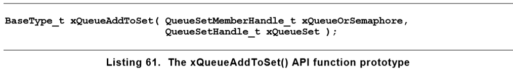

**参数**

xQueueOrSemaphore：要添加到队列集合中的队列或信号量的句柄。队列句柄和信号量句柄都可以被转换为QueueSetMemberHandle_t类型。

xQueueSet：队列或信号量将要被添加到的队列集合的句柄。

**返回值**

pdPASS：只有当队列或信号量成功添加到队列集合中时返回pdPASS。

pdFAIL：如果队列或信号量不能被添加到队列集合中，返回pdFAIL。队列和二进制信号量只有当它们是空的时候才可以添加到集合。计数信号量只有当它的计数为零时才可以被添加到集合中。队列和信号量一次只能是一个集合的成员。

**xQueueSelectFromSet()函数**

xQueueSelectFromSet()函数用于从队列集合中读出一个队列句柄。

当集合中的队列或者信号量接收数据时，接收数据的队列或者信号量的句柄将被发送到队列集合中，在任务调用xQueueSelectFromSet()函数时返回发送到集合中的句柄。如果调用xQueueSelectFromSet()函数返回了一个句柄，那么通过该句柄引用的队列或者信号量一定包含数据，任务可以直接利用该句柄读取队列或者信号量中的数据。其函数原型如下图所示：

注意：不要从集合中的队列或信号量中读取数据，除非队列或信号量的句柄已经从xQueueSelectFromSet()调用中返回。只有当句柄从xQueueSelectFromSet()函数中返回时才可以读取队列或者信号量。

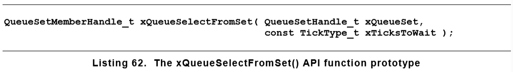

**参数**

xQueueSet：将要从中读取队列句柄或者信号量句柄的队列集合句柄。队列集合句柄会在调用xQueueCreateSet()函数创建队列集合时返回。

xTicksToWait：当队列集合为空时，任务因等待接收队列或信号量句柄而进入阻塞态的最大持续时间。如果xTicksToWait的值为0，那么当队列集合中的队列和信号量都为空时，xQueueSekectFromSet()函数会立即返回。

设置xTicksToWait的值为portMAX_DELAY会使任务一直等待，直到集合中有数据可读，要使用portMAX_DELAY需在FreeRTOSConfing.h头文件中将INCLUDE_vTaskSuspend的值设置为1。

**返回指**

Non-NULL：返回一个非空值，则该返回值将是包含数据的队列或者信号量的句柄。返回的句柄是一个QueueSetMemberHandle_t类型的数据，它可以被转换为QueueHandle_t类型或者SemaphoreHandle_t类型。

NULL：如果返回NULL，那么表示不能从队列集合中读取句柄。

#### 4.6 利用队列创建邮箱（长度为1的队列）

在嵌入式社区对于邮箱没有一个统一的说法，在不同的操作系统中邮箱“mailbox”有不同的意义。在FreeRTOS中邮箱被用来指长度为1的队列。一个队列被称作邮箱可能是因为它是在应用程序中使用，而不是因为它与队列在功能上有差异。（用的地方不一样，叫法就不一样。）

- 队列用来发送一个任务到另一个任务的数据，或者中断服务程序到任务的数据。发送者发送一个数据项到队列，接收者从队列中取出数据项。数据通过队列从发送者到接收者。
- 邮箱保存的数据可以被任何任务或中断服务程序读取。数据不通过邮箱传输，数据会一直在邮箱中，直到被重写。发送者重写邮箱中的数据值。接收者读取邮箱中的数据，并不会像读取队列那样读取之后将该项删除。

**xQueueOverwrite()函数**

类似于xQueueSendBack()函数，xQueueOverwrite()函数将数据发送到一个队列，与xQueueSendToBack()不同的是，如果要写入的队列已经满了的话，xQueueOverWrite()函数不会因此进入阻塞状态或者立即返回，它将会将数据重写入队列。

xQueueOverwrite()函数应只用在长度为1的队列中。这种限制避免了当队列已经满时，实现的功能要对队列中的哪一个数据项重写做出判断的需要。其函数原型如下图所示：

注意：在中断服务程序中一定要使用中断安全版本的xQueueOverwriteFromISR()函数，不能使用xQueueOverwrite()函数。


**参数**

xQueue：被写入或发送数据的队列句柄。该句柄在调用xQueueCreate()函数创建句柄时返回。

pvItemToQueue：将要写入队列的数据的指针。队列在创建时就已经设置好了它可以报存的数据项大小，所以指针所指的数据将会复制若干字节到队列的存储区。

**返回指**

pdPASS：就算队列已经满了，xQueueOverwrite()函数也能向队列写数据，该函数一定返回psPASS。

**xQueuePeek()函数**

xQueuePeek()函数用来从队列中接收（读取）数据项，并且读取之后数据项并不会被删除。xQueuePeek()函数从队列的头部接收数据，并不改变存储在队列中的数据，也不改变读出的数据在队列中的位置。其函数原型如下图所示：

注意：在中断服务程序中一定要使用xQueuePeekFromISR()函数，绝不能使用xQueuePeek()函数。

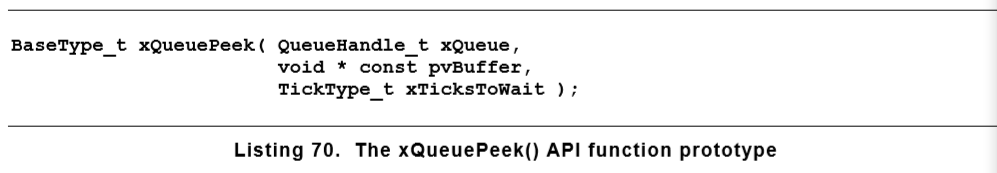

xQueuePeek()函数的参数与返回值与xQueueReceive()函数相同。

### 5 软件定时器

软件定时器被用来在将来的一个设定的时间安排一个函数的执行，或者以一个固定的频率周期性地执行函数。通过软件定时器调用执行的函数被称作软件定时器的回调函数。

软件定时器由内核控制，实施。软件定时器不需要硬件支持，与硬件定时器或者用剑计数器都没有关系。

需注意，秉承着FreeRTOS在保证最大效率的前提下使用新颖巧妙的设计的理念，软件定时器只有在其回调函数真正执行时才占用处理时间，其他情况下不会使用处理时间。

软件定时器的功能是可选的，如果你要使用它的话：

1. 将FreeRTOS源代码中FreeRTOS/Source/timers.c文件作为构建你的项目的一部分。
2. 在FreeRTOSConfig.h头文件中将configUSE_TIMERS设置为1。

在本章将学习到以下内容：

- 软件定时器与任务的各自特点及对比。
- RTOS演示任务。
- 定时器命令序列。
- 一次性软件定时器与周期性定时器的区别。
- 如何创建、开始、重置以及修改软件定时器的周期。

#### 5.1 软件定时器的回调函数（Software Timer Callback Functions）

软件定时器**回调函数**同样也是由C语言实现。唯一特别的是它的函数原型，**必须返回void**，并且**将该软件定时器的句柄作为其唯一的参数**。回调函数的原型如下所示：

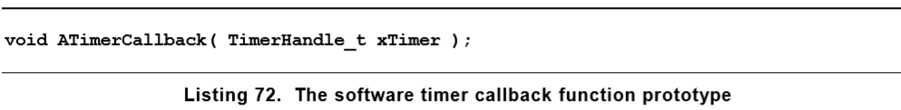

软件定时器回调函数从开始执行到结束，按正常的方式退出。回调函数应很小，并且绝不能进入阻塞状态。

注意：我们会看到，当FreeRTOS调度器开始运行后，任务中执行的软件定时器回调函数将被自动创建。因此，软件定时器回调函数是绝不能调用FreeRTOS的应用接口函数，因为这将会造成调用任务进入阻塞状态。当使用xQueueReceive()函数接收数据时，设置xTicksToWait参数为0时，该函数可以用在回调函数中。在回调函数中使用如vTaskDelay()函数时不行的，调用延时函数将会时调用任务经常进入阻塞态。

#### 5.2 软件定时器的属性和状态

##### 5.2.1 周期性软件定时器

软件定时器的周期是从定时器开始到其回调函数执行的这段时间。

##### 5.2.2 一次性定时器和自动重载定时器

**一次性定时器**

一经开始，一次性定时器将只执行其回调函数一次。一次性定时器可以被再次手动开始。它自己并不会从新开始。

**自动重载定时器**

一经开始，自动重载定时器将在它的定时耗尽之后将自动重新开始，这就表示了他的回调函数将被周期性地执行。

下图展示了one-shot timer和auto-reload timer之间行为的不同。途中竖直的虚线表示滴答中断的发生时刻。

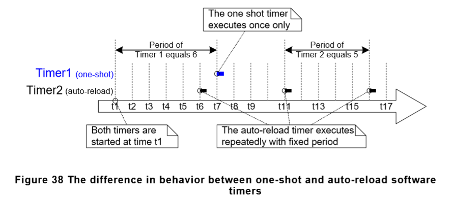

##### 5.2.3 软件定时器状态

软件定时器的状态有以下几种：

**休眠状态（Dorman）**

休眠状态的定时器，可以使用它的句柄引用，但是它不在运行状态，因此它的回调函数不会被执行。

**运行状体（Running）**

当软件定时器进入运行状态或者被重置后，在它的定时周期结束后将会执行它的回调函数。

下面两个图分别展示了one-shot timer和auto-reload timer在休眠和运行两个状态之间转换的可能。两种定时器最关键的不同在于当定时器定时结束后进入的状态，one-shot timer将会执行回调函数之后进入休眠状态，而auto-reload timer将会在回调函数执行完毕之后重新进入运行态。

xTimerDelete()函数将删除一个定时器，定时器可在在任何时刻被删除。

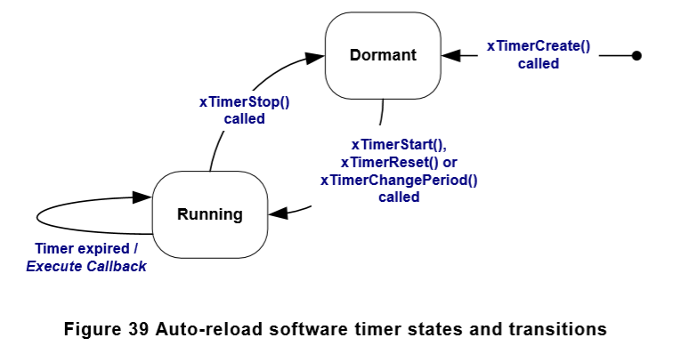

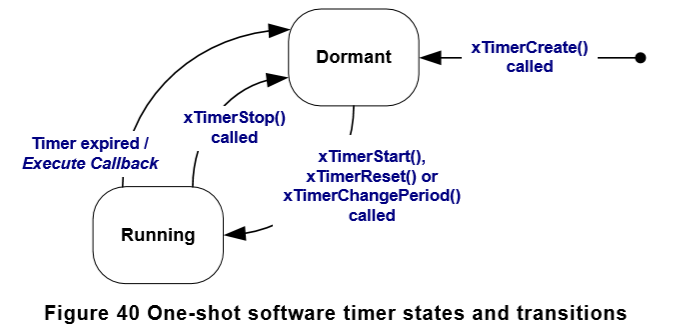

#### 5.3 软件定时器的上下文（context）

##### 5.3.1 RTOS守护进程（定时器服务任务）

所有的软件定时器回调函数都在一个相同的RTOS守护进程（定时器服务任务）上下文中执行。

守护进程任务是一个标准的FreeRTOS任务，它在调度器开始的时候被制动创建。守护进程任务的优先级和堆栈大小在编译时由configTIMER_TASK_PRIORITY和configTIMER_TASK_DEPTH两个常量分别设定。两个常量都在FreeRTOSConfig.h头文件中定义。

软件定时器回调函数绝不能调用FreeRTOS的应用程序接口函数，如果调用会造成使用软件定时器的任务进入阻塞状态，同样也可能会使守护进程任务进入阻塞状态。

##### 5.3.2 定时器命令队列

软件定时器应用程序接口函数从**调用任务（calling task）**发送命令到守护进程任务所使用的队列，被称为定时器命令队列。定时器命令队列如下图所示。命令包括开启定时器、停止定时器、重置定时器。

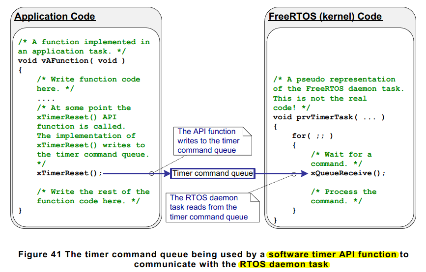

定时器命令队列是一个标准的FreeRTOS队列，当调度器开始的时候被自动创建。定时器命令队列的长度在编译时由FreeRTOSConfig.h头文件中的configTIMER_QUEUE_LENGTH常量配置。

##### 5.3.3 守护进程任务调度

守护进程程序同其他任何FreeRTOS任务一样被调度；当它处于就绪态任务中且优先级最高时就可以进入运行态，它只负责处理命令或执行定时器回调函数。下面两个图展示了设置configTIMER_TASK_PRIORITY常量不同的值（优先级）对定时器任务的影响。

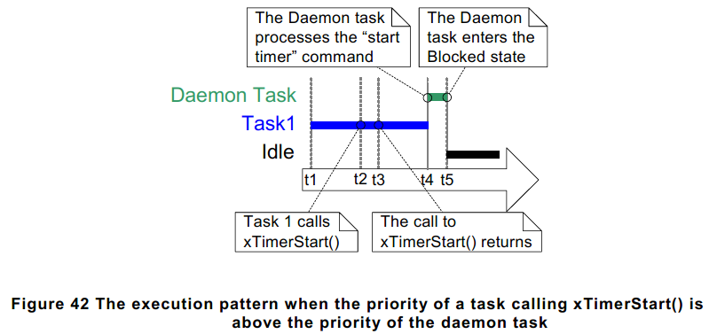

上图展示了当守护进程任务的优先级比调用xTimerStart()函数启动定时器的任务优先级低的时候，系统的执行模式。从图中可以看出Task1优先级>Deamon Task优先级>Idle优先级。

1. **t1时刻**

   Task1处于运行态，deamon任务处于阻塞态。

   如果有一个命令发送到定时器命令队列中，守护进程任务将离开阻塞态，在这种情况下它将处理命令，另一种情况是定时器时间耗尽，它将执行软件定时器的回调函数。

2. **t2时刻**

   Task1调用xTimerStart()。

   xTimerStart()函数发送一个命令到定时器命令队列，使得守护进程任务退出阻塞态。由于Task1的优先级比守护进程任务的优先级高，所以守护进程任务不会抢占Task1。

   Task1继续处于运行态，继续运行，守护进程任务退出阻塞态之后将进入就绪态。

3. **t3时刻**

   Task1执行xTimerStart()函数完毕。Task1从执行xTimerStart()函数开始到结束，一直处于运行态。
   
4. **t4时刻**

   Task1调用了一个应用程序接口函数使其进入了阻塞态。守护进程任务就成了就绪任务中优先级最高的任务，因此调度器选择守护进程任务进入运行态。守护进程任务就可以开始处理Task1发送到定时器命令队列的命令了。

   注意：**计算软件定时器时间到期的起始时刻是从‘开始定时器’命令被发送到定时器命令队列的时刻**，而不是守护进程任务从定时器命令队列中取出‘开始定时器‘命令的时刻。

5. t5时刻

   守护进程任务完成对Task1发送的命令的处理，并尝试从定时器命令队列中接收更多的数据。但是队列已经空了，因此守护进程任务重新进入阻塞态。守护进程任务在有命令发送到命令队列或者软件定时器超时后离开阻塞态。

   此时就绪态中，空闲任务的优先级最高，因此调度器选择空闲任务进入运行态。

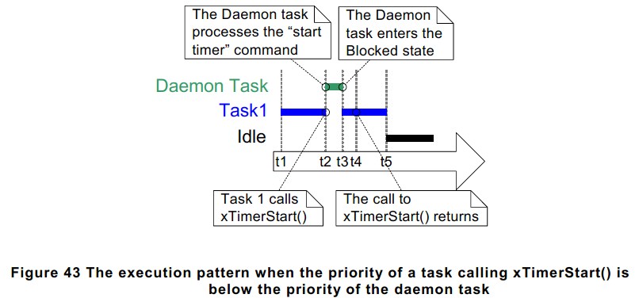

上图与上上图类似，但是在此处守护进程任务的优先级高于调用xTimerStart()函数的的任务优先级。

1. **t1时刻**

   Task1处于运行态，守护进程任务处于阻塞态（定时器命令队列为空）

2. **t2时刻**

   Task1调用xTimerStart()函数。

   xTimerStart()函数发送一条命令到定时器命令队列，这将使守护进程任务离开阻塞态，守护进程任务的优先级高于Task1的优先级，因此调度器选择守护进程任务进入运行态。在Task1任务完全执行完xTimerStart()函数之前，它就被抢占了，此时它处于运行态。

   守护进程任务开始处理Task1发送到命令队列中的命令。

3. **t3时刻**

   守护进程完成Task1发送到命令队列的命令，并尝试接受更多的命令进行处理。但是此时定时器命令队列是空的，因此守护进程任务重新进入阻塞状态。

   Task1从就绪态转为运行态。

4. **t4时刻**

   Task1是被守护进程任务抢占了，在抢占之前没有执行完xTimerStart()函数，当它重新进入运行态时，续集执行xTimerStart()函数剩下的退出（return）部分。

5. **t5时刻**

   Task1调用一个应用程序接口函数，使其进入阻塞态。此时空闲任务进入运行态。

发送到定时器命令队列中的命令包含一个**时间戳（time stamp）**。时间戳用于随时计算一个应用程序任务发送一条命令到这条命令被进程守护任务处理完成的时间。例如，如果发送一个’start a timer‘命令来开始一个周期为10个ticks的定时器，时间戳则被用来确保定时器是在**命令在发送后**开始计算这10个tick，**而不是**在**命令被守护进程任务处理之后**才开始这10个tick的计时。

#### 5.4 创建 & 开始软件定时器

##### 5.4.1 xTimerCreate()函数

软件定时器在使用前必须明确的创建它。（FreeRTOS V9.0.0也包含了xTimerCreateStatic()函数，使用该函数创建的定时器时，在编译时其需要的内存将被静态地分配）

软件定时器可以使用一个TimerHandle_t类型的变量来引用它。xTimerCreate()函数用来创建一个软件定时器并返回一个TimerHandle_t类型的变量来引用xTimerCreate()函数创建的定时器。刚创建的软件定时器处于休眠状态。其函数原型为下图所示。

软件定时器可以在调度器运行之前创建，也可以在调度器运行之后从任务中创建。

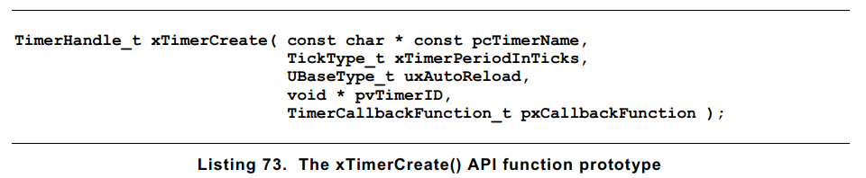

**参数**

pcTimerName：具有描述性的定时器名字。FreeRTOS不会使用该名字。它的存在纯粹是为了debug。通过这个高可读性的名字分辨定时器要比定时器句柄容易的多。

xTimerPeriodInTicks：用ticks数量指定的定时器周期。pdMS_TO_TICKS()宏可以用来将以毫秒为单位的数值转换为ticks数量。

uxAutoReload：设置uxAutoReload参数为pdTRUE则创建的定时器为自动重载定时器。设置uxAutoReload参数为pdFALSE则创建的定时器为一次性定时器。

pvTimerID：每一个定时器都有一个ID值。这个ID是一个viod指针，可以供程序开发人员以任意目的使用。当多个定时器的回调函数是同一个时，这个ID非常有用，因为这个ID可用于提供特定于某个定时器的存储。定时器ID的使用示例将在本章节展示，当然还是去看书，我是不会写在这里的。

当创建定时器时会给pvTimerID一个初始值。

pxCallbackFunction：软件定时器的回调函数是一个用C语言编写的简单函数，它的函数原型在Listing72那张图片上。pxCallbackFunction参数是一个函数指针（实际上，就是函数名），指向的函数用作创建的这个软件定时器的回调函数。

**返回值**

NULL：如果返回NULL，则由于没有足够的堆内存供FreeRTOS分配必要的数据结构给定时器，而使得软件定时器创建失败。

non-NULL：返回一个非NULL值则表示软件定时器创建成功。返回的值是创建的定时器的句柄。

##### 5.4.2 xTimerStart()函数（发送一条命令到队列）

xTimerStart()函数用于启动一个处于休眠状态的软件定时器，或者用于重置（重新启动）一个在运行状态的软件定时器。xTimerStop()函数用于停止一个处于运行状态的软件定时器。停止软件定时器就是将其状态转变为休眠状态。

xTimerStart()函数可以在调度器启动之前调用，但是即使那样，软件定时器其实没有真正的启动，直到调度器启动它才启动。其函数原型如下图所示。

注意：绝不能在中断服务程序中调用xTimerStart()函数。更安全的做法是调用xTimerStartFromISR()。

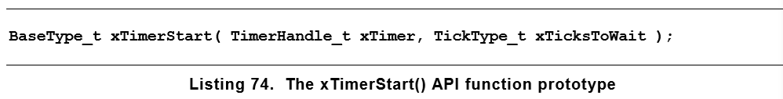

**参数**

**xTimer**：需要开启或者重置的软件定时器句柄。该句柄是调用xTimerCreate()函数创建软降定时器时返回的句柄。

**xTicksToWait**：xTimerStart()函数使用定时器命令队列发送“开启定时器”命令给守护进程任务。xTicksToWait参数指定了调用xTimerStart()函数的任务由于软件定时器命令队列已满而进入阻塞状态等待队列有空间可访问时的最长时间。

如果xTicksToWait参数设置为0，则当定时器命令队列满时，xTimerStart()函数将会立即返回。

阻塞状态的时间单位时ticks，所以你可以使用pdMS_TO_TICKS()。

如果在FreeRTOSConfig.h头文件中将INCLUDE_vTaskSuspend设置为1，那么在调用xTimerStart()函数时，将xTicksToWait参数设置为portMAX_DELAY时，调用xTimerStart()函数的任务在由于定时器命令队列已满而进入阻塞态等待队列有可使用的空间时，如果一直没有空用的空间，该任务将一直处于阻塞态。

如果xTimerStart()函数被调用前调度器并没用启动，那么xTicksToWait参数将被忽略，此时xTickStart()函数的行为等同于将xTicksToWait参数设置为0。

**返回值**

**pdPASS**：如果“start a timer”命令成功发送到定时器命令队列。

如果守护进程任务的优先级大于调用xTimerStart()函数的任务，那么调度器将保证在xTimerStart()函数返回之前处理“start a timer”命令。

**pdFAISE**：如果“start a timer”命令不能被写入定时器命令队列（队列已满），则会返回pdFALSE。

#### 5.5 定时器ID（Timer ID）

每一个定时器都有一个ID，它是应用开发者可以以任何目的使用的标签值。ID被存在一个void指针（void *）中，因此可以直接存储一个int类型的值作为指针，指向你想要的数据对象，或用作函数指针。

当软件定时器被创建时会给定一个初始ID-这个ID可以在之后使用vTimerSetTimerID()函数修改，这个ID也可以使用pvTimerGetTimerID()函数获取。

与其他API函数不同，vTimerSetTimerID()函数和pvTimerGetTimerID()函数可以直接访问软件定时器，这两个函数不需要发送命令到定时器命令队列。

##### 5.5.1 vTimerSetTimerID()函数 & pvTimerGetTimerID()函数

vTimerSetTimerID()函数原型如下图所示：


**参数**

xTimer：要被更新ID值的软件定时器句柄。该句柄是调用xTimerCreate()函数创建软件定时器时的返回值。

pvNewID：要设置的新的软件定时器ID。

pvTimerGetTimerID()函数原型如下图所示：

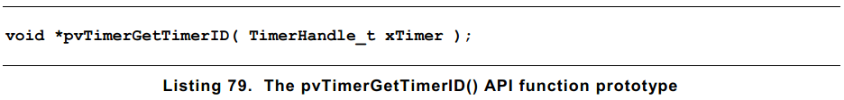

**参数**

xTimer：被询问ID的软件定时器句柄。

**返回值**

ID：被询问ID的软件定时器的ID。

同一个回调函数可以分配给多个软件定时器。当这种情况发生时，回调函数的参数就可以用于判决哪一个定时器时间到期了。

#### 5.6 改变定时器的周期

每一个官方的FreeRTOS端口都提供一个或多个样例工程。大多数的工程示例都有自检功能，他们使用LED给使用项目的人一个项目状态的视觉反馈。当自检没有问题时，LED等缓慢闪烁（时间间隔长），如果自检出现失败时，LED快速闪烁。

一些示例项目将自检实现为一个任务，在任务中通过vTaskDelay()函数控制LED灯的闪烁频率。还有些示例工程将自检实现为软件定时器的回调函数，利用定时器的周期控制LED灯的闪烁速率。

##### 5.6.1 xTimerChangePeriod()函数

xTimerChangePeriod()函数用于改变一个软件定时器的周期。

如果使用xTimerChangePeriod()函数改变一个正在运行的定时器的周期，那么该定时器将会使用新的周期重新计算他的到期时间。重新计算到期时间的起始时间与调用xTimerChangePeriod()调用的时间相关，而不是在定时器原始的启动时刻开始重新计算。

如果使用xTimerChangePeriod()改变一个处于休眠状态的定时器，那么该定时器将计算一个到期时间，并且转入运行态（**调用函数xTimerChange()函数会启动处于休眠状态的定时器**）。

注意：在终端服务程序中，要使用中断-安全版本的xTimerChangePeriodFromISR()函数，决不能使用xTimerChangePeriod()函数。

xTimerChangePeriod()函数的原型如下：


**参数**

**xTimer**：将要被更新周期值的软件定时器句柄。调用xTimerCreate()函数创建定时器时的返回值。

**xTimerPeriodInTicks**：软件定时器的新周期值，单位是ticks。pdMS_TO_TICKS()宏是个好东西。

**xTicksToWait**：xTimerChangePeriod()函数使用定时器命令队列发送“改变周期”命令到守护进程任务。xTicksToWait参数指定了调用xTimerChangePeriod()的任务当定时器命令队列已满时，进入阻塞状态以等待队列中有可访问的空间的最大阻塞时间。同其他函数一样，该参数也可以设置为0和portMAX_DELAY。

如果xTimerChangePeriod()函数在调度器开启之前调用，那么xTIcksToWait参数将被忽略，此时xTimerChangePeriod()函数的行为相当于将xTicksToWait参数设置为0。

**返回值**

pdPASS：只有命令成功发送到定时器命令队列时才返回pdPASS。

pdFALSE：如果“改变周期”命令由于定时器命令队列已满而不能写到队列时将会返回pdFALSE。

#### 5.7 重置软件定时器

重置软件定时器意味着重新开启这个定时器；定时器的到期时间将从定时器重启时重新计算。如下图所示，定时器开启时其周期为6tick，然后在其最终的到期时间到来（回调函数被执行）之前两被次重启。

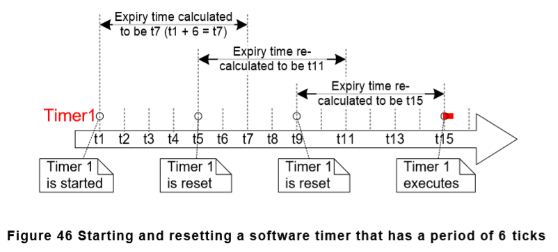

##### 5.7.1 xTimerReset()函数

xTimerReset()用于重新开始定时器。xTimerReset()同样也可以用于开启一个处于休眠状态的定时器。其函数原型如下图所示。

注意：绝不能在中断服务程序中使用xTimerReset()函数，要使用中断-安全版本，xTimerResetFromISR()函数。

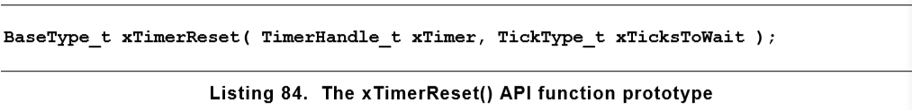

**参数**

xTimer：要重置会开启的定时器句柄。

xTicksToWait：调用xTimerReset()函数的任务，使用定时器命令队列发送“reset”命令到守护进程任务时的最大阻塞时间。同样该值可以被设置为0或portMAX_DELAY。

**返回值**

pdPASS：只有在重置命令成功发送到定时器命令队列时才会返回pdPASS。

pdFALSE：重置命令未能成功发送到定时器命令队列时返货pdFALSE。

### 6 中断管理（Interrupt Management）

**Events(事件s)**

当环境中有事件发生时，嵌入式操作系统必须采取相对应事件的操作。例如，一个报文到达以太网外设（事件）会需要将其输入到TCP/IP协议栈进行处理（操作）。高级点的操作系统将必须处理来自不同源头的事件，所有的事件都会有不同处理开销和响应时间需求。在不同的操作系统中，必须做出使得事件处理实现策略最佳的判断：

1. 如何检测事件的发生？大部分都是用中断的方法，不过轮询的方式也是会用到的。
2. 当使用中断处理事件时，有多少代码需要在终端服务程序内执行，有多少需要在中断服务程序（Interrupt Service Routine, ISR）外部执行呢？通常的做法是希望中断服务程序越短越好。
3. 事件时如何与main（non-ISR）代码进行通信，又如何构建这段代码使得它可以以最佳地适应对可能出现的异步事件进行处理。

FreeRTOS没有给应用程序的开发者强加任何的事件处理策略，反而提供了允许以一个简单且可维护的方式实施所选策略的特性。

**分清任务优先级和中断优先级的区别是非常重要的**

- 任务是一个软件特征，与运行FreeRTOS的硬件没有关系。任务的优先级是在软件中由应用开发者分配的，软件算法（调度器）决定哪一个任务进入运行态。
- 尽管中断服务程序是由软件编写的，但是它确是一个硬件特性，因为要运行哪个中断服务程序、在何时运行是由硬件控制的。**任务只有在没有中断服务程序运行的时候才会运行。**因此最低优先级的中断就会中断最高优先级的任务的运行，在任何情况下任务都不可能抢占中断服务程序的运行。

所有运行FreeRTOS的架构都支持中断处理，不过各个架构的中断入口、中断优先级分配等相关详细内容会有差异。

#### 6.1 在ISR中使用的FreeRTOS API

**The Interrupt Safe API**

在一个中断服务程序中会经常用到FreeRTOS提供的应用程序接口函数，但是大多数FreeRTOS API函数在中断服务程序中执行时是无效的--最明显的就是调用某个API函数以使其调用任务进入阻塞态时；如果这个API函数从ISR中被调用而不是在任务中被调用，那么就没有任务会进入到阻塞态。FreeRTOS解决这个问题的办法是提供了两个版本的API函数；一个版本用于在任务中调用，另一个版本用于在ISRs中调用。函数名字后面带有“FromISR”的是在ISRs中使用的版本。

**注意：绝不能再中断服务程序中调用函数名中没有“FromISR”的FreeRTOS应用程序接口函数。**

**使用Interrupt Safe API的好处**

在中断服务程序中使用中断安全版本的API可以使得任务代码和中断服务程序代码更有效率，中断入口也会更加简单。试想一下，如果在程序中只是用一个版本的API函数，那么中断和任务都将调用相同的API函数。当中断和任务可以条用同一版本的API函数时：

- 被调用的API函数需要一个附加的逻辑去判断调用它的是任务还是中断服务程序。这个附加的逻辑会引入通过函数的新路径，使得函数代码更长，更复杂，更难以调试。
- 在任务中调用函数时，函数的某些参数会变得多余，同样地，如果在ISR中调用这个函数时，其他的一些参数也可能会变得多余。
- 每个FreeRTOS端口需要提供一个确定（任务或中断）执行上下文的机制。
- 如果某个架构不容易确定任务或中断服务程序的执行上下文，那么则需要使用额外的、浪费的、更复杂的非标准的中断入口代码，使得执行上下文可以由软件提供。

**使用Interrupt Safe API函数的缺点**

虽然使用两个相同功能的API函数版本可以使得任务和中断服务程序更加高效，但是也会引入一个新的问题，在任务和中断服务程序中有时调用一个非FreeRTOS API的函数是不可避免的，但是问题就是这个非FreeRTOS API的函数会调用FreeRTOS API函数。

通常集成第三方代码时这会成为一个问题，这也是当软件的设计不受程序开发者控制的唯一时刻。如果这种问题发生的时候可以通过以下几种技术中的一个解决：

1. 将中断处理延迟到任务，因此API函数就只需要在任务的上下文中调用即可。
2. **如果你使用的FreeRTOS端口支持中断嵌套，那么使用带有"FromISR"的API函数，这种函数可以在任务和中断服务程序中调用。**
3. 第三方的代码通常包含了FreeRTOS的抽象层，该层可以用于实现对调用某个函数的（任务或中断）上下文测试，然后调用适合该上下文的API函数。

**pxHigherPriorityTaskWoken 参数**

如果一个上下文切换是由中断执行的，那么在中断退出时任务运行的上下文可能会与中断开始时任务的上下文不同。因为中断可能中断一个任务，从另一个不同的任务返回。

一些FreeRTOS API函数可以把任务从阻塞态切入到就绪态。例如，如果有一个任务在等待队列中有可获得的数据时进入阻塞态，那么xQueueSendToBack()函数就可以发送数据到相应的目标队列，使得等待数据的任务进入就绪态。

如果通过FreeRTOS API函数使得任务退出阻塞态，而这个任务的优先级又比当前正在运行的任务优先级高，那么按照FreeRTOS的调度规则，将会发生一个向更高优先级任务的切换。这时向更高优先级任务的切换的真实发生，取决于API函数被调用的上下文。

- 如果这个函数是从任务中调用的

如果在FreeRTOSConfig,h头文件中将configUSE_PREEMPTION设置为1，那么在调用函数后-在函数退出之前，将处于运行态的任务会自动切换到高优先级的任务

- 如果这个函数是从中断中调用

将处于运行态的任务将不会自动切换到处于就绪态的最高优先级任务。但是，将会通过设置一个变量告知应用开发者此处应该执行一个上下文切换。中断安全应用程序接口函数（后面带有“FromISR”）有一个被叫做pxHigherPriorityTaskWoken指针参数就是为了这个目的而设计的。

如果需要发生上下文切换时，interrupt safe应用程序接口函数将设置*pxHigherPriorityTaskWoken变量为pdTRUE。为了检测到上下文切换的发生，在使用参数pxHigherPriorityTaskWoken时，必须在第一次使用它时，将它指向的变量值初始化为pdFALSE。

FreeRTOS API函数只可以设置*pxHighPriorityTaskWoken参数设置为pdTRUE。如果中断服务程序中调用了多个FreeRTOS API函数，那么相同的变量可以作为pxHigherPriorityTaskWoken参数在每个API函数调用中传递，pxHigherPriorityTaskWoken参数只需要在首次使用之前初始化为psFALSE就行。


