# Git Study Log

## 一  Git基础

### 1 Git本地命令

#### 1.1 git help查看帮助

```
git help <command>
git <command> help
git <command> -h
man git-<command>
```

获取命令command的用法说明，例如git help add、git help config。

#### 1.2 git init初始化仓库

```
git init
```

将当前文件夹初始化为Git仓库，git init初始化Git仓库之后会默认生成一个主分支master，也是你所在的默认分支，基本上是实际开发中正式环境下的分支，一般情况下master分支不会轻易直接在上面操作。

#### 1.3 git status查看状态

```
git status
git status -s/--short
```

查看状态，默认直接在master分支，可以查看文件夹下文档所处状态。在工作目录下的每一个文件有且仅有两种状态：**已跟踪**或**未跟踪**，已跟踪的文件是指那些被纳入版本控制的文件（即Git已经知道的文件），在上一次快照中有它们的记录，在工作一段时间后，它们的状态可能是未修改、已修改或已放入暂存区。

第二种查看状态的命令可以得到一种格式更为简洁的输出。

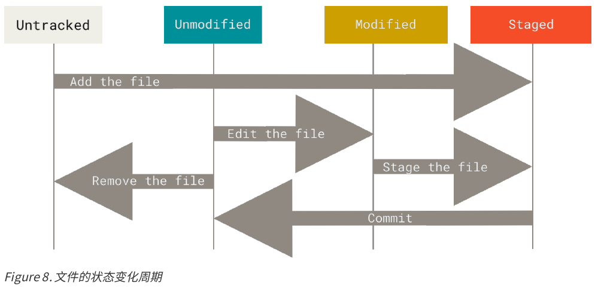

#### 1.4 git add将修改添加到暂存

```
git add <filename>
git add <directory>
```

将“filename”文件添加到Git仓库，但是未提交。git add后面如果是目录的话，将会递归地（添加）跟踪该目录下的所有文件。git add命令的理解为“精确地将内容添加到下一次提交中”。**运行了git add之后又作了修订的文件，需要重新运行git add把最新版本重新暂存起来**。

```
git add *
```

将所有**已跟踪文件的修改**及**未跟踪的文件**添加到暂存区。

（git add是一个多功能的命令，以后用到再来添加）

#### 1.5 git commit提交暂存区域快照

```
git commit <filename> -m "a description of the commit information"
git commit
git commit -v
```

将filename文件提交到Git仓库，并添加说明信息。执行第二条会将所有执行过git add的文件提交，并打开默认的文本编辑器提示你输出提交说明。执行第三条可以查看更详细的内容修改提示。

在执行git commit之前，应该执行git status命令查看一下是否还有修改过的文件或者新添加的未追踪的文件没有被add进暂存区。git add是先把改动添加到一个”暂存区“，临时保存你的改动，而git commit才是最后真正的提交。

```
git commit -a  # 不推荐的用法
```

加上-a选项，Git会自动把所有已跟踪过的文件中的执行修改或删除操作的文件暂存起来并提交，从而跳过git add步骤，这很方便，新加的文件是不能被提交到本地仓库的，建议一般不要使用-a参数，**强烈推荐git add将改动的文件添加到暂存区，再用git commit提交到本地版本库**。

#### 1.6 git rm移除文件 &  git mv移动文件（重命名？）

##### 1.6.1 git rm

要从Git中移除某个文件，**就必须要从已跟踪文件中移除**（确切的说，是从暂存区域移除），然后提交。如果只是简单的地从工作目录中手工删除文件，运行git status时就会在"Changes not staged for commit"部分（也就是**未暂存清单**，未add清单）看到，然后再运行git rm 记录此次移除文件的操作，下次提交时，该文件就不会再纳入版本管理器了。如果要删除之前修改过或已经add到暂存区的文件，则必须使用强制删除选项-f。这是一种安全特性，用于防止误删尚未添加到快照的数据，这样的数据不能被恢复。

```
rm <filename>
git status
git rm <filename>
git status
git commit <filename> -m "delete filename!"
git push origin master
```

另一种情况是，我们想把文件从Git仓库中删除（亦即从暂存区域移除），但是仍然希望保留在当前工作目录中。可以使用--cached选项。

```
git rm --cached <filename>
```

git rm命令后面可以列出文件或者目录的名字，也可以使用glob模式。

##### 1.6.2 git mv

```
git mv file_from file_to
```

将文件file_from更名为file_to，与下面三行命令作用相同

```
mv file_from file_to
git rm file_from
git add file_to
```

#### 1.7 git log查看提交历史

```
git log
```

不传入任何参数的默认情况下，会按照时间先后顺序查看所有的commit记录，最近的更新在最上面。这个命令会列出每个提交的SHA-1校验和、作者的名字和邮箱地址、提交时间和提交说明，如下图所示。

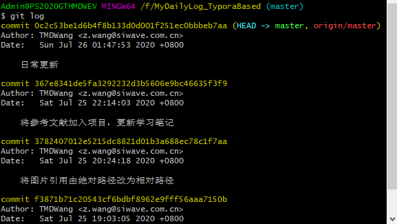

```
git log -p/--patch
git log -2
```

按补丁的格式输出每次提交所引入的差异。显示最近的两次提交。

```
git log --stat
```

查看每次提交的简略统计信息，列出所有被修改过的文件、有多少文件被修改了以及被修改过的文件的哪些行被移除或是添加了。在最后对每次提交做一个总结。

```
git log --pretty=oneline/short/full/fuller
git log --pretty=format:"%h - %an, %ar : %s"
```

使用不同于默认格式的方式展示提交历史。下图为git log --pretty=format常用选项。

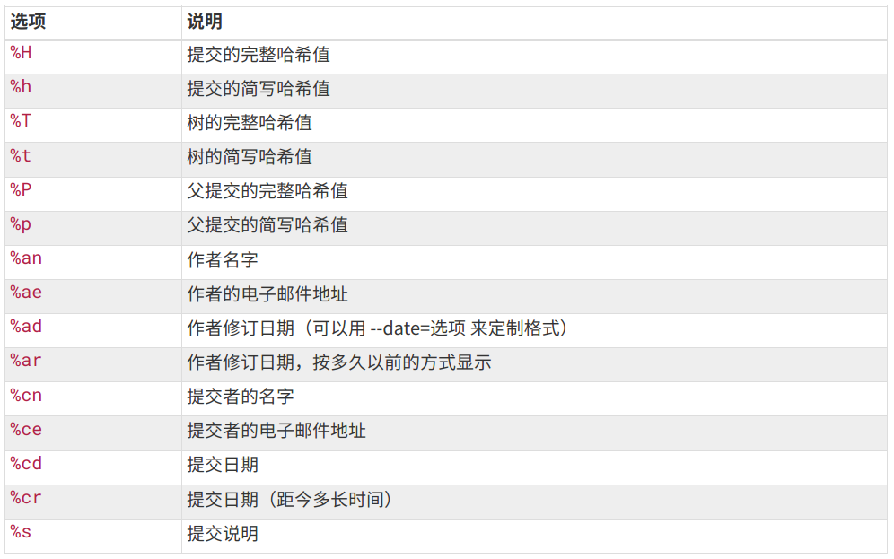

当oneline或format与另一个log选项--graph结合使用时尤其有用，**--graph选项**添加了一些ASCII字符串来形象地展示你的分支、合并历史。下图为git log的常用选项。

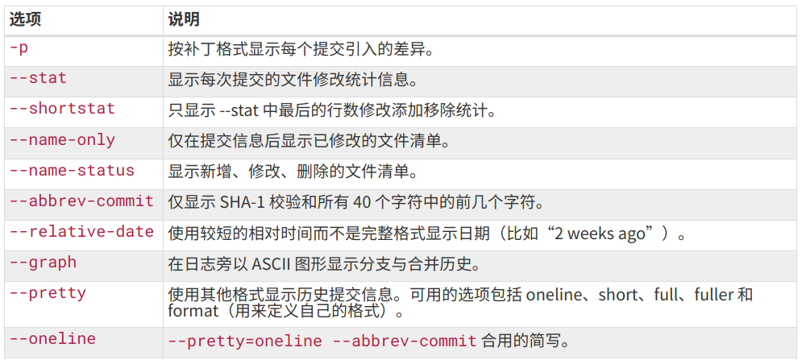

**限制输出长度**，除了定制输出格式的选项之外，git log还有许多非常实用的限制输出长度选项，例如--since和--until这种按照时间做限制的选项很有用。

```
git log --since=2.weeks
```

列出最近两周的所有提交。

```
git log -S <function_name>
```

-S选项接受一个字符串参数，并且只会显示哪些添加或者删除该字符串的提交。假设你想找出**添加或删除**了对某一个特定**函数的引用**的提交，可以执行上面的命令。

如果只关心某些文件或者目录的历史提交，可以在git log选项的最后指定他们的**路径**，因为是放在最后位置的选项，所以用两个短划线”--“隔开之前的选项和后面限定的路径名。

git log输出选项中常用的有下图所示：

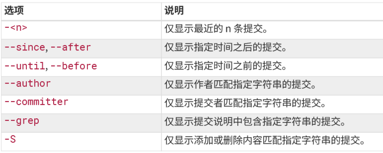

**总的来说，git log提供了很多选项检索我们想要知道的提交记录。**

#### 待归类

```
git branch
```

查看分支

```
git branch <branch_name>
git branch -d <branch_name>
```

创建一个名字为branch_name的分支。删除名字为branch_name的分支，-D为强制删除。

```
git merge <branch_name>
```

首先要切换到master分支，执行git merge branch_name，将名字为branch_name的分支合并到master分支。

#### 1.8 git checkout

```
git checkout <branch_name>
```

切换到名字为branch_name的分支。

```
git checkout -b <branch_name>
```

创建并切换到名字为branch_name的分支。

```
git checkout <commit_id>
```

切换到某次commit。

```
git checkout <tag_name>
```

切换到名字为tag_name时的Git仓库版本

checkout除了有“切换”的意思，checkout还有撤销的作用，假如你现在在实现一个小功能，快写完的时候，突然需求变了，之前写的代码完全不能用了，好在你还没有将该文件git add进暂存区，这时可以用下面的命令直接将文件还原到修改之前的样子

```
git checkout <filename>
```

checkout只能撤销还没有add进缓存区的文件。

#### 1.9 git stash

代码未完成之前一般不建议commit，会产生垃圾commit。当你正在一个新的分支上开发新的功能的时候，突然有一个紧急的bug需要修复，此时可以利用**stash**命令保存我们现在分支中的代码，让我们暂时切换到其他分支，修复完bug在切换回原来的分支。使用该命令的前提是没有进行commit，add代码也没关系。

```
git stash
```

将当前分支**所有没有commit**的代码先暂存起来，这时执行git status会发现当前分支非常干净，几乎看不到任何改动，之前修改的代码页看不见了，其实是stash起来了。

```
git stash list
```

查看stash记录，会查看到执行git stash命令的分支，这时就可以切换到其他分支，修复bug，结束之后，再切换回原来的分支继续之前未完成的工作。

```
git stash apply
```

回复执行git stash命令的分支。

```
git stash drop
```

把需要的代码恢复完成后，最好将暂存区的这次stash记录删除。

```
git stash pop
```

该命令不仅将stash的代码恢复回来，还自动帮你删除了这条stash记录。确保万一，可以执行git stash list查看一下是否还有该次stash记录。

git stash clear

清空所有暂存区的记录，drop是只删除一条记录，后面加上stash_id可以删除指定的stash记录，不加参数就是删除最近的一条记录，clear是清空记录。

#### 1.10 git merge & git rebase

rebase将两个分支先进行比较，按照一定的规则（时间？，内容？）合并，使得合并之后的代码很有逻辑，但是很难清晰的知道代码的出处。而merge则直接将另一分支的代码放到当前分支，虽然简单粗暴，但是很清楚的知道代码的来源。

##### 1.10.1 git merge合并

merge是合并的意思，我们在一个featureA分支开发完一个功能，需要合并到主分支master上时，可以进行如下操作

```
git checkout master
git merge featureA
```

首先切换到master分支，然后把featureA分支合并到master分支上。

##### 1.10.2 git rebase合并

rebase也是合并的意思，其用法如下

```
git checkout master
git rebase featureA
```

首先切换到master分支，然后将featureA分支合并到当前分支。

#### 1.11 撤销操作

”**在Git中任何已提交的东西几乎总是可以恢复的**。甚至那些被删除的分支中的提交或使用--amend选项覆盖的提交也可恢复。然而，**任何你未提交的东西丢失后可能再也找不到了**。“

##### 1.11.1 git commit --amend修补提交

在任何一个阶段，你都有可能想要撤销某些操作。**但是，有些撤销操作时不可逆的，此处会因为操作失误而导致之前的工作丢失。**

```
git commit --amend
```

该命令会将暂存区中的文件提交。如果自上次提交以来你还未做任何修改（或者，在提交后马上执行此命令），那么快照会保持不变，而你所修改的只是提交信息。

提交之后发现忘记了暂存某些需要的更改，可以执行下面几条命令，最终你只会有一个提交（即第二次提交的结果将代替第一次提交的结果）。

```
git commit -m "initial commit"
git add forgotten_file
git commit --amend
```

##### 1.11.2 取消暂存的文件（与Pro Git书中不一样，可能是Git版本问题）

如果你不小心用git add *将所有已修改的文件暂存，可是文件中包含了你本次不想提交的文件，可以用下图中提示的命令取消暂存的文件。

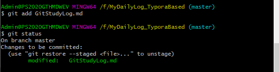

```
git restore --staged <file>
```

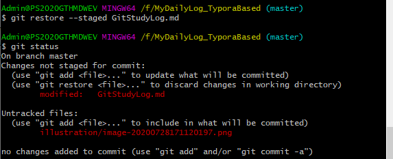

从图中可以看出之前暂存的GitStudyLog.md文件从暂存状态退回了被修改状态。

##### 1.11.3 撤销对文件的修改（与Pro Git书中不一样，可能是Git版本问题）

同样在1.11.2的图中可以看到，modified状态的GitStudyLog.md文件，被提示可以有git add和git restore两种操作，后者表示抛弃工作目录中该文件的修改部分。（在此处先提交一波，以免前边更改丢失）

```
git restore <filename>
```

该命令会用最近提交的版本覆盖掉当前内容。

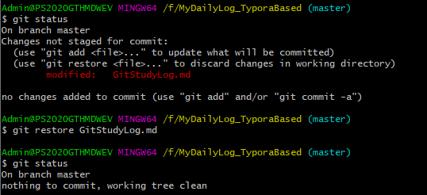

**注意！！！这个命令太危险了，慎用！慎用！慎用！**学到这里我对是否有办法撤销该命令造成的后果一无所知，而且Git没有提示，使用时Git也没有警告。

更好的做法在Git分支中，即保存当前进度，又回到修改之前的状态。

#### 1.12 git tag打标签

像其他版本控制系统（VCS）一样，Git可以给仓库历史中的**某一个提交打上标签**，以示重要。

Git支持两种标签：轻量标签（lightweight）与附注标签（annotated）。

”轻量标签很像一个不会改变的分支--它只是某个特定提交的引用。而附注标签时存储在Git数据库中的一个完整对象，它们是可以被校验的，其中包含打标签者的名字、电子邮件地址、日期时间，此外还有一个标签信息，并且可以使用GNU Privacy Guard（GPG）签名并验证。“

通常会建议创建附注标签，这样可以保存以上所有的信息。但是你只是想用一个临时的标签，或者因为某些原因不想保存这些信息，那么也可以用轻量标签。

##### 1.12.1 查看标签

```
git tag
git tag <-l/--list> "v1.*"
```

在Git中列出已有的标签，可带上-l/--list选项，在该选项后面加上通配符可检索出相应的标签。例中表示只列出v1.版本的标签。

##### 1.12.2 打标签

###### 附注标签

```
git tag -a <tagname> -m "tag message"
git show <tagname>
```

git show命令可以查看标签信息和与之对应的提交信息（打tag前最近一次提交信息）。

###### 轻量标签

```
git tag <tag_name>
```

将当前Git仓库版本（当前的代码或文件版本）打上标签tag_name，轻量标签本质上是将提交的校验和存储到一个文件中--没有保存其他任何信息。同样，git show命令也能（且仅能）查看与该轻量标签对应的最近一次提交信息。

###### 后期打标签

也可以对过去的提交打标签。要在哪个提交上打标签，你需要在命令的末尾指定提交的校验和checksum（或者部分校验和）。

```
git tag -a <tagname> <checksum/part of checksum>
```

###### 共享标签

默认情况下，git push命令并不会传送标签到远程仓库服务器上。在创建完标签之后你必须显式地推送标签到共享服务器上。这个过程像共享远程分支一样，你可以运行：

```
git push origin <tagname>
git push origin --tags
```

如果你想一次性推送很多标签，也可以使用带有--tags选项的git push命令。这将会把所有不在远程仓库服务器上的标签（轻量和附注）全部传送到服务器。当其他人从仓库中拉取或克隆，他们也能得到你的那些标签。

###### 删除标签

```
git tag -d <tagname>
```

删除本地标签。该命令并不会从任何远程仓库中移除这个标签，要移除的话，必须用：

```
git push <remote> :refs/tags/<tagname>
```

更新你的远程仓库，其含义是将冒号前面的空值推送到远程标签名，从而高效的删除它。也可以用下面的命令直接删除远程标签。

```
git push <remote> --delete <tagname>
```

###### 检出标签

如果你想查看某个标签所指向的文件版本，可以使用git checkout命令，虽然这会使你的仓库处于“分离头指针（detacthed HEAD）”的状态--这个状态有些不好的副作用。

```
git checkout <tagname>
```

在“分离头指针”状态下，如果你做了某些更改然后提交他们，标签不会发生变化，但你的新提交将不属于任何认知，并且将无法访问，除非通过确切的提交哈希才能访问。因此，如果你需要进行更改，比如你要修复旧版本中的错误，那么通常需要创建一个新的分支。

```
git checkout -b <branch> <tagname>
```

如果在这之后又进行了一次提交，新建的这个分支就会因为这次改动向前移动，此时该branch就跟tagname所标记的分支不同了，此时哟啊当心了。（????）

### 2 Git远程仓库命令

#### 2.1 远程操作基础

```
ssh-keygen -t rsa
```

生成SSH key，连续输入三个回车即可生成密钥文件id_rsa与公钥文件id_rsa.pub，找到生成的公钥，将内容添加到Github后，就可以向Github提交代码或文件等。

```
git config --global user.name "TMDWang"
git config --global user.email "z.wang@siwave.com.cn"
```

在提交代码之前要设置自己的用户名与邮箱，这些信息会出现在所有的commit记录里，执行以上代码进行设置（我自己的用户名与邮箱）。

```
git remote
git remote -v
```

查看当前项目有哪些远程仓库，如果你克隆了自己的仓库，那么至少应该看到origin，这是Git给你克隆的仓库服务器的默认名字。加入-v参数，会显示需要读写远程仓库使用的Git保存的简写与其对应的URL。如果你的远程仓库不止一个，该命令会将他们全部列出。

```
git remote show <remote>
```

查看某一远程仓库的更多信息。

```
git remote rename <oldname> <newname>
```

远程仓库的重命名。同样也会修改你所有远程跟踪的分支名字，oldname/master改为newname/master。

```
git remote remove <remote>
```

移除远程仓库，一旦使用这种方式删除了一个远程仓库，那么所有和这个远程仓库相关的远程跟踪分支以及配置信息也会一起被删除。

#### 2.2 关联远程仓库的两种方法

##### 2.2.1 本地关联GitHub远程仓库

本地已有一个完整的Git仓库，并且进行了很多次commit，可以利用下面的命令将本地仓库里的项目与远程仓库的项目进行关联，关联之前要保证远程仓库Github中已经有该项目（下方命令中的MyStudyLog.git），若没有，要新建一个。

```
git remote add <shortname> <url>  # 添加一个新的远程Git仓库，同时指定一个方便的简写。
git remote add origin git@github.com:TMDWang/MyStudyLog.git
```

给当前目录中的项目添加一个远程仓库，"origin"：远程仓库名，可自己随意取名，如果只有一个远程仓库时，一般取名origin，如果有多个远程仓库，比如Github一个，公司一个，这样的话提交到不同的远程仓库就需要指定不同的仓库名字。跟远程仓库交互时可以用名称代替url。"git@github.com:TMDWang/MyStudyLog.git"：Github远程仓库SSH地址。给当前项目添加完远程仓库之后，就可以git push origin mastert，向origin的master分支提交代码了。

##### 2.2.2 Clone自己的项目

```
git clone git@github.com:TMDWang/MyStudyLog.git
```

这样就把远程仓库中的MyStudyLog项目clone到了本地，此时该项目本身已经是一个git仓库，不需要执行git init进行初始化，而且已经关联好了远程仓库，我们只需要在该目录下修改或者添加文件，然后进行commit之后，就可以git push origin master,向远程仓库提交代码了。

Git支持多种数据传输协议，http://协议、git://协议、SSH传输协议（上例所使用）。

#### 2.3 git fetch/git pull拉取远程仓库到本地

```
git fetch origin
```

该命令会访问远程仓库，从中拉去所有你还没有的数据。执行完成后，你将会拥有那个远程仓库中所有分支的引用，可以随时合并或查看。

如果你使用clone命令克隆了一个仓库，命令会自动将其添加为远程仓库并默认以”origin“为简写。所以，git fetch origin会抓取克隆（或上一次抓取）后新推送的所有工作。git fetch命令只会将数据下载到你的本地仓库--它并不会自动合并或修改你当前的工作。当准备好时你必须手动将其合并入你的工作。

```
git pull origin master
```

将远程仓库origin的master分支的**最新代码更新**到本地，**一般在push之前都会先pull，这样不容易冲突**。

如果你的当前分支设置了跟踪远程分支，那么可以用git pull命令来自动抓取并合并该远程分支到当前分支。默认情况下，git clone命令会自动设置本地master分支跟踪克隆的远程仓库的master分支（或其他名字的默认分支）。运行git pull会从最初克隆的服务器上抓取数据并自动尝试合并到当前所在分支。

#### 2.4 本地推送到远程仓库

```
git push <remote> <branch>
git push origin master
```

将本地代码推到远程仓库origin的master分支。只有当你又所克隆服务器的**写入权限**，并且**之前没有人推送过**时，这条命令才能生效。

当你和其他人在同一时间克隆，他们先推送到仓库然后你再推送到仓库时，你的推送会被拒绝。你必须先抓取他们的工作并将其合并进你的工作后才能推送。

### 3 config & alias

#### 3.1 config（Git配置）

如果你不想每次都输入完整的Git命令，可以通过git config文件来轻松地为每一个命令设置一个别名。（新手还是老老实实把命令打全吧！）

```
git config --list
```

查看所有的配置信息

```
git config <key>
```

查看某一项的配置信息，例如git config user.name。

```
git config --global user.name "TMDWang"
git config --global user.email "z.wang@siwave.com.cn"
```

配置用户名与邮箱

```
git config --global core.editor "'D:/Notepad++/notepad++.exe' -multiInst -notabbar -nosession -noPlugin"
```

配置默认的编辑器，可以在安装程序时选择，也可以用上面的命令修改。

#### 3.2 alias（别名、外号）

```
git config --global alias.lg "log --graph --pretty=format:'%Cred%h%Creset -%C(yellow)%d%Creset %s %Cgreen(%cr) %C(bold blue)<%an>%Creset' --abbrev-commit --date=relative"
```

将"log --graph --pretty=format:'%Cred%h%Creset -%C(yellow)%d%Creset %s %Cgreen(%cr) %C(bold blue)<%an>%Creset' --abbrev-commit --date=relative"取一个别名lg。

```
git config --global alias.my_test_ssh "git@github.com:TMDWang/my_test.git"
```

将自己仓库的某个项目ssh地址（"git@github.com:TMDWang/my_test.git"）取个简短的别名my_test_ssh。

### 4 工作流程（一般情况下）

在本地项目中完成工作之后，git status可以查看修改文件后的状态，GitStudyLog.md文件被修改但是未添加到暂存区。

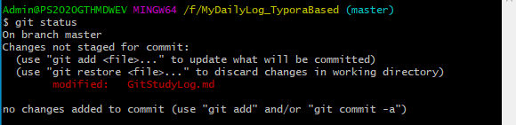

添加到暂存区，未提交状态，此时可以用"git restore --staged filename"命令撤销暂存区的内容。

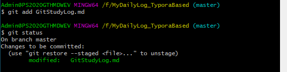

提交到仓库，此时的状态为空。然后将本地同步到远程（git push origin master），之后可以进行修改再add、commit、同步......。

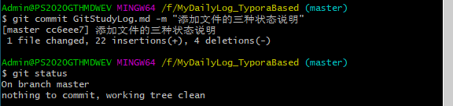

同步到远程仓库

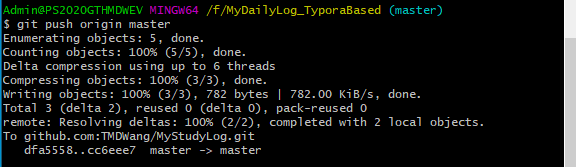

### 5 diff 比较文件差异

```
git diff
```

不加参数，可以查看尚未暂存的文件更新了哪些部分。此命令比较的是工作目录中当前文件和暂存区域快照之间的差异，也就是修改之后还没有暂存起来的内容变化。下图为执行该命令后的输出。

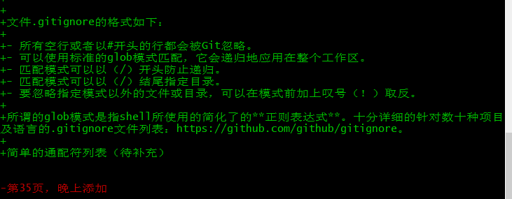

其中前面带有+号的是增加的内容，带有-号的是删除的内容。

```
git diff --staged/--cached
```

查看已暂存的将要添加到下次提交的内容，这条命令可以对比已暂存文件和最后一次提交的文件差异。

```
git diff <commit_id1> <commit_id2>
```

比较两次提交之间的差异，commit_id是每次commit的SHA1值，可以根据git log看到，是长度为40的字符串。

```
git diff <branch1> <branch2>
```

比较两个分支之间的差异

比较文件差异也可以使用图形化的工具或外部diff工具来比较差异。可以使用git difftool命令来调用emerge或vimdiff等软件**输出**diff的分析结果。使用下面的命令可以查看你系统中支持哪些Git Diff插件。（**配置difftool**，待补充）

```
git difftool --tool-help
```

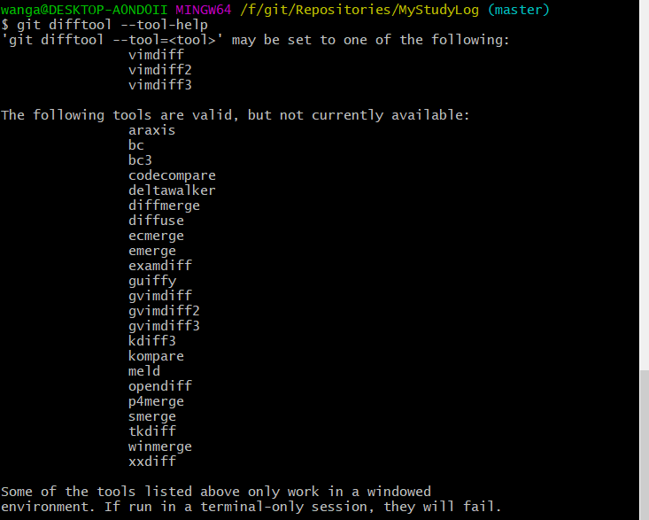

### 6 解决冲突

在两个分支上更改了同一文件，当合并到主分支master上时，第二次commit会提示冲突conflicts。此时需要手动解决这个冲突之后重新进行提交。

（待补充）

### 7 忽略文件

一般总会有些文件无需纳入Git管理，也不希望它们总出现在未跟踪文件列表，通常都是一些自动生成的文件，比如日志、编译过程中创建的临时文件等。在这种情况下，我们可以创建一个名为.gitignore的文件，列出要忽略的文件。要养成一开始就为你的新仓库设置好.gitignore文件的习惯，以免将来误提交无用的文件。最简单的情况下，一个仓库可能只有根目录下一个.gitignore文件，它递归应用到整个仓库中。然而，子目录下也可以有额外的.gitignore文件，文件中的规则只作用于它所在的目录中。语法规则示例如下：

```
*.[oa]			# 忽略所有以.o、.a结尾的文件
!lib.a			# 但跟踪所有的lib.a文件，即使前面忽略了.a文件
*~				# 忽略所有名字以波浪符（~）结尾的文件
/TODO			# 只忽略当前目录下的TODO文件，不忽略其他目录下的
build/			# 忽略任何目录下名为build的文件夹
doc/*.txt		# 忽略doc/notes.txt，但不忽略doc/server/arch.txt
doc/**/*.pdf	# 忽略doc/目录及其所有子目录下的.pdf文件
```

文件.gitignore的格式如下：

- 所有空行或者以#开头的行都会被Git忽略。
- 可以使用标准的glob模式匹配，它会递归地应用在整个工作区。
- 匹配模式可以以（/）开头防止递归。
- 匹配模式可以以（/）结尾指定目录。
- 要忽略指定模式以外的文件或目录，可以在模式前加上叹号（！）取反。

所谓的glob模式是指shell所使用的简化了的**正则表达式**。十分详细的针对数十种项目及语言的.gitignore文件列表：https://github.com/github/gitignore。

简单的通配符列表（待补充）


## 二 分支

Git保存的不是文件的变化或者差异，而是一系列不同时刻的**快照**。在进行提交操作时，Git会保存一个**提交对象（commit object）**，**该提交对像会包含一个指向暂存内容快照的指针**，不仅如此，该提交对象**还包含了作者的姓名和邮箱、提交时输入的信息以及指向它的父对象的指针**。首次提交产生的提交对象没有父对象，普通提交操作产生的提交对象有一个父对象，而由多个分支合并产生的提交有多个父对象。

**暂存操作会为每一个文件产生校验和，然后会把当前版本的文件快照保存到Git仓库中（Git使用blob对象来保存它们），最终将校验和加入到暂存区域等待提交。**

当使用Git commit进行提交操作时，Git会先计算每一个子目录的校验和，然后在Git仓库中保存这些校验和为树对象，随后Git便会创建一个提交对象，它除了包含上述内容外还包含指向这个树对象的指针。如此一来，Git就可以在需要的时候重现此次保存的快照。

假设我们有一个工作目录，里面包含了三个将要被暂存和提交的文件README、test.rb和LICENSE，将他们暂存并提交之后，如下图所示，Git仓库中会有5个对象：3个blob对象（保存着文件快照）、一个树对象（记录着目录结构和blob对象索引）以及1个提交对象（包含着指向前述树对象的指针和所有提交信息）。

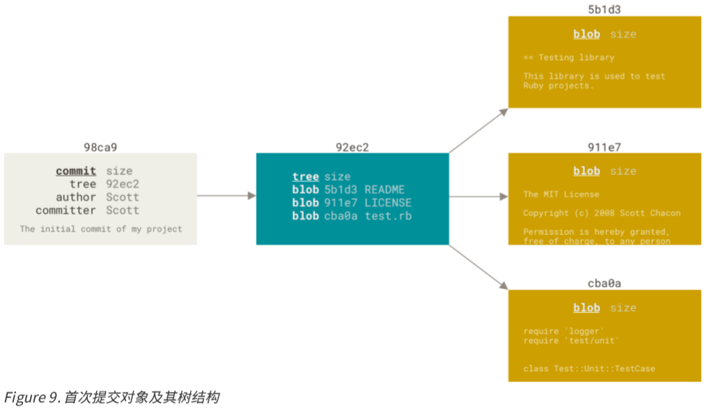

做些修改之后再提交，那么这次提交产生的对象会包含一个指向上次提交对象（父对象）的指针。

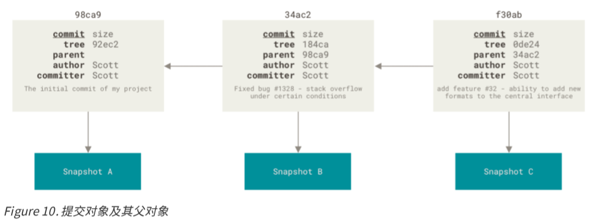Git的分支，其实本质上仅仅是指向提交对象的可变指针。通常我们默认都会有一个主分支叫master，在多次提交之后，你其实已经有一个指向最后那个提交对象的master分支，master分支会在每次提交时自动向前移动。

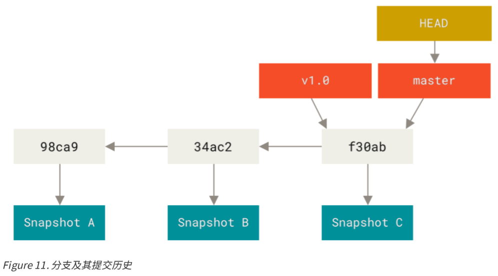

创建一个testing分支，你需要使用git branch testing命令。这会在当前所在的提交对象上创建一个指针。

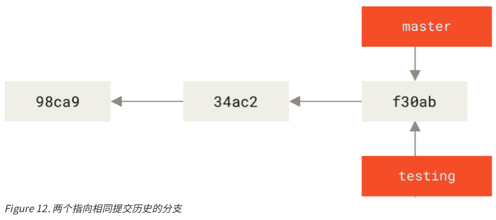

Git有一个名为HEAD的特殊指针，同其它版本控制系统里的HEAD概念完全不同，在Git中，它是一个指针，指向当前所在的本地分支（将HEAD想想为当前分支的别名）。在创建完分支后，你仍然在master分支上，因为git branch命令仅仅创建了一个分支，并不会自动切换到新分支去。


可以使用git log命令查看各个分支当前所指的的对象，提供这一功能的参数是--decorate。

```
git log --oneline --decorate
```

要切换到一个已经存在的分支，需要使用git checkout命令。例如：

```
git checkout testing
```

切换到testing分支。这样HEAD就指向了testing分支了。

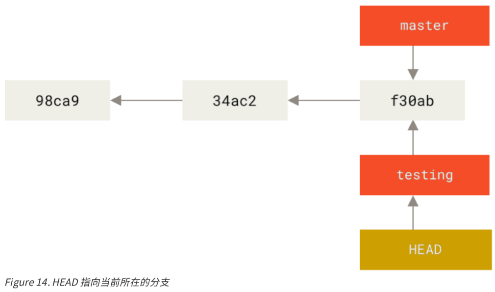

那么这样做的好处是什么呢？修改一下test.rb文件，提交一次看看。

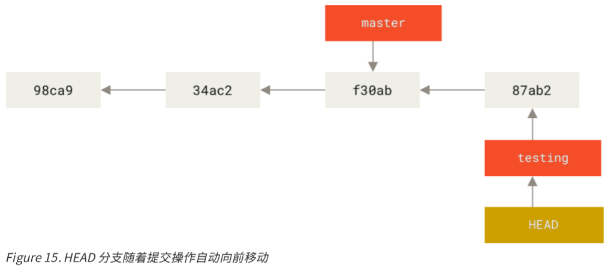

如图所示，你的testing分支向前移动了，但是master分支没有，它仍然指向运行git checkout时所指的对象。interesting，现在我们再切换会master分支看看:

```
git checkout master
```

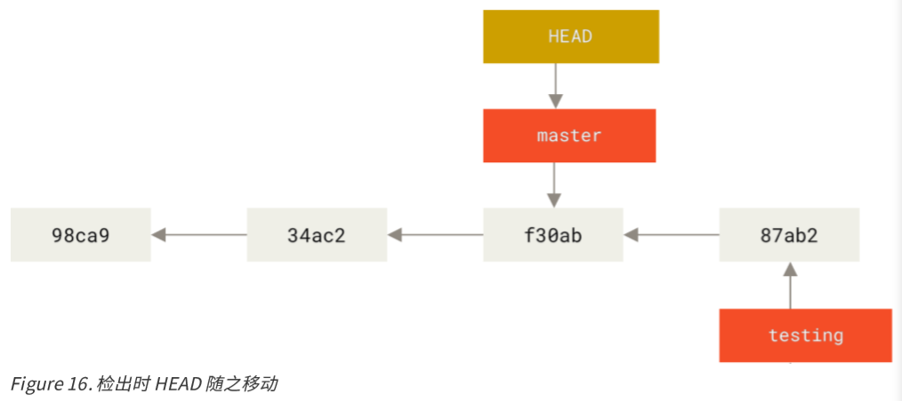

这条命令做了两件事，一是使HEAD指回master分支，二是将工作目录恢复成master分支所指向的快照内容。也就是说，你现在做修改的话，项目将始于一个较旧的版本。本质上来将，这就是忽略testing分支所做的修改，以便向另一个方向进行开发。

**分支切换会改变你工作目录中的文件**

在切换分之时，一定要**注意你工作目录里的文件会被改变**。如果切换到一个较旧的分支，你的工作目录会恢复到该分支最后一次提交时的样子。如果Git不能干净利落地完成这个任务，它将禁止切换分支。

```
git log --oneline --decorate --graph --all
```

该命令会输出你的提交历史、各个分支的指向以及项目的分支分叉情况。


### 2.1 常用命令

**创建 & 切换 & 删除分支**

```
git branch develop  # 创建一个基于当前master分支且名字为develop的新分支，此时develop分支与master主分支的内容完全一样。
git checkout develop  # 切换到develop分支。
git checkout -b develop  # 合并以上两步，新建develop分支并切到该分支下。
git branch -d develop  # 删除本地develop分支。
git branch -D develop  # 强制删除本地develop分支。
```

**查看分支**

```
git branch  # 查看本地分支列表。
git branch -r  # 查看远程分支列表。
```


**推送 & 拉取 & 删除远程分支**

```
git push origin develop  # 将本地develop分支推送到名字为origin的远程仓库。
git checkout develop origin/develop  # 如果远程有个分支develop，而本地没有，执行上条命令可以将远程分支迁到本地。
git checkout -b develop origin/develop  # 将远程分支迁到本地并切换到该分支。
git push origin :develop  # 删除远程分支。
```

### 2.2 分支管理流程Git Flow

Git Flow是一种比较成熟的分支管理流程。整个工作流程如下图所示。


Github地址：https://github.com/nvie/gitflow

相关博客：http://stormzhang.com/git/2014/01/29/git-flow/


王震是最聪明的！


## 参考文献

[1] Stormzhang,《从 0 开始学习 GitHub 系列》, ./book/.

[2] Scott Chacon & Ben Straub, 《Pro Git》, ./book/.