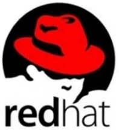
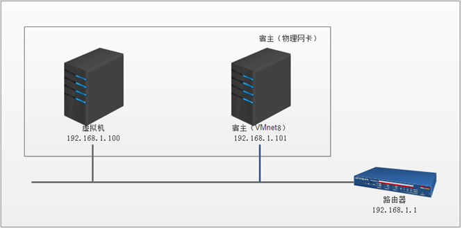
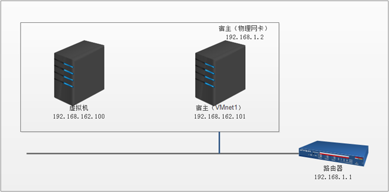

#### 1 主流的Linux有哪些

Linux的各个噶型版本使用的是同一个Linux内核，因此在内核层不存在什么兼容性问题，每个版本有不一样的感觉，只是在发行版本的最外层（由发行商整合开发的应用）才有所体现。

Linux的发行版本版本可以大体分为两类：

1. 商业公司维护的发行版本，以著名的Red Hat为代表。
2. 社区组织维护的发行版本，以Debian为代表。

##### 1.1 Red Hat Linux



Red Hat（红帽公司）创建于1993年，是目前世界上资深的Linux厂商，也是最获认可的Linux品牌。

Red Hat公司的产品主要包括RHEL（Red Hat Enterprise Linux，收费版本）和CentOS（RHEL的社区克隆版本，免费版本）、Fedora Core（由Red Hat桌面版发展而来，免费版本）。我国国内互联网公司常用的Linux发行版本是CentOS，它是基于Red Hat Enterprise Linux源代码重新编译、去除Red Hat商标的产物，各种操作使用和付费版本没有区别，且完全免费。缺点是不向用户提供技术支持，也不负任何商业责任。

##### 1.2 Ubuntu Linux


Ubuntu基于知名的Debian Linux发展而来，界面友好，容易上手，对硬件的支持非常全面，是目前最适合做桌面系统的Linux发行版本，而且Ubuntu的所有发行版本都免费提供。

##### 1.3 SuSE Linux


SuSE LInux以Slackware Linux为基础，原来是德国的SuSE Linux AG公司发布的Linux版本，1994年发行了第一版，早期只有商业版本，2004年被Novell公司收购后，成立了OpenSUSE社区，推出了自己的社区版本OpenSUSE。

SuSE Linux在欧洲较为流行，在我国国内也有较多应用。值得一提的是，它吸取了Red Hat Linux的很多特质。

SuSE Linux可以非常方便地实现与Windows的交互，硬件检测非常优秀，拥有界面友好的安装过程、图形管理工具，对于终端用户和管理员来说使用非常方便。

##### 1.4 Gentoo Linux


Gentoo最初由Daniel Robbins（FreeBSD的开发者之一）创建，首个稳定版本发布于2002年。Gentoo是所有Linux发行版本里安装最复杂的，到目前为止仍采用源码包编译安装操作系统。

不过，它是安装完成后最便于管理的版本，也是在相同硬件环境下运行最快的版本。Gentoo快速、设计干净而有弹性，它的出名是因为其高度的自定制性（基于源代码的发行版）。

##### 1.5 其他Linux发行版

|    发行版    |       网址       | 特点                                                         | 软件包管理器                                  |
| :----------: | :--------------: | ------------------------------------------------------------ | --------------------------------------------- |
| Debian Linux |  www.debian.org  | 开放的开发模式，且易于进行软件包升级                         | apt                                           |
| Fedora Core  |  www.redhat.com  | 拥有数量庞大的用户，优秀的社区技术支持。并有许多创新。       | up2data(rpm)、yum(rpm)                        |
|    CentOS    |  www.centos.org  | Centos是一种对RHEL(Red Hat Enterprise Linux)源代码再编译的产物，由于Linux是开发源代码的操作系统，并不排斥基于源代码的再分发，CentOS就是将商业的Linux操作系统RHEL进行源代码再编译后分发，并在RHEL的基础上修正了不少已知的漏洞。 | rpm                                           |
|  SUSE Linux  |   www.suse.com   | 专业的操作系统，易用的YaST软件包管理系统                     | YaST(rpm)、第三方apt(rpm)软件库（repository） |
|   Mandriva   | www.mandriva.com | 操作界面友好，使用图形配置工具，有庞大的社区进行技术支持，支持NTFS分区的大小变更 | rpm                                           |
|   KNOPPIX    | www.knoppix.com  | 可以直接在CD上运行，具有优秀的硬件检测和适配能力，可作为系统的急救盘使用 | apt                                           |
| Gentoo Linux |  www.gentoo.org  | 高度的可定制性，使用手册完整                                 | portage                                       |
|    Ubuntu    |  www.ubuntu.com  | 优秀易用的桌面环境，基于Debian构建                           | apt                                           |


#### 2 GNU项目、GPL协议

##### 2.1 GNU项目

GNU的全称为GNU's not unix，意思是“GNU不是UNIX”，GNU计划，又称革奴计划，是由Richard Stallman在1984年公开发起的，是FSF（Free Software Foundation）的主要项目。这个项目的目标是奖励一套完全自由的和可移植的类Unix操作系统。

GNU类Unix操作系统是由一系列应用程序、系统库和开发工具构成的软件集合，例如：Emacs编辑软件、gcc编译软件、bash命令解释程序和编程语言，以及gawk（GNU's awk）等，并加上了用于资源分配和硬件管理的内核。

但是GNU自己的内核Hurd仍在开发中，离实用还有一定的距离。因此，这个GNU系统并没有流行起来。现在的GNU系统通常是使用LInux系统的内核、加上GNU项目贡献的一些组件，以及其他相关程序组成的，这样的组合被称为GNU/Linux操作系统。

到1991年Linux内核发布的时候，GNU项目已经完成了出系统内核之外的各种必备软件的开发。在Linus Torvalds和其他开发人员的努力下，GNU项目的部分组件又运用到了Linux内核之上，例如：GNU项目里的Emacs、gcc、bash、gawk等，至今都是Linux系统中很重要的基础软件。

##### 2.2 GPL协议

GPL全称为General Public License，通用公共许可，是一个最著名的开源许可协议，开源社区最著名的Linux内核就是在GPL许可下发布的。GPL许可是自由软件基金会（Free Software Foundation）创建的。

1984年，Richard Stallman发起开发自由软件的运动后不久，在其他人的协作下，他创立了通用公共许可证（GPL），这对推动自由软件的发展起到了至关重要的作用。

简单的理解，GPL许可的核心，是保证任何人有共享和修改自由软件的自由，任何人有权取得、修改和重新发布自由软件的源代码权利，但都必须同时给出具体更改的源代码。

虽然这个LInux内核是基于GNU通用公共许可的，但是Linux内核并不是GNU计划的一部分。

#### 3 虚拟机的三种网络连接方式

VMware虚拟机常见的网络类型有bridged（桥接）、NAT（地址转换）、host-only（仅主机）三种。

- NAT（Network Address Translation）

网络地址转换，NAT模式是比较简单的实现虚拟机上网的方式，NAT模式的虚拟机就是通过宿主机（物理电脑）上网和交换数据的。

在NAT模式下，虚拟机的网卡连接到宿主机的VMnet8上。此时系统的VMware NAT Service服务就充当了路由器，负责将虚拟机发到VMnet8的包进行地址转换之后发到实际的网络上，再将实际网络上返回的包进行地址转换后通过VMnet8发送给虚拟机。VMware DHCP Service负责为虚拟机分配IP地址。NAT网络类型的原理逻辑图如下图所示。


NAT网络特别适合于家庭里电脑直接连网线的情况，办公室的局域网也适合的，优势是不会和其他物理主机IP冲突，且在没有路由器的环境下也可以使用。

- Bridged（桥接模式）

桥接模式可以简单理解为通过物理主机网卡架设了一座桥，从而连入到了实际网络中。因此，虚拟机可以被分配与物理主机相同网段的独立IP，所有网络功能和网络中的真实机器几乎完全一样。桥接模式下的虚拟机和网内真是计算机所处的位置是一样的。

在Bridged模式下，电脑设备创建的虚拟机就像一台真正的计算机一样，它会直接连接到实际的网络上，上网与宿主机没有联系。Bridged网络类型的原理逻辑图如下图所示。



Bridged网络类型适合的场景：特别适合于局域网环境，优势就是虚拟机像一台真正的主机一样，缺点是可能回合其他物理主机IP冲突，并且在和宿主机交换数据时，都会经过实际的路由器。

- Host-only（仅主机）

在Host-only模式下，虚拟机的网卡会连接到宿主机的VMnet1上，但宿主系统并不为虚拟机提供任何路由服务，因此，虚拟机只能和宿主机进行通信，不能连接到实际网络上，即无法上网。Host-only网络类型的原理逻辑图如下图所示。



#### 4 Linux的包管理器

大约在上世纪90年代中期，Debian创建了DEB打包格式（.deb），Red Hat Linux创建了RPM打包系统（.rpm）。

在GNU/Linux（以下简称Linux）操作系统中，**RPM**和**DPKG**为最常见的两类软件包管理工具，它们分别应用于基于RPM软件包的Linux发行版本和基于DEB软件包的Linux发行版本。软件包管理工具的作用是提供在操作系统中安装，升级，卸载需要的软件的方法，并提供对系统中所有软件状态信息的查询。

RPM全程为Redhat Package Manager，最早由Red Hat公司制定实施，随后被GNU开源操作系统接受并成为很多Linux系统（RHEL）的既定软件标准。与RPM进行竞争的是基于Debian操作系统（UBUNTU）的DEB软件包管理工具-DPKG，全称为Debian Package，功能方面与RPM相似。

请记住：包管理器是一个通用的概念，它并不是Linux独有的。你会经常发现各种软件或编程语言的包管理器。有只针对Python包的PIP包管理器。设置Atom编辑器也有自己的包管理器。

##### 4.1 Debian派系

dpkg是Debian Linux家族的基础包管理系统，它用于安装、删除、存储和提供deb包的信息。这是一个低层面的工具，并且有多个前端工具可以帮助用户从远程的仓库获取包，或处理复杂的包关系的工具，包括如下：

- apt（Advanced Packaging Tools，高级打包工具）

这是一个dpkg包管理系统的前端工具，它是一个非常受欢迎的、自由而强大的，有用的命令行包管理器系统。Debian及其衍生版，例如Ubuntu和Linux Mint的用户应该非常熟悉这个包管理工具。

适用于deb包管理式的操作系统，主要使用在ubuntun，主要解决软件包之间的依赖性问题，但因为下载速度慢被人诟病。

- aptitude包管理器

这个也是Debian Linux家族一个非常出名的命令行前端包管理工具，它的工作方式类似APT，它最初为Debian及其衍生版设计的，但是现在它的功能延伸到了RHEL家族。

- synaptic包管理器

synaptic是一个基于GTK+的APT的可视化包管理器，对于一些不想使用命令行的用户，它非常好用。

##### 4.2 红帽派系

RPM二进制包命名的一般格式如下：

```
包名-版本号-发布次数-发行商-Linux平台-适合的硬件平台-包扩展名
```

rpm包管理器

这个是红帽创建的Linux基本标准（LSB）打包格式和基础包管理系统．基于这个底层系统，有多个前端包管理工具可供你使用。

- yum

这是一个开源、流行的命令行包管理器，它是用户使用RPM的前端包管理工具之一。可以把它行业Debian Linux系统中的APT进行对比，它俩拥有相同的功能。

是Yellow dog Updater Modified的简称，是一个在Fedora和RedHat以及SUSE中的Shell前端软件包管理器。基于rpm包管理，能够从指定的服务器自动下载RPM包并且安装，可以自动处理依赖性关系，并且一次安装所有依赖的软件包，无需繁琐地一次次下载、安装。

- dnf

这个也是一个用于基于RPM的发行版的包管理器，Fedora18+引入了它，它是下一代YUM。

##### 4.3 其他派系

**Pacman包管理器（Arch Linux）**

这个是一个流行的、强大而易用的包管理器，它用于Arch Linux和其他的一些小众发行版。它提供了一些其他包管理器提供的基本功能，包括安装、自动解决依赖关系、升级、卸载和降级软件。但是最大的用处是，它为Arch用户创建了一个简单易用的包管理方式。

**Zypper包管理器（openSUSE）**

这个是一个使用libaypp库制作的用于OpenSUSE系统上的命令行包管理器，他的常用功能包括访问仓库、安装包、解决依赖问题和其他功能。更重要的是，它也可以支持存储库扩展功能，如模式、补丁和产品。

**Portage包管理器（Gentoo）**

这个是Gentoo的包管理器，当下不怎么流行的一个发行版，但是这并不妨碍他成为Linux下最好的软件包管理器之一。Portage项目的主要目标是创建一个简单、无故障的包管理系统，包含向后兼容、自动化等功能。

#### 5 Linux的Shell


#### 6 CPU架构

什么是架构

指令集与架构的关系