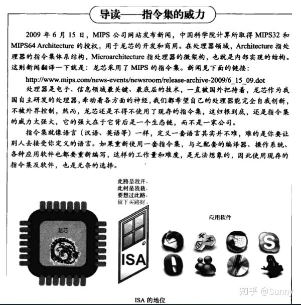

#### 1 主流的Linux有哪些

Linux的各个噶型版本使用的是同一个Linux内核，因此在内核层不存在什么兼容性问题，每个版本有不一样的感觉，只是在发行版本的最外层（由发行商整合开发的应用）才有所体现。

Linux的发行版本版本可以大体分为两类：

1. 商业公司维护的发行版本，以著名的Red Hat为代表。
2. 社区组织维护的发行版本，以Debian为代表。

##### 1.1 Red Hat Linux


Red Hat（红帽公司）创建于1993年，是目前世界上资深的Linux厂商，也是最获认可的Linux品牌。

Red Hat公司的产品主要包括RHEL（Red Hat Enterprise Linux，收费版本）和CentOS（RHEL的社区克隆版本，免费版本）、Fedora Core（由Red Hat桌面版发展而来，免费版本）。我国国内互联网公司常用的Linux发行版本是CentOS，它是基于Red Hat Enterprise Linux源代码重新编译、去除Red Hat商标的产物，各种操作使用和付费版本没有区别，且完全免费。缺点是不向用户提供技术支持，也不负任何商业责任。

##### 1.2 Ubuntu Linux


Ubuntu基于知名的Debian Linux发展而来，界面友好，容易上手，对硬件的支持非常全面，是目前最适合做桌面系统的Linux发行版本，而且Ubuntu的所有发行版本都免费提供。

##### 1.3 SuSE Linux


SuSE LInux以Slackware Linux为基础，原来是德国的SuSE Linux AG公司发布的Linux版本，1994年发行了第一版，早期只有商业版本，2004年被Novell公司收购后，成立了OpenSUSE社区，推出了自己的社区版本OpenSUSE。

SuSE Linux在欧洲较为流行，在我国国内也有较多应用。值得一提的是，它吸取了Red Hat Linux的很多特质。

SuSE Linux可以非常方便地实现与Windows的交互，硬件检测非常优秀，拥有界面友好的安装过程、图形管理工具，对于终端用户和管理员来说使用非常方便。

##### 1.4 Gentoo Linux


Gentoo最初由Daniel Robbins（FreeBSD的开发者之一）创建，首个稳定版本发布于2002年。Gentoo是所有Linux发行版本里安装最复杂的，到目前为止仍采用源码包编译安装操作系统。

不过，它是安装完成后最便于管理的版本，也是在相同硬件环境下运行最快的版本。Gentoo快速、设计干净而有弹性，它的出名是因为其高度的自定制性（基于源代码的发行版）。

##### 1.5 其他Linux发行版

|    发行版    |       网址       | 特点                                                         | 软件包管理器                                  |
| :----------: | :--------------: | ------------------------------------------------------------ | --------------------------------------------- |
| Debian Linux |  www.debian.org  | 开放的开发模式，且易于进行软件包升级                         | apt                                           |
| Fedora Core  |  www.redhat.com  | 拥有数量庞大的用户，优秀的社区技术支持。并有许多创新。       | up2data(rpm)、yum(rpm)                        |
|    CentOS    |  www.centos.org  | Centos是一种对RHEL(Red Hat Enterprise Linux)源代码再编译的产物，由于Linux是开发源代码的操作系统，并不排斥基于源代码的再分发，CentOS就是将商业的Linux操作系统RHEL进行源代码再编译后分发，并在RHEL的基础上修正了不少已知的漏洞。 | rpm                                           |
|  SUSE Linux  |   www.suse.com   | 专业的操作系统，易用的YaST软件包管理系统                     | YaST(rpm)、第三方apt(rpm)软件库（repository） |
|   Mandriva   | www.mandriva.com | 操作界面友好，使用图形配置工具，有庞大的社区进行技术支持，支持NTFS分区的大小变更 | rpm                                           |
|   KNOPPIX    | www.knoppix.com  | 可以直接在CD上运行，具有优秀的硬件检测和适配能力，可作为系统的急救盘使用 | apt                                           |
| Gentoo Linux |  www.gentoo.org  | 高度的可定制性，使用手册完整                                 | portage                                       |
|    Ubuntu    |  www.ubuntu.com  | 优秀易用的桌面环境，基于Debian构建                           | apt                                           |


#### 2 GNU项目、GPL协议

##### 2.1 GNU项目

GNU的全称为GNU's not unix，意思是“GNU不是UNIX”，GNU计划，又称革奴计划，是由Richard Stallman在1984年公开发起的，是FSF（Free Software Foundation）的主要项目。这个项目的目标是奖励一套完全自由的和可移植的类Unix操作系统。

GNU类Unix操作系统是由一系列应用程序、系统库和开发工具构成的软件集合，例如：Emacs编辑软件、gcc编译软件、bash命令解释程序和编程语言，以及gawk（GNU's awk）等，并加上了用于资源分配和硬件管理的内核。

但是GNU自己的内核Hurd仍在开发中，离实用还有一定的距离。因此，这个GNU系统并没有流行起来。现在的GNU系统通常是使用LInux系统的内核、加上GNU项目贡献的一些组件，以及其他相关程序组成的，这样的组合被称为GNU/Linux操作系统。

到1991年Linux内核发布的时候，GNU项目已经完成了出系统内核之外的各种必备软件的开发。在Linus Torvalds和其他开发人员的努力下，GNU项目的部分组件又运用到了Linux内核之上，例如：GNU项目里的Emacs、gcc、bash、gawk等，至今都是Linux系统中很重要的基础软件。

##### 2.2 GPL协议

GPL全称为General Public License，通用公共许可，是一个最著名的开源许可协议，开源社区最著名的Linux内核就是在GPL许可下发布的。GPL许可是自由软件基金会（Free Software Foundation）创建的。

1984年，Richard Stallman发起开发自由软件的运动后不久，在其他人的协作下，他创立了通用公共许可证（GPL），这对推动自由软件的发展起到了至关重要的作用。

简单的理解，GPL许可的核心，是保证任何人有共享和修改自由软件的自由，任何人有权取得、修改和重新发布自由软件的源代码权利，但都必须同时给出具体更改的源代码。

虽然这个LInux内核是基于GNU通用公共许可的，但是Linux内核并不是GNU计划的一部分。

#### 3 虚拟机的三种网络连接方式

VMware虚拟机常见的网络类型有bridged（桥接）、NAT（地址转换）、host-only（仅主机）三种。

- NAT（Network Address Translation）

网络地址转换，NAT模式是比较简单的实现虚拟机上网的方式，NAT模式的虚拟机就是通过宿主机（物理电脑）上网和交换数据的。

在NAT模式下，虚拟机的网卡连接到宿主机的VMnet8上。此时系统的VMware NAT Service服务就充当了路由器，负责将虚拟机发到VMnet8的包进行地址转换之后发到实际的网络上，再将实际网络上返回的包进行地址转换后通过VMnet8发送给虚拟机。VMware DHCP Service负责为虚拟机分配IP地址。NAT网络类型的原理逻辑图如下图所示。


NAT网络特别适合于家庭里电脑直接连网线的情况，办公室的局域网也适合的，优势是不会和其他物理主机IP冲突，且在没有路由器的环境下也可以使用。

- Bridged（桥接模式）

桥接模式可以简单理解为通过物理主机网卡架设了一座桥，从而连入到了实际网络中。因此，虚拟机可以被分配与物理主机相同网段的独立IP，所有网络功能和网络中的真实机器几乎完全一样。桥接模式下的虚拟机和网内真是计算机所处的位置是一样的。

在Bridged模式下，电脑设备创建的虚拟机就像一台真正的计算机一样，它会直接连接到实际的网络上，上网与宿主机没有联系。Bridged网络类型的原理逻辑图如下图所示。


Bridged网络类型适合的场景：特别适合于局域网环境，优势就是虚拟机像一台真正的主机一样，缺点是可能回合其他物理主机IP冲突，并且在和宿主机交换数据时，都会经过实际的路由器。

- Host-only（仅主机）

在Host-only模式下，虚拟机的网卡会连接到宿主机的VMnet1上，但宿主系统并不为虚拟机提供任何路由服务，因此，虚拟机只能和宿主机进行通信，不能连接到实际网络上，即无法上网。Host-only网络类型的原理逻辑图如下图所示。


#### 4 Linux的包管理器

大约在上世纪90年代中期，Debian创建了DEB打包格式（.deb），Red Hat Linux创建了RPM打包系统（.rpm）。

在GNU/Linux（以下简称Linux）操作系统中，**RPM**和**DPKG**为最常见的两类软件包管理工具，它们分别应用于基于RPM软件包的Linux发行版本和基于DEB软件包的Linux发行版本。软件包管理工具的作用是提供在操作系统中安装，升级，卸载需要的软件的方法，并提供对系统中所有软件状态信息的查询。

RPM全程为Redhat Package Manager，最早由Red Hat公司制定实施，随后被GNU开源操作系统接受并成为很多Linux系统（RHEL）的既定软件标准。与RPM进行竞争的是基于Debian操作系统（UBUNTU）的DEB软件包管理工具-DPKG，全称为Debian Package，功能方面与RPM相似。

请记住：包管理器是一个通用的概念，它并不是Linux独有的。你会经常发现各种软件或编程语言的包管理器。有只针对Python包的PIP包管理器。设置Atom编辑器也有自己的包管理器。

##### 4.1 Debian派系

dpkg是Debian Linux家族的基础包管理系统，它用于安装、删除、存储和提供deb包的信息。这是一个低层面的工具，并且有多个前端工具可以帮助用户从远程的仓库获取包，或处理复杂的包关系的工具，包括如下：

- apt（Advanced Packaging Tools，高级打包工具）

这是一个dpkg包管理系统的前端工具，它是一个非常受欢迎的、自由而强大的，有用的命令行包管理器系统。Debian及其衍生版，例如Ubuntu和Linux Mint的用户应该非常熟悉这个包管理工具。

适用于deb包管理式的操作系统，主要使用在ubuntun，主要解决软件包之间的依赖性问题，但因为下载速度慢被人诟病。

- aptitude包管理器

这个也是Debian Linux家族一个非常出名的命令行前端包管理工具，它的工作方式类似APT，它最初为Debian及其衍生版设计的，但是现在它的功能延伸到了RHEL家族。

- synaptic包管理器

synaptic是一个基于GTK+的APT的可视化包管理器，对于一些不想使用命令行的用户，它非常好用。

##### 4.2 红帽派系

RPM二进制包命名的一般格式如下：

```
包名-版本号-发布次数-发行商-Linux平台-适合的硬件平台-包扩展名
```

rpm包管理器

这个是红帽创建的Linux基本标准（LSB）打包格式和基础包管理系统．基于这个底层系统，有多个前端包管理工具可供你使用。

- yum

这是一个开源、流行的命令行包管理器，它是用户使用RPM的前端包管理工具之一。可以把它行业Debian Linux系统中的APT进行对比，它俩拥有相同的功能。

是Yellow dog Updater Modified的简称，是一个在Fedora和RedHat以及SUSE中的Shell前端软件包管理器。基于rpm包管理，能够从指定的服务器自动下载RPM包并且安装，可以自动处理依赖性关系，并且一次安装所有依赖的软件包，无需繁琐地一次次下载、安装。

- dnf

这个也是一个用于基于RPM的发行版的包管理器，Fedora18+引入了它，它是下一代YUM。

##### 4.3 其他派系

**Pacman包管理器（Arch Linux）**

这个是一个流行的、强大而易用的包管理器，它用于Arch Linux和其他的一些小众发行版。它提供了一些其他包管理器提供的基本功能，包括安装、自动解决依赖关系、升级、卸载和降级软件。但是最大的用处是，它为Arch用户创建了一个简单易用的包管理方式。

**Zypper包管理器（openSUSE）**

这个是一个使用libaypp库制作的用于OpenSUSE系统上的命令行包管理器，他的常用功能包括访问仓库、安装包、解决依赖问题和其他功能。更重要的是，它也可以支持存储库扩展功能，如模式、补丁和产品。

**Portage包管理器（Gentoo）**

这个是Gentoo的包管理器，当下不怎么流行的一个发行版，但是这并不妨碍他成为Linux下最好的软件包管理器之一。Portage项目的主要目标是创建一个简单、无故障的包管理系统，包含向后兼容、自动化等功能。

#### 5 Linux的Shell

现在我们使用的操作系统（Windows、Mac OS、Android、iOS等）都是带图形界面的，简单直观，容易上手。计算机的普及离不开图形界面。然而在计算机的早期并没有图形界面，我们只能透过一个一个的命令来控制计算机，这些命令有成百上千之多，且不说记住这些命令非常困难，每天面对没有任何色彩的“黑屏”本身就是一件枯燥的事情；这个时候的计算机还远远谈不上炫酷和普及，只有专业人员才能使用。

对于图形界面，用户点击某个图标就能启动某个程序；对于命令行，用户输入某个程序的名字（可以看作一个命令）就能启动某个程序。这两者的基本过程都是类似的，都需要查找程序在硬盘上的安装位置，然后将他们加载到内存运行。

换句话说，**图形界面和命令行要达到的目的是一样的，都是让用户控制计算机。**然而，真正能够控制计算机硬件（CPU、内存、显示器等）的只有操作系统内核（Kernel），图形界面和命令行只是假设在用户和内核之间的一座桥梁。

由于安全、复杂、繁琐等原因，用户不能直接接触内核（也没有必要），需要另外在开发一个程序，让用户直接使用这个程序；该程序的作用就是接受用户的操作（点击图标、输入命令），并进行简单的处理，然后再传递给内核。如此一来，用户和内核之间就多了一层“代理”，这层“代理”即简化了用户的操作，也保护了内核。

用户界面和命令行就是这个另外开发的程序，就是这层“代理”。在Linux下，这个命令行程序叫做Shell。

Shell除了能解释用户输入的命令，将它传递给内核，还可以：

- 调用其他程序，给其他程序传递数据或参数，并获取程序的处理结果；
- 在多个程序之间传递数据，把一个程序的输出作为另一个程序的输入；
- Shell本身也可以被其他程序调用。

由此可见，Shell是将内核、程序和用户连接了起来。

Shell虽然没有C/C++、Java、Python等强大，但也支持了基本的变成元素，例如：

- if...else选择结构，switch...case开关语句，for、while、until循环；
- 变量、数组、字符串、注释、加减乘除、逻辑运算等概念；
- 函数，包括用户自定义的函数和内置函数（例如printf、export、eval等）。

站在这个角度讲，Shell也是一种编程语言，他的编译器（解释器）是Shell这个程序。我们平时所说的Shell，有时候是指连接用户和内核的这个程序，有时候又是指Shell编程。

**Shell是一种脚本语言**

任何代码最终都要被“翻译”成二进制的形式才能在计算机中执行。

有的编程语言，如C/C++、Pascal、Go语言、汇编等，必须在程序运行之前将所有代码都翻译二进制形式，也就是生成可执行文件，用户拿到的是最终生成的可执行文件，看不到源代码。

这个过程叫做**编译（Compile）**，这样的编程语言叫做**编译型语言**，完成编译过程的软件叫做**编译器（Compiler）**。

而有的编程语言，如Shell、JavaScript、Python、PHP等，需要一边执行一遍解释，不会生成任何可执行文件，用户必须拿到源码才能运行程序。程序运行后会即时翻译，翻译完一部分执行一部分，不用等到所有代码都翻译完。这个过程叫做**解释**，这样的编程语言叫做**解释型语言**或者**脚本语言（Script）**，完成解释过程的软件叫作**解释器**。

编译型语言的有点事执行速度快、对硬件要求低、保密性好，适合开发操作系统、大型应用程序、数据库等。

脚本语言的优点是使用灵活、部署容易、跨平台性好，非常适合web开发以及小工具的制作。

##### 5.1 几种常见的Shell

常见的Shell有sh、bash、csh、tcsh、ash等。

- sh

sh的全称是Bourne shell，由AT&T公司的Steve Bourne开发，为了纪念他，就用他的名字命名了。

sh是UNIX上的标准shell，很多UNIX版本都配有sh。sh是第一个流行的Shell。

- csh

sh之后另一个广为流传的shell是由柏克莱大学的Bill Joy设计的，这个shell的语言有点类似C语言，所以才的名为C Shell，简称csh。

- tcsh

tcsh是csh的增强版，加入了命令补全功能，提供了更加强大的语法支持。

- ash

一个简单的轻量级的Shell，占用资源少，适合运行于低内存环境，但是与下面讲到的bash shell完全兼容。

- bash

bash shell是Linux的默认Shell，由GNU组织开发，保持了对sh shell的兼容性，是各种Linux发行版默认配置的Shell。

bash兼容sh意味着，针对编写的Shell代码可以不加修改地在bash中运行。尽管如此，bash和sh还是有一些不同之处：

1. bash扩展了一些命令和参数；
2. bash并不完全兼容sh，它们有些行为并不一致，但在大多数企业运维的情况下区别不大，特殊场景可以使用bash代替sh。

**查看Shell**

Shell是一个程序，一般都是放在/bin或者/user/bin目录下，当前Linux系统可用的Shell都记录在/etc/shells文件中。/etc/shells是一个纯文本文件，可以打开这个文件查看当前Liunx系统支持的Shell。

通过cat命令查看

```shell
cat /etc/shells
```

在现代的Linux上，sh已经被bash代替，/bin/sh往往是指向/bin/bash的符号链接。

使用以下命令也可以看到当前系统默认的Shell

```shell
echo $SHELL
```

SEHLL是Linux系统中的环境变量，它指明了当前使用的Shell程序的位置，也就是使用的哪个Shell。

#### 6 指令集架构、微架构

架构的概念在CPU中比较复杂，我们都知道英特尔和AMD的处理器产品使用的是X86架构，但是我们又会经常听到一英特尔十代酷睿使用了Sunny Core架构，AMD三代锐龙使用了Zen2架构，那么此架构和彼架构之间的区别是什么？其实这是因为很多人对架构名称简写而造成的误区，X86架构全名应该是X86**指令集架构（Instruction Set Architecture，ISA）**，而Sunny Core架构应该是Sunny Core**微架构（microarchitecture）**。同样是架构名称的缩写，所表达的意思完全不同。

微架构与指令集是两个概念：指令集是CPU选择的语言，而微架构（常见的代号Haswell、Cortex-A15等都是微架构）是具体的实现。i7-4770的核心是Haswell微架构，这种微架构兼容X86指令集。对于兼容ARM指令集的芯片来说这令个概念尤其容易混淆：ARM公司将自己研发的指令集叫做ARM指令集，同事它还研发具体的微架构如Cortex系列并对外授权。但是，一款CPU使用了ARM指令集不等于它就使用了ARM研发的微架构。Intel、高通、苹果、Nvidia等厂商都自行开发了兼容ARM指令集的微架构，同时还有许多厂商使用ARM开发的微架构来制造CPU。通常，**业界认为只有具备独立的微架构研发能力的企业才算具备了CPU研发能力，而是否使用自行研发的指令集无关紧要。微架构的研发也是IT产业技术含量最高的领域之一。**

##### 6.1 指令集架构

CISC（Complex instruction set computer）：复杂指令集

- 简洁的软件代码
- 复杂的指令集
- 复杂的硬件
- 较少的寄存器

RISC（Reduced instruction set computer）：精简指令集

- 更多的软件代码
- 精简的指令集
- 更简单的硬件
- 较多的寄存器

###### 6.1.1 CISC-复杂指令集计算机

长期以来，计算机性能的提高往往是通过增加硬件的复杂性来获得，随着集成电路技术，特别是VLSI（Very Large Scale Integration，超大规模集成电路）技术的迅速发展，为了软件编程方便和提高程序的运行速度，**硬件工程师**采用的办法是**不断增加可实现复杂功能的指令和多种灵活的编址方式**。甚至某些指令可支持高级语言语句归类后的复杂操作。致使硬件越来越复杂，造价也相应提高。

为实现复杂操作，微处理器除向程序员提供类似各种寄存器和机器指令外。还通过存于只读存储器（ROM）中的微程序来实现其极强的功能，来处理在分析每一条指令之后实行的一系列初级指令运算来完成所需的功能，这种设计的型式被称为复杂指令集计算机（Complex Instruction Set Computer-CISC）结构。

一般CISC计算机所含的指令数目至少300条以上，有的甚至超过500条。早期的CPU全部是CISC架构，它的设计目的是**要用最少的机器语言指令来完成所需的计算任务**。比如对于乘法运算，在CISC架构的CPU上，可能需要这样一条指令：

```assembly
MUL ADDRA, ADDRB;
```

就可以将ADDRA和ADDRB中的数相乘并将结果储存在ADDRA中。将ADDRA、ADDRB中的数据读入寄存器，相乘和将结果写回内存的操作全部依赖于CPU中设计的逻辑来实现。这种架构会增加CPU结构的复杂性和对CPU工艺的要求，但对于编译器的开发十分有利。比如上面的例子，C程序中的"a *= b;"就可以直接编译为一条乘法指令。

今天只有Intel及其兼容CPU还在使用CISC架构。

6.1.2 RISC-精简指令集计算机

采用复杂指令系统的计算机有着较强的处理高级语言的能力，这对提高计算机的性能是有益的。当计算机的设计沿着这条道路发展时。有的人没有随波直流，他们回过头去看一看过去走过的道路，开始怀疑这种传统的做法：IBM公司在纽约Yorktown的JhomasI.Wasom研究中心于1975年组织Power研究指令系统的合理性问题。因为当时已感到，日趋庞杂的指令系统不但不易实现，而且还可能降低系统性能。1979年以帕特逊教授为首的一批科学家也开始在美国加册大学伯克莱分校开展这一研究。结果表明，CISC存在许多缺点。首先，在这种计算机中，各种指令的使用率相差悬殊：**一个典型程序的运算过程所使用的80%指令，只占一个处理器指令系统的20%，事实上最频繁使用的指令是取、存和加这些最简单的指令**。这样一来，长期致力于复杂指令系统的设计，实际上是在设计一种难得在实践中用得上的指令系统的处理器。同事，复杂的指令系统必然带来结构的复杂性。这不但增加了设计的时间与成本还容易造成设计失误。此外，尽管VLSI技术现在已达到很高的水平，但也很难把CISC的全部硬件做在一个芯片上，这也妨碍单片计算机的发展。在CISC中，许多复杂指令需要极复杂的操作，这类指令多数是某种高级语言的直接翻版，因而通用性差。由于采用二级的伪码执行方式，它也降低了那次额被频繁调用的简单指令系统的运行速度。因而，针对CISC的这些弊病。帕特逊等人提出了精简指令的设想，即指令系统应当只包含那些使用频率很高的少量指令，变更提供一些必要的指令以支持操作系统和高级语言。按照这个原则发展而成的计算机被称为精简指令集计算机（Reduced Instruction Set Computer-RISC）结构。

RISC架构要求软件来指定各个操作步骤。上面的例子如果要在RISC架构上实现，将ADDRA、ADDRB中的数据读入寄存器，相乘、将结果写回内存的操作都必须由软件来实现。

```assembly
MOV A, ADDRA;
MOV B, ADDRB;
MUL A, B;
STR ADDRA, A;
```

**这种架构可以降低CPU的复杂性以及允许在同样的工艺水平下生产出功能更强大的CPU，但是对于编译器的设计有跟高的要求**。

###### 6.1.3 总结

从硬件角度来看CISC处理的是不等长指令集，它必须对不等长指令进行分割，因此在执行单一指令的时候需要进行较多的处理工作。而RISC执行的是等长精简指令集，CPU在执行指令的时候速度较快且性能稳定。因此在并行处理方面RISC明显由于CISC，RISC可同时执行多条指令，它可将一条指令分割成若干个进程或线程，交由多个处理器同时执行。由于RISC执行的是精简指令集，所以它的制造工艺简单且成本低廉。

从软件角度来看，CISC运行的则是我们所熟识的DOS、Windows操作系统。而且它拥有65%以上的软件厂商代理为基于CISC体系结构的PC及其兼容机服务的，像Microsoft就是其中大量的应用程序。而RISC在此方面却显得有些势单力薄。虽然在RISC上也可运行DOS、Windows，但是需要一个翻译过程，所以运行速度要慢许多。

##### 6.2 微架构

指令集的硬件实现就是微架构。

##### 6.3 指令集架构与微架构的关系

**处理器的架构就是处理器的硬件架构，称为微架构。是一堆硬件电路，去实现指令集架构所规定的操作运算。**其实就是CPU的集中电路图纸，用来实现我们这些指令集，从而通过指令集就可以操作电路进而操作硬件。所以指令集决定了处理器的架构，因为处理器架构就是用硬件电路实现指令集。但是具体用什么样的处理器架构，设计怎样的硬件电路，每个人设计的都可以不一样。

汇编语言是用人类看得懂的语言来描述指令集。否则指令集的机器码都是一堆二进制数字，也就是机器语言，人类读起来非常麻烦，但汇编是用类似人类语言的方式描述指令集，读起来方便多了。要设计处理器，首先就需要有指令集，规定处理器相应操作，通过指令集去控制处理器实现相应功能。但处理器是一堆硬件电路，智能识别二进制数据，所以指令集是有一堆二进制数据组成。而二进制数据对人类来说读起来很麻烦。为了方便人类操作指令集，发明了汇编语言来描述指令集。汇编语言类似人类语言，读起来方便多了，至于汇编语言怎么转换成机器语言，是通过对应的汇编器来转换的。

虽然汇编语言读起来方便了，但也有缺陷。首先汇编语言操作起来还是挺麻烦的。其次汇编语言对应一条条指令集，所以当指令集改变时，就得修改相应汇编语言，导致其可移植性很差，不能跨平台使用，如arm的汇编语言于Intel X86的就不同。这是人们就想开发一种更方便操作，超越指令集的语言，于是有了C、C++等高级语言。

单处理器只能识别二进制码，那怎么能识别高级语言呢？于是人们开发了编译器，依照如下顺序，将高级语言翻译成二进制码：高级语言->汇编语言->二进制机器码。至此人类可以很方便的利用高级语言编写程序，控制处理器完成相应功能。



#### 7 Linux命令

##### 7.1 time